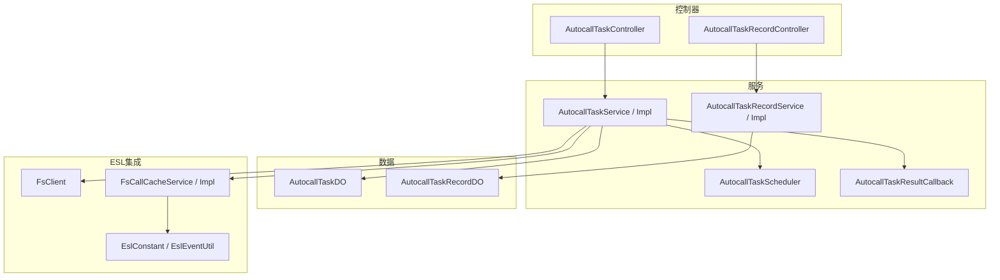
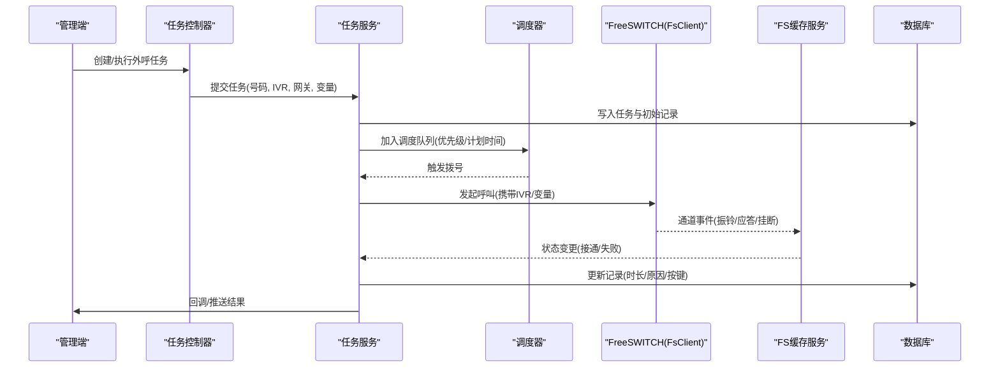
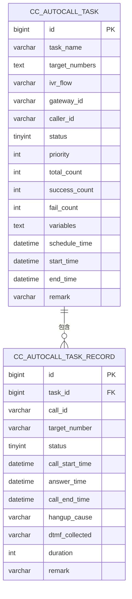
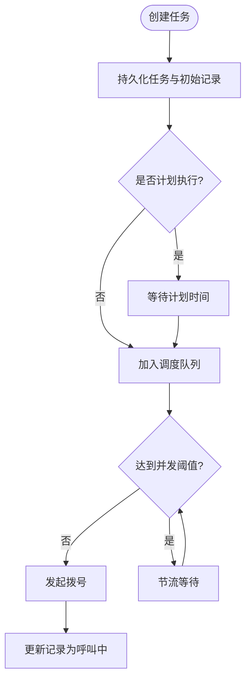
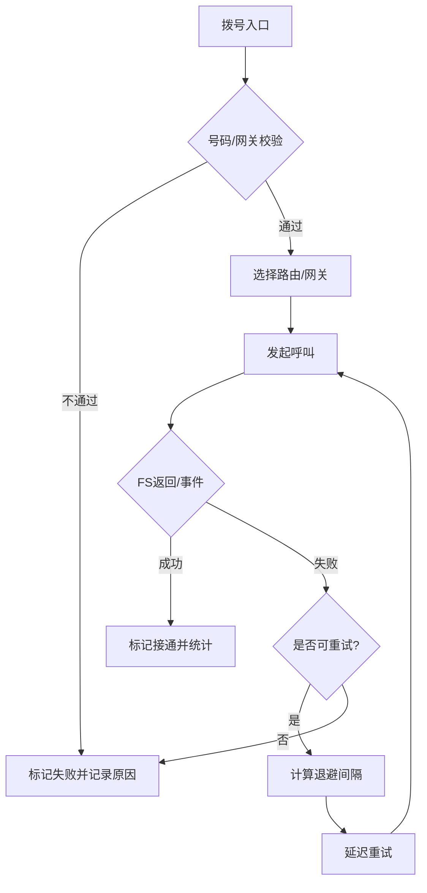
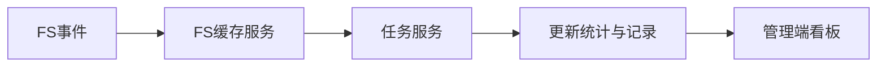
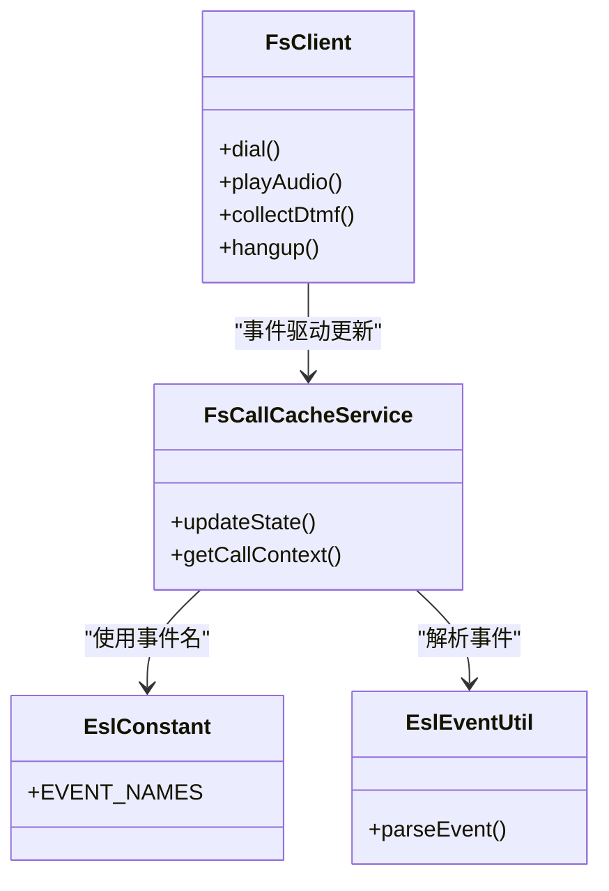
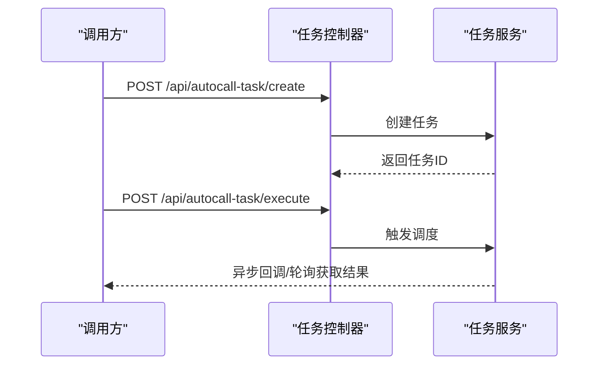
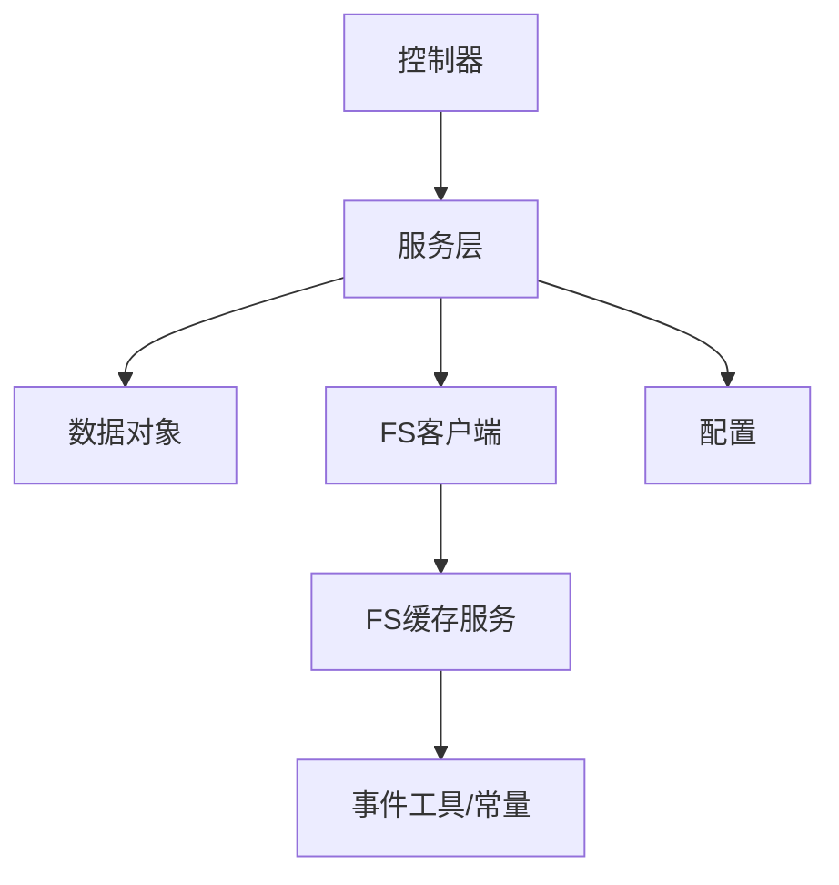

# 自动外呼系统

<cite>
**本文引用的文件**
- [autocall_task.sql](file://yudao-cloud/yudao-module-cc/doc/sql/autocall_task.sql)
- [AutocallTaskController.java](file://yudao-cloud/yudao-module-cc/yudao-module-cc-server/src/main/java/cn/iocoder/yudao/module/cc/controller/admin/autocall/AutocallTaskController.java)
- [AutocallTaskRecordController.java](file://yudao-cloud/yudao-module-cc/yudao-module-cc-server/src/main/java/cn/iocoder/yudao/module/cc/controller/admin/autocall/AutocallTaskRecordController.java)
- [AutocallTaskService.java](file://yudao-cloud/yudao-module-cc/yudao-module-cc-server/src/main/java/cn/iocoder/yudao/module/cc/service/autocall/AutocallTaskService.java)
- [AutocallTaskServiceImpl.java](file://yudao-cloud/yudao-module-cc/yudao-module-cc-server/src/main/java/cn/iocoder/yudao/module/cc/service/autocall/AutocallTaskServiceImpl.java)
- [AutocallTaskScheduler.java](file://yudao-cloud/yudao-module-cc/yudao-module-cc-server/src/main/java/cn/iocoder/yudao/module/cc/service/autocall/AutocallTaskScheduler.java)
- [AutocallTaskRecordService.java](file://yudao-cloud/yudao-module-cc/yudao-module-cc-server/src/main/java/cn/iocoder/yudao/module/cc/service/autocall/AutocallTaskRecordService.java)
- [AutocallTaskRecordServiceImpl.java](file://yudao-cloud/yudao-module-cc/yudao-module-cc-server/src/main/java/cn/iocoder/yudao/module/cc/service/autocall/AutocallTaskRecordServiceImpl.java)
- [AutocallTaskResultCallback.java](file://yudao-cloud/yudao-module-cc/yudao-module-cc-server/src/main/java/cn/iocoder/yudao/module/cc/service/autocall/AutocallTaskResultCallback.java)
- [AutocallTaskDO.java](file://yudao-cloud/yudao-module-cc/yudao-module-cc-server/src/main/java/cn/iocoder/yudao/module/cc/dal/dataobject/autocall/AutocallTaskDO.java)
- [AutocallTaskRecordDO.java](file://yudao-cloud/yudao-module-cc/yudao-module-cc-server/src/main/java/cn/iocoder/yudao/module/cc/dal/dataobject/autocall/AutocallTaskRecordDO.java)
- [FsCallCacheService.java](file://yudao-cloud/yudao-module-cc/yudao-module-cc-server/src/main/java/cn/iocoder/yudao/module/cc/esl/service/FsCallCacheService.java)
- [FsCallCacheServiceImpl.java](file://yudao-cloud/yudao-module-cc/yudao-module-cc-server/src/main/java/cn/iocoder/yudao/module/cc/esl/service/FsCallCacheServiceImpl.java)
- [EslConstant.java](file://yudao-cloud/yudao-module-cc/yudao-module-cc-server/src/main/java/cn/iocoder/yudao/module/cc/esl/constant/EslConstant.java)
- [EslEventUtil.java](file://yudao-cloud/yudao-module-cc/yudao-module-cc-server/src/main/java/cn/iocoder/yudao/module/cc/esl/utils/EslEventUtil.java)
- [FsClient.java](file://yudao-cloud/yudao-module-cc/yudao-module-cc-server/src/main/java/cn/iocoder/yudao/module/cc/esl/client/FsClient.java)
- [CcConfig.java](file://yudao-cloud/yudao-module-cc/yudao-module-cc-server/src/main/java/cn/iocoder/yudao/module/cc/config/CcConfig.java)
- [ApiConstants.java](file://yudao-cloud/yudao-module-cc/yudao-module-cc-api/src/main/java/cn/iocoder/yudao/module/cc/enums/ApiConstants.java)
</cite>

## 目录
1. [简介](#简介)
2. [项目结构](#项目结构)
3. [核心组件](#核心组件)
4. [架构总览](#架构总览)
5. [详细组件分析](#详细组件分析)
6. [依赖关系分析](#依赖关系分析)
7. [性能考虑](#性能考虑)
8. [故障排查指南](#故障排查指南)
9. [结论](#结论)
10. [附录](#附录)

## 简介
本文件为自动外呼系统的技术文档，聚焦于外呼任务管理（创建、调度、监控、统计）、拨号策略（算法、重试、失败处理）、业务流程与数据模型、API接口说明、配置选项与拨号规则、与FreeSWITCH的集成方式及通话控制逻辑，并总结设计模式与最佳实践。目标是帮助开发者快速理解与扩展该子系统，同时为运维提供可观测性与调优建议。

## 项目结构
自动外呼能力位于呼叫中心模块中，围绕“任务-记录-调度-执行-回调”的主线组织：
- 控制器层：对外暴露任务与记录的查询、创建、执行等API
- 服务层：封装任务生命周期管理、拨号策略、重试与失败处理、结果回调
- 数据层：任务与记录的数据对象与持久化
- ESL集成：通过FreeSWITCH事件与通道状态驱动流程推进
- 配置：集中化的CC相关配置项

图表来源
- [AutocallTaskController.java](file://yudao-cloud/yudao-module-cc/yudao-module-cc-server/src/main/java/cn/iocoder/yudao/module/cc/controller/admin/autocall/AutocallTaskController.java)
- [AutocallTaskRecordController.java](file://yudao-cloud/yudao-module-cc/yudao-module-cc-server/src/main/java/cn/iocoder/yudao/module/cc/controller/admin/autocall/AutocallTaskRecordController.java)
- [AutocallTaskService.java](file://yudao-cloud/yudao-module-cc/yudao-module-cc-server/src/main/java/cn/iocoder/yudao/module/cc/service/autocall/AutocallTaskService.java)
- [AutocallTaskServiceImpl.java](file://yudao-cloud/yudao-module-cc/yudao-module-cc-server/src/main/java/cn/iocoder/yudao/module/cc/service/autocall/AutocallTaskServiceImpl.java)
- [AutocallTaskScheduler.java](file://yudao-cloud/yudao-module-cc/yudao-module-cc-server/src/main/java/cn/iocoder/yudao/module/cc/service/autocall/AutocallTaskScheduler.java)
- [AutocallTaskResultCallback.java](file://yudao-cloud/yudao-module-cc/yudao-module-cc-server/src/main/java/cn/iocoder/yudao/module/cc/service/autocall/AutocallTaskResultCallback.java)
- [FsClient.java](file://yudao-cloud/yudao-module-cc/yudao-module-cc-server/src/main/java/cn/iocoder/yudao/module/cc/esl/client/FsClient.java)
- [FsCallCacheService.java](file://yudao-cloud/yudao-module-cc/yudao-module-cc-server/src/main/java/cn/iocoder/yudao/module/cc/esl/service/FsCallCacheService.java)
- [EslConstant.java](file://yudao-cloud/yudao-module-cc/yudao-module-cc-server/src/main/java/cn/iocoder/yudao/module/cc/esl/constant/EslConstant.java)
- [EslEventUtil.java](file://yudao-cloud/yudao-module-cc/yudao-module-cc-server/src/main/java/cn/iocoder/yudao/module/cc/esl/utils/EslEventUtil.java)

章节来源
- [autocall_task.sql:1-101](file://yudao-cloud/yudao-module-cc/doc/sql/autocall_task.sql#L1-L101)

## 核心组件
- 任务控制器：提供任务的创建、分页查询、执行、暂停、取消等能力
- 记录控制器：提供任务执行明细的分页查询与导出
- 任务服务：实现任务生命周期管理、拨号策略编排、重试与失败处理、结果回调
- 调度器：按任务计划时间或立即触发拨号，支持优先级与并发控制
- 记录服务：维护每次外呼的执行轨迹与状态流转
- ESL缓存服务：在内存中维护通话上下文，配合FS事件完成状态同步
- FreeSWITCH客户端：发起呼叫、发送DTMF、播放音频、挂断等控制指令
- 常量与工具：事件名、事件解析、号码格式化工具等
- 配置：CC模块全局参数（如并发、超时、重试策略等）

章节来源
- [AutocallTaskController.java](file://yudao-cloud/yudao-module-cc/yudao-module-cc-server/src/main/java/cn/iocoder/yudao/module/cc/controller/admin/autocall/AutocallTaskController.java)
- [AutocallTaskRecordController.java](file://yudao-cloud/yudao-module-cc/yudao-module-cc-server/src/main/java/cn/iocoder/yudao/module/cc/controller/admin/autocall/AutocallTaskRecordController.java)
- [AutocallTaskService.java](file://yudao-cloud/yudao-module-cc/yudao-module-cc-server/src/main/java/cn/iocoder/yudao/module/cc/service/autocall/AutocallTaskService.java)
- [AutocallTaskServiceImpl.java](file://yudao-cloud/yudao-module-cc/yudao-module-cc-server/src/main/java/cn/iocoder/yudao/module/cc/service/autocall/AutocallTaskServiceImpl.java)
- [AutocallTaskScheduler.java](file://yudao-cloud/yudao-module-cc/yudao-module-cc-server/src/main/java/cn/iocoder/yudao/module/cc/service/autocall/AutocallTaskScheduler.java)
- [AutocallTaskRecordService.java](file://yudao-cloud/yudao-module-cc/yudao-module-cc-server/src/main/java/cn/iocoder/yudao/module/cc/service/autocall/AutocallTaskRecordService.java)
- [AutocallTaskRecordServiceImpl.java](file://yudao-cloud/yudao-module-cc/yudao-module-cc-server/src/main/java/cn/iocoder/yudao/module/cc/service/autocall/AutocallTaskRecordServiceImpl.java)
- [AutocallTaskResultCallback.java](file://yudao-cloud/yudao-module-cc/yudao-module-cc-server/src/main/java/cn/iocoder/yudao/module/cc/service/autocall/AutocallTaskResultCallback.java)
- [FsClient.java](file://yudao-cloud/yudao-module-cc/yudao-module-cc-server/src/main/java/cn/iocoder/yudao/module/cc/esl/client/FsClient.java)
- [FsCallCacheService.java](file://yudao-cloud/yudao-module-cc/yudao-module-cc-server/src/main/java/cn/iocoder/yudao/module/cc/esl/service/FsCallCacheService.java)
- [EslConstant.java](file://yudao-cloud/yudao-module-cc/yudao-module-cc-server/src/main/java/cn/iocoder/yudao/module/cc/esl/constant/EslConstant.java)
- [EslEventUtil.java](file://yudao-cloud/yudao-module-cc/yudao-module-cc-server/src/main/java/cn/iocoder/yudao/module/cc/esl/utils/EslEventUtil.java)
- [CcConfig.java](file://yudao-cloud/yudao-module-cc/yudao-module-cc-server/src/main/java/cn/iocoder/yudao/module/cc/config/CcConfig.java)

## 架构总览
自动外呼系统采用“控制器-服务-数据-ESL集成”的分层架构，结合事件驱动的通话状态推进机制。任务由调度器触发，服务层根据拨号策略调用FreeSWITCH进行呼叫，FS事件回推至缓存服务更新通话上下文，最终通过回调将结果落库并通知上层。

图表来源
- [AutocallTaskController.java](file://yudao-cloud/yudao-module-cc/yudao-module-cc-server/src/main/java/cn/iocoder/yudao/module/cc/controller/admin/autocall/AutocallTaskController.java)
- [AutocallTaskService.java](file://yudao-cloud/yudao-module-cc/yudao-module-cc-server/src/main/java/cn/iocoder/yudao/module/cc/service/autocall/AutocallTaskService.java)
- [AutocallTaskScheduler.java](file://yudao-cloud/yudao-module-cc/yudao-module-cc-server/src/main/java/cn/iocoder/yudao/module/cc/service/autocall/AutocallTaskScheduler.java)
- [FsClient.java](file://yudao-cloud/yudao-module-cc/yudao-module-cc-server/src/main/java/cn/iocoder/yudao/module/cc/esl/client/FsClient.java)
- [FsCallCacheService.java](file://yudao-cloud/yudao-module-cc/yudao-module-cc-server/src/main/java/cn/iocoder/yudao/module/cc/esl/service/FsCallCacheService.java)
- [EslConstant.java](file://yudao-cloud/yudao-module-cc/yudao-module-cc-server/src/main/java/cn/iocoder/yudao/module/cc/esl/constant/EslConstant.java)

## 详细组件分析

### 数据模型
- 外呼任务表：存储任务名称、被叫号码列表、IVR流程、出局网关、主叫号码、状态、优先级、统计计数、业务变量、计划/实际起止时间等
- 外呼任务记录表：存储每次外呼的目标号码、关联任务ID、通话ID、状态、开始/接通/结束时间、挂断原因、DTMF收集、通话时长等

图表来源
- [autocall_task.sql:11-66](file://yudao-cloud/yudao-module-cc/doc/sql/autocall_task.sql#L11-L66)

章节来源
- [autocall_task.sql:1-101](file://yudao-cloud/yudao-module-cc/doc/sql/autocall_task.sql#L1-L101)
- [AutocallTaskDO.java](file://yudao-cloud/yudao-module-cc/yudao-module-cc-server/src/main/java/cn/iocoder/yudao/module/cc/dal/dataobject/autocall/AutocallTaskDO.java)
- [AutocallTaskRecordDO.java](file://yudao-cloud/yudao-module-cc/yudao-module-cc-server/src/main/java/cn/iocoder/yudao/module/cc/dal/dataobject/autocall/AutocallTaskRecordDO.java)

### 任务创建与调度
- 任务创建：接收任务配置（号码、IVR、网关、主叫、变量、计划时间），持久化任务与初始记录，设置状态为待执行
- 调度执行：调度器按优先级与计划时间拉取任务，批量生成拨号记录，进入拨号队列；支持立即执行与定时执行
- 并发与限流：基于配置限制每批并发数与全局并发，避免对FS造成压力

图表来源
- [AutocallTaskController.java](file://yudao-cloud/yudao-module-cc/yudao-module-cc-server/src/main/java/cn/iocoder/yudao/module/cc/controller/admin/autocall/AutocallTaskController.java)
- [AutocallTaskService.java](file://yudao-cloud/yudao-module-cc/yudao-module-cc-server/src/main/java/cn/iocoder/yudao/module/cc/service/autocall/AutocallTaskService.java)
- [AutocallTaskScheduler.java](file://yudao-cloud/yudao-module-cc/yudao-module-cc-server/src/main/java/cn/iocoder/yudao/module/cc/service/autocall/AutocallTaskScheduler.java)

章节来源
- [AutocallTaskController.java](file://yudao-cloud/yudao-module-cc/yudao-module-cc-server/src/main/java/cn/iocoder/yudao/module/cc/controller/admin/autocall/AutocallTaskController.java)
- [AutocallTaskService.java](file://yudao-cloud/yudao-module-cc/yudao-module-cc-server/src/main/java/cn/iocoder/yudao/module/cc/service/autocall/AutocallTaskService.java)
- [AutocallTaskScheduler.java](file://yudao-cloud/yudao-module-cc/yudao-module-cc-server/src/main/java/cn/iocoder/yudao/module/cc/service/autocall/AutocallTaskScheduler.java)

### 拨号策略与重试机制
- 拨号算法：支持号码路由选择、网关选择、主叫号码映射、IVR流程注入；可按优先级与负载动态选择出口
- 重试机制：针对网络抖动、忙音、无应答等场景进行指数退避重试；可配置最大重试次数与重试间隔
- 失败处理：统一归因（如运营商拒绝、超时、号码无效），记录挂断原因，支持失败告警与人工干预

图表来源
- [AutocallTaskServiceImpl.java](file://yudao-cloud/yudao-module-cc/yudao-module-cc-server/src/main/java/cn/iocoder/yudao/module/cc/service/autocall/AutocallTaskServiceImpl.java)
- [FsClient.java](file://yudao-cloud/yudao-module-cc/yudao-module-cc-server/src/main/java/cn/iocoder/yudao/module/cc/esl/client/FsClient.java)
- [EslConstant.java](file://yudao-cloud/yudao-module-cc/yudao-module-cc-server/src/main/java/cn/iocoder/yudao/module/cc/esl/constant/EslConstant.java)

章节来源
- [AutocallTaskServiceImpl.java](file://yudao-cloud/yudao-module-cc/yudao-module-cc-server/src/main/java/cn/iocoder/yudao/module/cc/service/autocall/AutocallTaskServiceImpl.java)
- [FsClient.java](file://yudao-cloud/yudao-module-cc/yudao-module-cc-server/src/main/java/cn/iocoder/yudao/module/cc/esl/client/FsClient.java)
- [EslConstant.java](file://yudao-cloud/yudao-module-cc/yudao-module-cc-server/src/main/java/cn/iocoder/yudao/module/cc/esl/constant/EslConstant.java)

### 监控与统计
- 实时监控：通过FS事件流更新通话状态，前端可实时查看任务进度与通话明细
- 统计指标：总数、接通数、失败数、平均时长、成功率、失败原因分布
- 审计追踪：记录关键操作日志与事件链路，便于问题定位

图表来源
- [FsCallCacheService.java](file://yudao-cloud/yudao-module-cc/yudao-module-cc-server/src/main/java/cn/iocoder/yudao/module/cc/esl/service/FsCallCacheService.java)
- [EslEventUtil.java](file://yudao-cloud/yudao-module-cc/yudao-module-cc-server/src/main/java/cn/iocoder/yudao/module/cc/esl/utils/EslEventUtil.java)
- [AutocallTaskRecordService.java](file://yudao-cloud/yudao-module-cc/yudao-module-cc-server/src/main/java/cn/iocoder/yudao/module/cc/service/autocall/AutocallTaskRecordService.java)

章节来源
- [FsCallCacheService.java](file://yudao-cloud/yudao-module-cc/yudao-module-cc-server/src/main/java/cn/iocoder/yudao/module/cc/esl/service/FsCallCacheService.java)
- [EslEventUtil.java](file://yudao-cloud/yudao-module-cc/yudao-module-cc-server/src/main/java/cn/iocoder/yudao/module/cc/esl/utils/EslEventUtil.java)
- [AutocallTaskRecordService.java](file://yudao-cloud/yudao-module-cc/yudao-module-cc-server/src/main/java/cn/iocoder/yudao/module/cc/service/autocall/AutocallTaskRecordService.java)

### 与FreeSWITCH的集成与通话控制
- 连接与事件：通过ESL建立连接，订阅通道事件（如CHANNEL_ANSWER、CHANNEL_HANGUP），使用事件工具解析并更新缓存
- 通话控制：发起呼叫、播放音频、收集DTMF、桥接、挂断等操作均通过FS客户端完成
- 上下文传递：在呼叫时携带IVR流程ID与业务变量，FS侧根据流程驱动交互

图表来源
- [FsClient.java](file://yudao-cloud/yudao-module-cc/yudao-module-cc-server/src/main/java/cn/iocoder/yudao/module/cc/esl/client/FsClient.java)
- [FsCallCacheService.java](file://yudao-cloud/yudao-module-cc/yudao-module-cc-server/src/main/java/cn/iocoder/yudao/module/cc/esl/service/FsCallCacheService.java)
- [EslConstant.java](file://yudao-cloud/yudao-module-cc/yudao-module-cc-server/src/main/java/cn/iocoder/yudao/module/cc/esl/constant/EslConstant.java)
- [EslEventUtil.java](file://yudao-cloud/yudao-module-cc/yudao-module-cc-server/src/main/java/cn/iocoder/yudao/module/cc/esl/utils/EslEventUtil.java)

章节来源
- [FsClient.java](file://yudao-cloud/yudao-module-cc/yudao-module-cc-server/src/main/java/cn/iocoder/yudao/module/cc/esl/client/FsClient.java)
- [FsCallCacheService.java](file://yudao-cloud/yudao-module-cc/yudao-module-cc-server/src/main/java/cn/iocoder/yudao/module/cc/esl/service/FsCallCacheService.java)
- [EslConstant.java](file://yudao-cloud/yudao-module-cc/yudao-module-cc-server/src/main/java/cn/iocoder/yudao/module/cc/esl/constant/EslConstant.java)
- [EslEventUtil.java](file://yudao-cloud/yudao-module-cc/yudao-module-cc-server/src/main/java/cn/iocoder/yudao/module/cc/esl/utils/EslEventUtil.java)

### API接口概览
- 外呼任务接口：创建任务、分页查询、执行/暂停/取消、查看统计
- 外呼记录接口：分页查询、详情查看、导出
- 事件回调：任务执行结果回调（可选），用于对接外部系统

图表来源
- [AutocallTaskController.java](file://yudao-cloud/yudao-module-cc/yudao-module-cc-server/src/main/java/cn/iocoder/yudao/module/cc/controller/admin/autocall/AutocallTaskController.java)
- [AutocallTaskService.java](file://yudao-cloud/yudao-module-cc/yudao-module-cc-server/src/main/java/cn/iocoder/yudao/module/cc/service/autocall/AutocallTaskService.java)
- [ApiConstants.java](file://yudao-cloud/yudao-module-cc/yudao-module-cc-api/src/main/java/cn/iocoder/yudao/module/cc/enums/ApiConstants.java)

章节来源
- [AutocallTaskController.java](file://yudao-cloud/yudao-module-cc/yudao-module-cc-server/src/main/java/cn/iocoder/yudao/module/cc/controller/admin/autocall/AutocallTaskController.java)
- [AutocallTaskRecordController.java](file://yudao-cloud/yudao-module-cc/yudao-module-cc-server/src/main/java/cn/iocoder/yudao/module/cc/controller/admin/autocall/AutocallTaskRecordController.java)
- [ApiConstants.java](file://yudao-cloud/yudao-module-cc/yudao-module-cc-api/src/main/java/cn/iocoder/yudao/module/cc/enums/ApiConstants.java)

### 配置选项与拨号规则
- 并发与限流：单任务并发、全局并发、批次大小
- 重试策略：最大重试次数、退避策略、失败分类
- 路由与网关：号码前缀匹配、网关权重、主叫映射
- 超时与计时：振铃超时、应答超时、挂机清理
- 变量与IVR：TTS文本、业务键值对、流程ID

章节来源
- [CcConfig.java](file://yudao-cloud/yudao-module-cc/yudao-module-cc-server/src/main/java/cn/iocoder/yudao/module/cc/config/CcConfig.java)
- [AutocallTaskDO.java](file://yudao-cloud/yudao-module-cc/yudao-module-cc-server/src/main/java/cn/iocoder/yudao/module/cc/dal/dataobject/autocall/AutocallTaskDO.java)
- [AutocallTaskRecordDO.java](file://yudao-cloud/yudao-module-cc/yudao-module-cc-server/src/main/java/cn/iocoder/yudao/module/cc/dal/dataobject/autocall/AutocallTaskRecordDO.java)

### 设计模式与最佳实践
- 策略模式：拨号路由、重试策略、失败处理策略可插拔
- 观察者模式：FS事件驱动的状态更新，解耦通话控制与业务逻辑
- 模板方法：统一的拨号流程骨架，子类定制具体策略
- 幂等与去重：基于call_id与任务ID保证重复请求安全
- 可观测性：全链路埋点、指标上报、错误码规范

章节来源
- [AutocallTaskServiceImpl.java](file://yudao-cloud/yudao-module-cc/yudao-module-cc-server/src/main/java/cn/iocoder/yudao/module/cc/service/autocall/AutocallTaskServiceImpl.java)
- [FsCallCacheService.java](file://yudao-cloud/yudao-module-cc/yudao-module-cc-server/src/main/java/cn/iocoder/yudao/module/cc/esl/service/FsCallCacheService.java)
- [EslEventUtil.java](file://yudao-cloud/yudao-module-cc/yudao-module-cc-server/src/main/java/cn/iocoder/yudao/module/cc/esl/utils/EslEventUtil.java)

## 依赖关系分析
- 控制器依赖服务层，服务层依赖数据对象与FS客户端
- FS事件通过缓存服务反写业务状态，形成闭环
- 配置中心影响调度与拨号行为

图表来源
- [AutocallTaskController.java](file://yudao-cloud/yudao-module-cc/yudao-module-cc-server/src/main/java/cn/iocoder/yudao/module/cc/controller/admin/autocall/AutocallTaskController.java)
- [AutocallTaskService.java](file://yudao-cloud/yudao-module-cc/yudao-module-cc-server/src/main/java/cn/iocoder/yudao/module/cc/service/autocall/AutocallTaskService.java)
- [FsClient.java](file://yudao-cloud/yudao-module-cc/yudao-module-cc-server/src/main/java/cn/iocoder/yudao/module/cc/esl/client/FsClient.java)
- [FsCallCacheService.java](file://yudao-cloud/yudao-module-cc/yudao-module-cc-server/src/main/java/cn/iocoder/yudao/module/cc/esl/service/FsCallCacheService.java)
- [EslConstant.java](file://yudao-cloud/yudao-module-cc/yudao-module-cc-server/src/main/java/cn/iocoder/yudao/module/cc/esl/constant/EslConstant.java)
- [EslEventUtil.java](file://yudao-cloud/yudao-module-cc/yudao-module-cc-server/src/main/java/cn/iocoder/yudao/module/cc/esl/utils/EslEventUtil.java)
- [CcConfig.java](file://yudao-cloud/yudao-module-cc/yudao-module-cc-server/src/main/java/cn/iocoder/yudao/module/cc/config/CcConfig.java)

章节来源
- [AutocallTaskController.java](file://yudao-cloud/yudao-module-cc/yudao-module-cc-server/src/main/java/cn/iocoder/yudao/module/cc/controller/admin/autocall/AutocallTaskController.java)
- [AutocallTaskService.java](file://yudao-cloud/yudao-module-cc/yudao-module-cc-server/src/main/java/cn/iocoder/yudao/module/cc/service/autocall/AutocallTaskService.java)
- [FsClient.java](file://yudao-cloud/yudao-module-cc/yudao-module-cc-server/src/main/java/cn/iocoder/yudao/module/cc/esl/client/FsClient.java)
- [FsCallCacheService.java](file://yudao-cloud/yudao-module-cc/yudao-module-cc-server/src/main/java/cn/iocoder/yudao/module/cc/esl/service/FsCallCacheService.java)
- [EslConstant.java](file://yudao-cloud/yudao-module-cc/yudao-module-cc-server/src/main/java/cn/iocoder/yudao/module/cc/esl/constant/EslConstant.java)
- [EslEventUtil.java](file://yudao-cloud/yudao-module-cc/yudao-module-cc-server/src/main/java/cn/iocoder/yudao/module/cc/esl/utils/EslEventUtil.java)
- [CcConfig.java](file://yudao-cloud/yudao-module-cc/yudao-module-cc-server/src/main/java/cn/iocoder/yudao/module/cc/config/CcConfig.java)

## 性能考虑
- 并发控制：合理设置单任务与全局并发，避免FS过载
- 批处理：批量生成拨号记录，减少DB写入压力
- 重试优化：指数退避与抖动，降低雪崩风险
- 缓存利用：FS事件到内存缓存的快速更新，降低DB压力
- 监控告警：关键指标（接通率、失败率、平均时长）监控与阈值告警

[本节为通用指导，无需特定文件引用]

## 故障排查指南
- 常见问题
  - 无法拨出：检查FS连接、网关配置、号码路由
  - 频繁失败：查看挂断原因、重试策略、号码有效性
  - 状态不同步：核对FS事件订阅与缓存更新逻辑
- 定位手段
  - 查看任务与记录状态流转
  - 检查FS事件日志与事件解析
  - 核对配置项（并发、超时、重试）
- 恢复措施
  - 调整重试策略与并发
  - 修复号码或网关配置
  - 重启FS连接或清理异常通道

章节来源
- [AutocallTaskRecordService.java](file://yudao-cloud/yudao-module-cc/yudao-module-cc-server/src/main/java/cn/iocoder/yudao/module/cc/service/autocall/AutocallTaskRecordService.java)
- [EslEventUtil.java](file://yudao-cloud/yudao-module-cc/yudao-module-cc-server/src/main/java/cn/iocoder/yudao/module/cc/esl/utils/EslEventUtil.java)
- [FsCallCacheService.java](file://yudao-cloud/yudao-module-cc/yudao-module-cc-server/src/main/java/cn/iocoder/yudao/module/cc/esl/service/FsCallCacheService.java)

## 结论
自动外呼系统以任务为中心，结合调度、拨号策略与FS事件驱动，实现了高可用、可扩展的外呼能力。通过合理的并发控制、重试机制与完善的监控统计，能够满足大规模外呼场景的需求。建议在上线前充分压测并发与重试策略，完善监控告警与故障自愈机制。

[本节为总结性内容，无需特定文件引用]

## 附录
- 术语解释
  - IVR：交互式语音应答
  - DID：直接入线号码（对外主叫显示）
  - ESL：FreeSWITCH事件套接字协议
- 参考脚本与测试
  - 部署脚本与测试用例位于doc目录下，可用于环境搭建与功能验证

[本节为补充信息，无需特定文件引用]