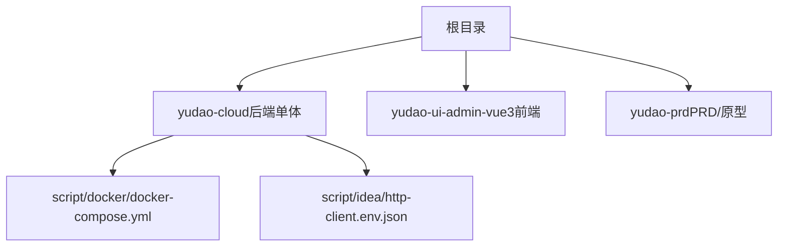
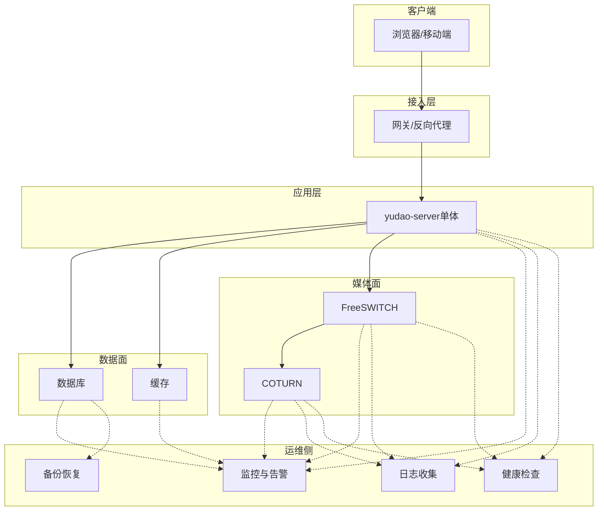
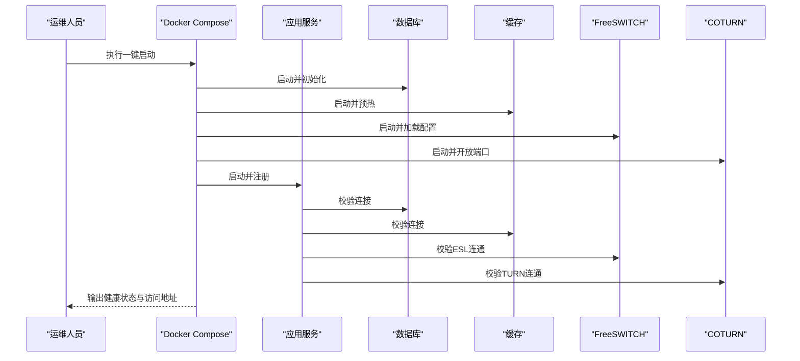
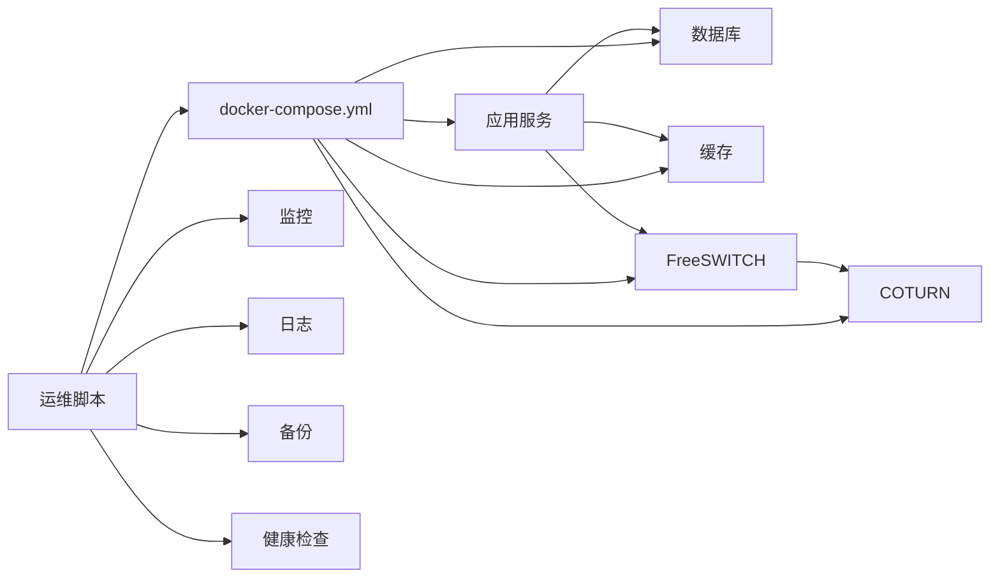

# 运维脚本

<cite>
**本文引用的文件**
- [README.md](file://README.md)
- [agents.md](file://agents.md)
- [docker-compose.yml](file://yudao-cloud/script/docker/docker-compose.yml)
- [http-client.env.json](file://yudao-cloud/script/idea/http-client.env.json)
</cite>

## 目录
1. [简介](#简介)
2. [项目结构](#项目结构)
3. [核心组件](#核心组件)
4. [架构总览](#架构总览)
5. [详细组件分析](#详细组件分析)
6. [依赖关系分析](#依赖关系分析)
7. [性能注意事项](#性能注意事项)
8. [故障诊断指南](#故障诊断指南)
9. [结论](#结论)
10. [附录](#附录)

## 简介
本指南面向运维与交付工程师，聚焦呼叫中心系统（基于 yudao-cloud）的自动化部署与日常运维。内容覆盖一键部署、批量部署、集群部署思路；COTURN 与 FreeSWITCH 部署要点；公网 IP 回环配置；监控、日志收集、备份恢复；以及故障诊断、性能分析与健康检查方法。同时提供自定义脚本开发指南与扩展示例，并说明执行权限、错误处理与日志记录机制。

## 项目结构
仓库包含后端单体工程、前端管理后台与产品文档三个子模块。运维相关的基础编排位于 script 目录，其中 docker-compose.yml 用于容器化编排；IDEA 环境配置文件便于本地调试。

图表来源
- [docker-compose.yml:1-200](file://yudao-cloud/script/docker/docker-compose.yml#L1-L200)
- [http-client.env.json:1-200](file://yudao-cloud/script/idea/http-client.env.json#L1-L200)

章节来源
- [README.md:1-29](file://README.md#L1-L29)
- [agents.md:1-150](file://agents.md#L1-L150)

## 核心组件
- 一键部署：通过 Docker Compose 编排基础服务（数据库、缓存、媒体服务器等），配合环境变量完成快速拉起。
- 批量部署：在同一模板基础上，按多实例或多租户维度复制 compose 配置，结合参数化变量实现批量创建。
- 集群部署：将媒体面（FreeSWITCH/COTURN）与控制面（应用服务）解耦，使用外部注册中心或 DNS 进行服务发现与负载均衡。
- COTURN 部署：提供 TURN/STUN 能力，解决 NAT 穿透问题，需开放 UDP/TCP 端口并配置认证密钥。
- FreeSWITCH 部署：作为媒体会话控制与媒体流转发核心，需正确配置 SIP 域、ACL、媒体端口范围及 ESL 接入。
- 公网 IP 回环配置：在特定网络环境下，确保内网访问公网地址时能回环到本机，避免媒体流路由异常。
- 监控与日志：采集系统指标与应用日志，集中存储与可视化，支持告警与容量规划。
- 备份与恢复：定期备份数据库与关键配置，支持增量/全量策略与快速恢复流程。
- 故障诊断与性能分析：定位连接失败、媒体中断、CPU/内存瓶颈等问题，提供常用命令与排查清单。
- 健康检查：对关键服务进行存活探测与就绪探针，保障编排层自动重启与流量切换。

章节来源
- [agents.md:41-78](file://agents.md#L41-L78)
- [docker-compose.yml:1-200](file://yudao-cloud/script/docker/docker-compose.yml#L1-L200)

## 架构总览
下图展示了典型的生产部署拓扑：前端管理界面通过网关访问后端单体服务；媒体面由 FreeSWITCH 与 COTURN 组成；数据面由数据库与缓存构成；运维侧提供监控、日志、备份与健康检查。

图表来源
- [docker-compose.yml:1-200](file://yudao-cloud/script/docker/docker-compose.yml#L1-L200)
- [agents.md:15-37](file://agents.md#L15-L37)

## 详细组件分析

### 一键部署（Docker Compose）
- 目标：通过单一命令拉起全部依赖服务与应用，减少人工干预。
- 步骤概览：
  - 准备环境与凭据：填写数据库、Redis、FS、TURN 的连接信息。
  - 启动编排：执行 compose up，等待所有服务就绪。
  - 初始化数据：导入系统 SQL 与 CC 业务数据。
  - 验证连通性：访问管理端与媒体接口。
- 关键点：
  - 使用环境变量隔离不同环境配置。
  - 为媒体端口设置防火墙规则。
  - 使用健康检查与重试策略提升稳定性。

图表来源
- [docker-compose.yml:1-200](file://yudao-cloud/script/docker/docker-compose.yml#L1-L200)

章节来源
- [docker-compose.yml:1-200](file://yudao-cloud/script/docker/docker-compose.yml#L1-L200)

### 批量部署
- 场景：同一套模板在多机房或多租户环境快速复制。
- 方法：
  - 参数化 compose 文件与环境变量。
  - 使用脚本循环生成实例目录并注入差异化配置。
  - 统一命名规范与资源配额，便于后续治理。
- 风险控制：
  - 预检依赖端口与磁盘空间。
  - 灰度发布与回滚预案。
  - 批量失败自动清理与告警。

章节来源
- [docker-compose.yml:1-200](file://yudao-cloud/script/docker/docker-compose.yml#L1-L200)

### 集群部署
- 设计原则：控制面与媒体面分离，媒体面横向扩展，控制面无状态化。
- 要点：
  - 使用外部注册/DNS 进行服务发现。
  - 媒体面通过负载均衡分发会话。
  - 共享数据面（数据库/缓存）保证一致性。
  - 跨可用区容灾与多活策略。

章节来源
- [agents.md:15-37](file://agents.md#L15-L37)

### COTURN 部署脚本
- 功能：安装与配置 TURN/STUN 服务，开放必要端口，配置用户认证与带宽限制。
- 使用方法：
  - 准备公网 IP 与证书（如需 TLS）。
  - 运行部署脚本，传入域名、密钥、端口等参数。
  - 验证 STUN/TURN 连通性与鉴权。
- 常见问题：
  - 端口未放行导致握手失败。
  - 认证密钥不一致导致协商失败。
  - 媒体流被 NAT 拦截，需检查回环与路由。

章节来源
- [agents.md:141-142](file://agents.md#L141-L142)

### FreeSWITCH 部署脚本
- 功能：安装与配置 FreeSWITCH，包括 SIP 域、ACL、媒体端口范围、ESL 接入与录音策略。
- 使用方法：
  - 准备 SIP 域名与证书。
  - 运行部署脚本，传入 SIP 域、管理员账号、媒体端口范围等。
  - 校验 SIP 注册与媒体流互通。
- 常见问题：
  - ACL 配置不当导致外网无法注册。
  - 媒体端口范围不足引发通话失败。
  - ESL 连接失败导致控制面无法下发配置。

章节来源
- [agents.md:141-142](file://agents.md#L141-L142)

### 公网 IP 回环配置脚本
- 功能：在内网环境中使访问公网 IP 的请求回环到本机，解决媒体流路由异常。
- 使用方法：
  - 识别当前公网 IP 与网卡。
  - 添加回环路由与 NAPT 规则。
  - 持久化配置并验证连通性。
- 注意事项：
  - 不同发行版命令差异较大，需适配。
  - 谨慎操作以免影响其他服务。
  - 变更后重新测试媒体流。

章节来源
- [agents.md:141-142](file://agents.md#L141-L142)

### 监控脚本
- 目标：采集系统与应用指标，提供可视化与告警。
- 能力：
  - 主机级：CPU、内存、磁盘、网络。
  - 服务级：进程存活、端口监听、响应时间。
  - 业务级：呼叫成功率、并发数、媒体质量。
- 集成：对接 Prometheus/Grafana 或自研平台。

章节来源
- [agents.md:15-37](file://agents.md#L15-L37)

### 日志收集脚本
- 目标：统一收集应用与中间件日志，支持检索与分析。
- 能力：
  - 轮转与压缩，控制磁盘占用。
  - 结构化输出，便于解析。
  - 远程推送至日志平台。
- 最佳实践：
  - 分级日志（INFO/ERROR/WARN）。
  - 敏感信息脱敏。
  - 关联请求 ID 追踪链路。

章节来源
- [agents.md:15-37](file://agents.md#L15-L37)

### 备份恢复脚本
- 目标：保障数据安全与可恢复性。
- 能力：
  - 数据库全量/增量备份。
  - 关键配置归档（FS/COTURN/应用配置）。
  - 定时任务与异地副本。
- 恢复流程：
  - 停止写入或进入只读模式。
  - 校验备份完整性。
  - 执行恢复并验证数据一致性。

章节来源
- [agents.md:15-37](file://agents.md#L15-L37)

### 故障诊断脚本
- 目标：快速定位常见故障。
- 能力：
  - 网络连通性检测（DNS、端口、路由）。
  - 服务健康检查（HTTP/ESL/TURN）。
  - 资源瓶颈分析（CPU/内存/IO/网络）。
- 输出：标准化报告与建议修复步骤。

章节来源
- [agents.md:15-37](file://agents.md#L15-L37)

### 性能分析脚本
- 目标：识别性能瓶颈并提供优化建议。
- 能力：
  - 应用层：JVM 指标、GC 行为、慢查询。
  - 系统层：上下文切换、I/O 等待、网络拥塞。
  - 媒体层：丢包、抖动、延迟。
- 工具链：结合系统工具与平台监控。

章节来源
- [agents.md:15-37](file://agents.md#L15-L37)

### 健康检查脚本
- 目标：确保服务处于可用状态，支撑编排层自动重启与流量切换。
- 能力：
  - 存活探针：进程是否存在、端口是否监听。
  - 就绪探针：依赖是否可达、配置是否生效。
  - 业务探针：关键接口返回码与耗时阈值。
- 集成：与编排平台联动，实现自愈。

章节来源
- [agents.md:15-37](file://agents.md#L15-L37)

### 自定义脚本开发指南与扩展示例
- 开发原则：
  - 幂等性：重复执行不产生副作用。
  - 可观测性：输出结构化日志与指标。
  - 可配置：通过环境变量或配置文件驱动。
  - 可测试：提供单元测试与集成测试用例。
- 扩展示例：
  - 新增第三方组件：封装安装、配置、启停与健康检查。
  - 多环境适配：按环境注入差异化参数。
  - 安全加固：最小权限、密钥管理与审计日志。

章节来源
- [agents.md:95-104](file://agents.md#L95-L104)

## 依赖关系分析
- 编排依赖：compose 文件定义服务间依赖顺序与网络拓扑。
- 运行时依赖：应用依赖数据库、缓存、FS、TURN 的连通性。
- 运维依赖：监控、日志、备份、健康检查对服务暴露的指标与日志路径有要求。

图表来源
- [docker-compose.yml:1-200](file://yudao-cloud/script/docker/docker-compose.yml#L1-L200)

章节来源
- [docker-compose.yml:1-200](file://yudao-cloud/script/docker/docker-compose.yml#L1-L200)

## 性能注意事项
- 媒体端口范围充足，避免并发通话受限。
- 合理设置线程池与连接池大小，防止资源耗尽。
- 启用日志轮转与压缩，控制磁盘增长。
- 监控关键指标并设置阈值告警。
- 定期压测与容量评估，提前扩容。

[本节为通用指导，无需具体文件引用]

## 故障诊断指南
- 常见问题定位：
  - 无法注册：检查 SIP 域、ACL、防火墙与证书。
  - 媒体不通：检查 TURN 端口、NAT 回环与媒体端口范围。
  - 控制面失联：检查 ESL 连接与配置重载。
- 诊断步骤：
  - 使用健康检查脚本确认服务状态。
  - 查看日志收集结果，定位错误堆栈。
  - 使用性能分析脚本识别瓶颈。
  - 根据报告执行修复并复测。

章节来源
- [agents.md:95-104](file://agents.md#L95-L104)

## 结论
通过标准化的部署脚本与完善的运维体系，可实现呼叫中心系统的高效交付与稳定运行。建议在生产环境严格遵循权限控制、错误处理与日志记录规范，并结合监控与备份策略保障业务连续性。

[本节为总结性内容，无需具体文件引用]

## 附录
- 本地调试：使用 IDEA 环境配置文件进行 API 调试。
- 命令参考：后端编译、打包与启动命令见 agents 文档。
- 数据库初始化：系统表与 CC 业务表初始化脚本位置见 agents 文档。

章节来源
- [http-client.env.json:1-200](file://yudao-cloud/script/idea/http-client.env.json#L1-L200)
- [agents.md:41-78](file://agents.md#L41-L78)