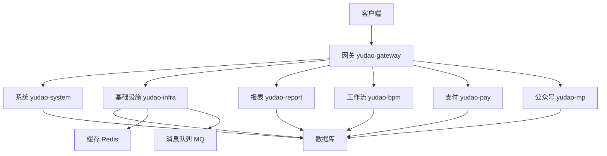
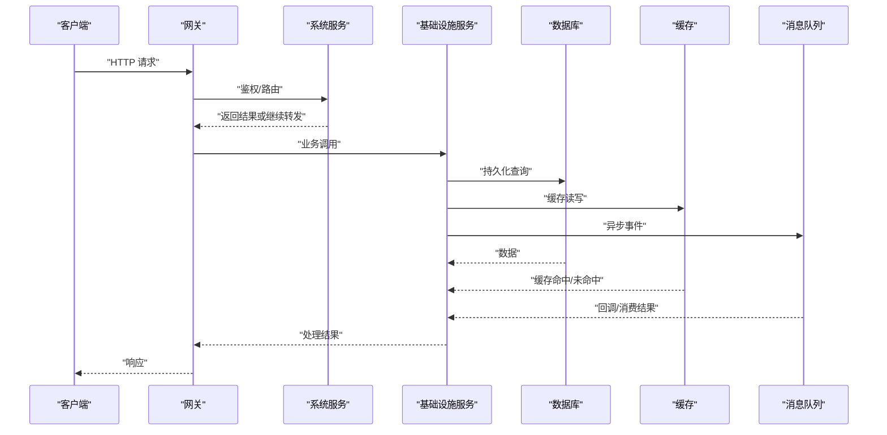
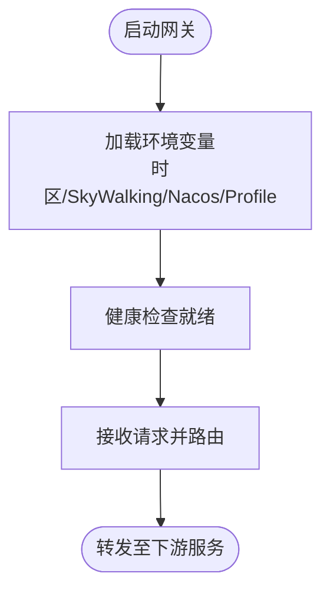
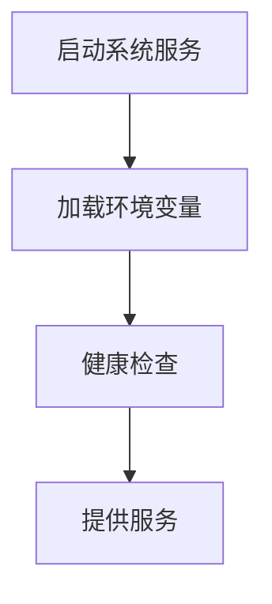
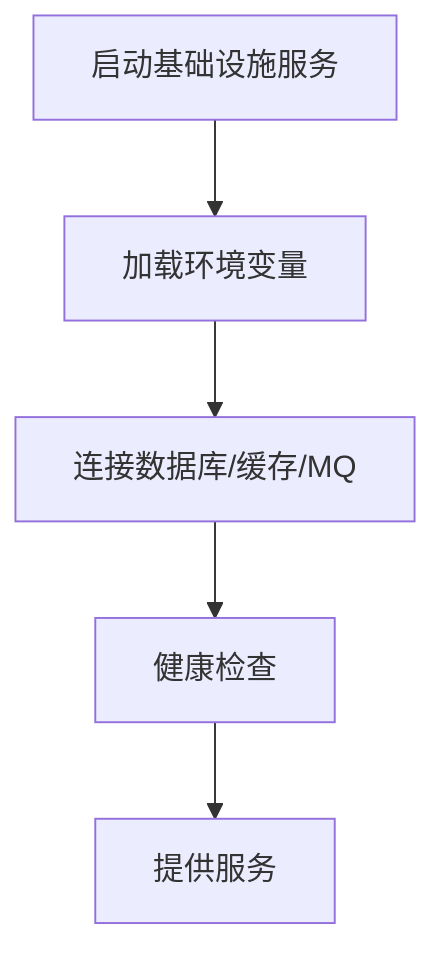
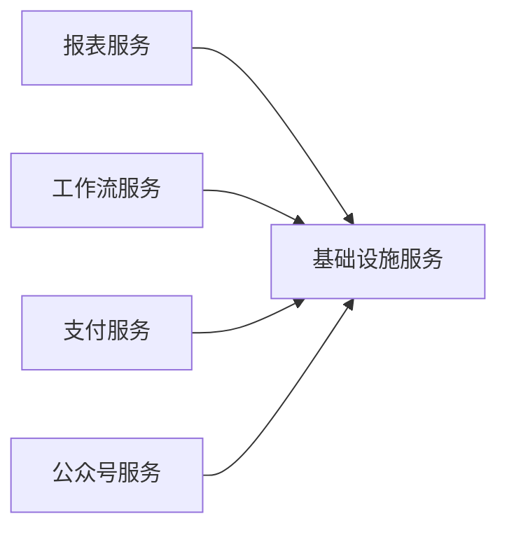
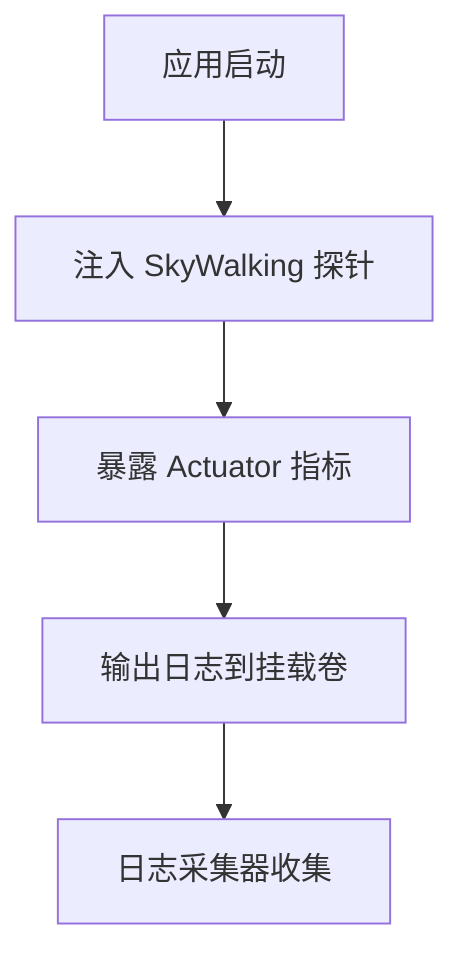
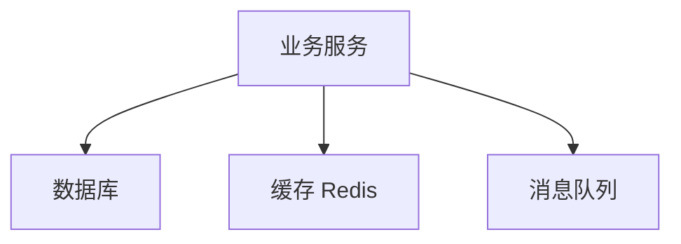
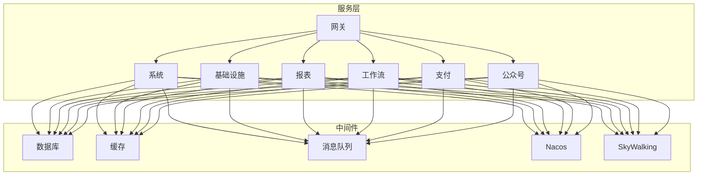

# 部署运维

<cite>
**本文引用的文件**
- [docker-compose.yml](file://yudao-cloud/script/docker/docker-compose.yml)
- [Dockerfile（网关）](file://yudao-cloud/yudao-gateway/Dockerfile)
- [Dockerfile（系统模块）](file://yudao-cloud/yudao-module-system-server/Dockerfile)
- [Dockerfile（基础设施模块）](file://yudao-cloud/yudao-module-infra-server/Dockerfile)
- [Dockerfile（报表模块）](file://yudao-cloud/yudao-module-report-server/Dockerfile)
- [Dockerfile（工作流模块）](file://yudao-cloud/yudao-module-bpm-server/Dockerfile)
- [Dockerfile（支付模块）](file://yudao-cloud/yudao-module-pay-server/Dockerfile)
- [Dockerfile（公众号模块）](file://yudao-cloud/yudao-module-mp-server/Dockerfile)
- [Dockerfile（AI模块）](file://yudao-cloud/yudao-module-ai-server/Dockerfile)
- [Dockerfile（CRM模块）](file://yudao-cloud/yudao-module-crm-server/Dockerfile)
- [Dockerfile（ERP模块）](file://yudao-cloud/yudao-module-erp-server/Dockerfile)
- [Dockerfile（IM模块）](file://yudao-cloud/yudao-module-im-server/Dockerfile)
- [Dockerfile（商城统计模块）](file://yudao-cloud/yudao-module-statistics-server/Dockerfile)
- [Dockerfile（交易模块）](file://yudao-cloud/yudao-module-trade-server/Dockerfile)
- [Dockerfile（会员模块）](file://yudao-cloud/yudao-module-member-server/Dockerfile)
- [Dockerfile（MES模块）](file://yudao-cloud/yudao-module-mes-server/Dockerfile)
- [Dockerfile（WMS模块）](file://yudao-cloud/yudao-module-wms-server/Dockerfile)
- [监控启动器说明](file://yudao-framework/yudao-spring-boot-starter-monitor/《芋道 Spring Boot 监控工具 Admin 入门》.md)
- [Actuator 监控端点说明](file://yudao-framework/yudao-spring-boot-starter-monitor/《芋道 Spring Boot 监控端点 Actuator 入门》.md)
- [SkyWalking 链路追踪说明](file://yudao-framework/yudao-spring-boot-starter-monitor/《芋道 Spring Boot 链路追踪 SkyWalking 入门》.md)
- [MyBatis 多数据源说明](file://yudao-framework/yudao-spring-boot-starter-mybatis/《芋道 Spring Boot 多数据源（读写分离）入门》.md)
- [Redis 缓存说明](file://yudao-framework/yudao-spring-boot-starter-redis/《芋道 Spring Boot Redis 入门》.md)
- [消息队列说明](file://yudao-framework/yudao-spring-boot-starter-mq/《芋道 Spring Boot 消息队列 RocketMQ 入门》.md)
- [安全框架说明](file://yudao-framework/yudao-spring-boot-starter-security/《芋道 Spring Boot 安全框架 Spring Security 入门》.md)
- [Web 接口文档说明](file://yudao-framework/yudao-spring-boot-starter-web/《芋道 Spring Boot API 接口文档 Swagger 入门》.md)
- [定时任务说明](file://yudao-framework/yudao-spring-boot-starter-job/《芋道 Spring Boot 定时任务入门》.md)
- [异步任务说明](file://yudao-framework/yudao-spring-boot-starter-job/《芋道 Spring Boot 异步任务入门》.md)
- [WebSocket 说明](file://yudao-framework/yudao-spring-boot-starter-websocket/《芋道 Spring Boot WebSocket 入门》.md)
- [RPC Feign 说明](file://yudao-framework/yudao-spring-boot-starter-rpc/《芋道 Spring Cloud 声明式调用 Feign 入门》.md)
- [环境配置启动器说明](file://yudao-framework/yudao-spring-boot-starter-env/README.md)
</cite>

## 目录
1. [简介](#简介)
2. [项目结构](#项目结构)
3. [核心组件](#核心组件)
4. [架构总览](#架构总览)
5. [详细组件分析](#详细组件分析)
6. [依赖关系分析](#依赖关系分析)
7. [性能与容量规划](#性能与容量规划)
8. [故障排查指南](#故障排查指南)
9. [结论](#结论)
10. [附录：脚本、备份恢复与安全加固](#附录脚本备份恢复与安全加固)

## 简介
本指南面向生产环境的部署与运维，覆盖环境变量与中间件配置、容器化与服务编排、负载均衡接入、监控告警、日志采集与分析、CI/CD 流水线与自动化发布、容量规划、性能优化及安全加固。内容基于仓库中的 Docker Compose 编排与多个服务的 Dockerfile，并结合框架内置的监控、数据库、缓存、消息队列、安全等能力进行说明。

## 项目结构
- 服务编排位于 script/docker/docker-compose.yml，定义了网关、系统、基础设施、报表、工作流、支付、公众号等服务的容器化运行方式、环境变量、健康检查、依赖顺序与挂载卷。
- 各业务模块均提供独立的 Dockerfile，便于独立构建镜像并纳入编排。
- 框架层提供监控、数据库、缓存、消息、安全、Web 等通用能力，可通过环境变量与配置文件注入到各服务中。

图表来源
- [docker-compose.yml:3-162](file://yudao-cloud/script/docker/docker-compose.yml#L3-L162)

章节来源
- [docker-compose.yml:1-162](file://yudao-cloud/script/docker/docker-compose.yml#L1-L162)

## 核心组件
- 网关服务：统一入口，负责路由转发、鉴权前置、限流熔断等。
- 系统服务：权限、租户、字典、菜单等基础能力。
- 基础设施服务：文件存储、任务调度、参数配置、短信邮件等公共能力。
- 业务服务：报表、工作流、支付、公众号等按领域划分的微服务。
- 外部中间件：数据库、缓存、消息队列、注册配置中心、链路追踪等。

章节来源
- [docker-compose.yml:3-162](file://yudao-cloud/script/docker/docker-compose.yml#L3-L162)

## 架构总览
下图展示了请求从客户端进入网关，再分发到具体业务服务，以及各服务对数据库、缓存、消息队列的访问路径。同时体现了健康检查与依赖启动顺序。

图表来源
- [docker-compose.yml:3-162](file://yudao-cloud/script/docker/docker-compose.yml#L3-L162)

## 详细组件分析

### 网关服务（yudao-gateway）
- 作用：对外暴露统一入口，承载路由、鉴权、限流、灰度等能力。
- 容器化：通过独立 Dockerfile 构建镜像，并在编排中作为首个服务启动。
- 关键配置：时区、SkyWalking 探针、Nacos 地址与命名空间、运行环境标识。
- 网络模式：主机网络，便于直接绑定端口与对接负载均衡。

图表来源
- [docker-compose.yml:3-21](file://yudao-cloud/script/docker/docker-compose.yml#L3-L21)
- [Dockerfile（网关）](file://yudao-cloud/yudao-gateway/Dockerfile)

章节来源
- [docker-compose.yml:3-21](file://yudao-cloud/script/docker/docker-compose.yml#L3-L21)
- [Dockerfile（网关）](file://yudao-cloud/yudao-gateway/Dockerfile)

### 系统服务（yudao-system）
- 作用：权限、租户、字典、菜单、用户组织等基础能力。
- 健康检查：通过 HTTP 端点探测服务可用性。
- 依赖：通常依赖基础设施服务提供的公共能力。

图表来源
- [docker-compose.yml:22-46](file://yudao-cloud/script/docker/docker-compose.yml#L22-L46)
- [Dockerfile（系统模块）](file://yudao-cloud/yudao-module-system-server/Dockerfile)

章节来源
- [docker-compose.yml:22-46](file://yudao-cloud/script/docker/docker-compose.yml#L22-L46)
- [Dockerfile（系统模块）](file://yudao-cloud/yudao-module-system-server/Dockerfile)

### 基础设施服务（yudao-infra）
- 作用：文件存储、任务调度、参数配置、短信邮件、第三方集成等公共能力。
- 健康检查：通过 HTTP 端点探测服务可用性。
- 依赖：数据库、缓存、消息队列等中间件。

图表来源
- [docker-compose.yml:47-74](file://yudao-cloud/script/docker/docker-compose.yml#L47-L74)
- [Dockerfile（基础设施模块）](file://yudao-cloud/yudao-module-infra-server/Dockerfile)

章节来源
- [docker-compose.yml:47-74](file://yudao-cloud/script/docker/docker-compose.yml#L47-L74)
- [Dockerfile（基础设施模块）](file://yudao-cloud/yudao-module-infra-server/Dockerfile)

### 业务服务（报表、工作流、支付、公众号等）
- 共同特征：均通过 Dockerfile 构建镜像；在编排中声明依赖基础设施服务；使用相同的环境变量模板接入 Nacos 与 SkyWalking。
- 差异点：各自暴露不同的 HTTP 端口与业务逻辑。

图表来源
- [docker-compose.yml:75-162](file://yudao-cloud/script/docker/docker-compose.yml#L75-L162)

章节来源
- [docker-compose.yml:75-162](file://yudao-cloud/script/docker/docker-compose.yml#L75-L162)

### 监控与可观测性
- SkyWalking 链路追踪：通过 JAVA_TOOL_OPTIONS 注入探针，设置采集后端地址与忽略路径。
- Actuator 监控端点：用于健康检查与指标暴露。
- Admin 监控面板：可视化服务状态与线程、内存等指标。
- 日志：容器内日志挂载到宿主机目录，便于集中收集。

图表来源
- [docker-compose.yml:6-19](file://yudao-cloud/script/docker/docker-compose.yml#L6-L19)
- [监控启动器说明](file://yudao-framework/yudao-spring-boot-starter-monitor/《芋道 Spring Boot 监控工具 Admin 入门》.md)
- [Actuator 监控端点说明](file://yudao-framework/yudao-spring-boot-starter-monitor/《芋道 Spring Boot 监控端点 Actuator 入门》.md)
- [SkyWalking 链路追踪说明](file://yudao-framework/yudao-spring-boot-starter-monitor/《芋道 Spring Boot 链路追踪 SkyWalking 入门》.md)

章节来源
- [docker-compose.yml:6-19](file://yudao-cloud/script/docker/docker-compose.yml#L6-L19)
- [监控启动器说明](file://yudao-framework/yudao-spring-boot-starter-monitor/《芋道 Spring Boot 监控工具 Admin 入门》.md)
- [Actuator 监控端点说明](file://yudao-framework/yudao-spring-boot-starter-monitor/《芋道 Spring Boot 监控端点 Actuator 入门》.md)
- [SkyWalking 链路追踪说明](file://yudao-framework/yudao-spring-boot-starter-monitor/《芋道 Spring Boot 链路追踪 SkyWalking 入门》.md)

### 数据库与缓存
- 数据库：支持多种数据库类型，建议根据业务选择 MySQL/PostgreSQL/Oracle 等，并通过多数据源与读写分离提升性能。
- 缓存：Redis 作为缓存与会话存储，降低数据库压力。
- 消息队列：RocketMQ/Kafka/RabbitMQ 用于异步解耦与削峰填谷。

图表来源
- [MyBatis 多数据源说明](file://yudao-framework/yudao-spring-boot-starter-mybatis/《芋道 Spring Boot 多数据源（读写分离）入门》.md)
- [Redis 缓存说明](file://yudao-framework/yudao-spring-boot-starter-redis/《芋道 Spring Boot Redis 入门》.md)
- [消息队列说明](file://yudao-framework/yudao-spring-boot-starter-mq/《芋道 Spring Boot 消息队列 RocketMQ 入门》.md)

章节来源
- [MyBatis 多数据源说明](file://yudao-framework/yudao-spring-boot-starter-mybatis/《芋道 Spring Boot 多数据源（读写分离）入门》.md)
- [Redis 缓存说明](file://yudao-framework/yudao-spring-boot-starter-redis/《芋道 Spring Boot Redis 入门》.md)
- [消息队列说明](file://yudao-framework/yudao-spring-boot-starter-mq/《芋道 Spring Boot 消息队列 RocketMQ 入门》.md)

### 安全与认证
- 安全框架：Spring Security 提供认证授权、密码加密、会话管理等。
- 接口文档：Swagger 用于接口调试与文档生成。
- 建议：生产环境关闭调试接口，启用 HTTPS，限制管理端访问。

章节来源
- [安全框架说明](file://yudao-framework/yudao-spring-boot-starter-security/《芋道 Spring Boot 安全框架 Spring Security 入门》.md)
- [Web 接口文档说明](file://yudao-framework/yudao-spring-boot-starter-web/《芋道 Spring Boot API 接口文档 Swagger 入门》.md)

### 任务与实时通信
- 定时任务：支持 Cron 表达式与分布式任务调度。
- 异步任务：提高吞吐与响应速度。
- WebSocket：用于实时推送与长连接场景。

章节来源
- [定时任务说明](file://yudao-framework/yudao-spring-boot-starter-job/《芋道 Spring Boot 定时任务入门》.md)
- [异步任务说明](file://yudao-framework/yudao-spring-boot-starter-job/《芋道 Spring Boot 异步任务入门》.md)
- [WebSocket 说明](file://yudao-framework/yudao-spring-boot-starter-websocket/《芋道 Spring Boot WebSocket 入门》.md)

## 依赖关系分析
- 服务间依赖：基础设施服务为其他服务提供公共能力；业务服务依赖基础设施服务。
- 中间件依赖：所有服务依赖数据库、缓存、消息队列；通过 Nacos 进行服务发现与配置管理。
- 可观测性依赖：SkyWalking 探针与采集后端。

图表来源
- [docker-compose.yml:3-162](file://yudao-cloud/script/docker/docker-compose.yml#L3-L162)

章节来源
- [docker-compose.yml:3-162](file://yudao-cloud/script/docker/docker-compose.yml#L3-L162)

## 性能与容量规划
- JVM 与容器资源：为每个服务分配合理的 CPU 与内存上限，避免争抢；开启 GC 日志以便分析。
- 连接池：数据库连接池大小根据并发与慢查询调优；缓存连接数与过期策略需结合热点数据评估。
- 线程模型：合理设置 Web 线程池与异步线程池，避免阻塞导致吞吐量下降。
- 水平扩展：无状态服务可横向扩容；有状态中间件（数据库、缓存、MQ）需主从或集群方案。
- 缓存策略：热点数据多级缓存（本地+分布式），合理设置 TTL 与失效策略。
- 消息堆积：监控 MQ 堆积量，必要时扩容消费者或优化处理逻辑。
- 容量规划：以压测基线为依据，逐步增加实例数与资源配额，关注 P95/P99 延迟与错误率。

[本节为通用指导，不直接分析具体文件]

## 故障排查指南
- 启动失败：检查环境变量是否正确（Nacos 地址、命名空间、Profile）、端口是否冲突、依赖服务是否就绪。
- 健康检查失败：确认健康端点可达，查看容器日志与系统负载。
- 数据库连接异常：核对连接串、账号权限、防火墙规则；观察慢查询与锁等待。
- 缓存异常：检查 Redis 连通性与内存使用率；清理大 Key 与热点 Key。
- 消息积压：查看消费者消费速率与生产者发送速率；调整并行度与重试策略。
- 链路追踪：通过 SkyWalking 定位慢调用与异常分支；结合日志上下文进行根因分析。
- 日志分析：集中收集容器日志，按服务与时间维度检索；建立告警规则（错误率、延迟、资源使用）。

章节来源
- [docker-compose.yml:6-19](file://yudao-cloud/script/docker/docker-compose.yml#L6-L19)
- [docker-compose.yml:39-44](file://yudao-cloud/script/docker/docker-compose.yml#L39-L44)
- [docker-compose.yml:66-71](file://yudao-cloud/script/docker/docker-compose.yml#L66-L71)
- [监控启动器说明](file://yudao-framework/yudao-spring-boot-starter-monitor/《芋道 Spring Boot 监控工具 Admin 入门》.md)
- [Actuator 监控端点说明](file://yudao-framework/yudao-spring-boot-starter-monitor/《芋道 Spring Boot 监控端点 Actuator 入门》.md)
- [SkyWalking 链路追踪说明](file://yudao-framework/yudao-spring-boot-starter-monitor/《芋道 Spring Boot 链路追踪 SkyWalking 入门》.md)

## 结论
本指南基于仓库中的编排与 Dockerfile，提供了生产环境部署的完整流程与运维要点。通过标准化的环境变量与中间件接入、完善的监控与日志体系、合理的容量规划与安全加固，可实现稳定、可扩展、易维护的生产系统。建议在上线前完成压测与演练，确保故障预案有效。

[本节为总结性内容，不直接分析具体文件]

## 附录：脚本、备份恢复与安全加固

### 环境变量配置清单
- 通用环境变量
  - 时区：Asia/Shanghai
  - 运行环境：test/prod（通过 Profile 切换）
  - 注册与配置中心：Nacos 地址与命名空间
  - 链路追踪：SkyWalking 探针与采集后端地址
- 服务级环境变量
  - 各服务端口与健康检查端点
  - 数据库连接串、用户名、密码
  - Redis 连接信息
  - MQ 连接信息与虚拟主机
- 建议
  - 使用密钥管理服务或环境变量注入，避免硬编码敏感信息
  - 不同环境使用不同命名空间隔离配置

章节来源
- [docker-compose.yml:6-19](file://yudao-cloud/script/docker/docker-compose.yml#L6-L19)
- [docker-compose.yml:25-35](file://yudao-cloud/script/docker/docker-compose.yml#L25-L35)
- [docker-compose.yml:50-60](file://yudao-cloud/script/docker/docker-compose.yml#L50-L60)

### 数据库配置与初始化
- 多数据源与读写分离：根据业务读写比例配置主从与分库分表策略。
- 初始化脚本：按数据库类型准备初始化 SQL，并在服务启动前执行。
- 连接池与索引：根据压测结果调优连接池大小与慢查询索引。

章节来源
- [MyBatis 多数据源说明](file://yudao-framework/yudao-spring-boot-starter-mybatis/《芋道 Spring Boot 多数据源（读写分离）入门》.md)

### 中间件配置
- 缓存：Redis 集群或哨兵模式，设置合适的内存上限与淘汰策略。
- 消息队列：RocketMQ/Kafka/RabbitMQ 集群，配置副本与分区以提升可靠性。
- 注册配置中心：Nacos 集群部署，保证高可用与配置热更新。

章节来源
- [Redis 缓存说明](file://yudao-framework/yudao-spring-boot-starter-redis/《芋道 Spring Boot Redis 入门》.md)
- [消息队列说明](file://yudao-framework/yudao-spring-boot-starter-mq/《芋道 Spring Boot 消息队列 RocketMQ 入门》.md)

### Docker 容器化与服务编排
- 镜像构建：每个服务独立 Dockerfile，多阶段构建减小镜像体积。
- 编排：使用 docker-compose 定义服务依赖、健康检查、卷挂载与环境变量。
- 网络：主机网络模式便于对接负载均衡与端口映射。

章节来源
- [docker-compose.yml:3-162](file://yudao-cloud/script/docker/docker-compose.yml#L3-L162)
- [Dockerfile（网关）](file://yudao-cloud/yudao-gateway/Dockerfile)
- [Dockerfile（系统模块）](file://yudao-cloud/yudao-module-system-server/Dockerfile)
- [Dockerfile（基础设施模块）](file://yudao-cloud/yudao-module-infra-server/Dockerfile)
- [Dockerfile（报表模块）](file://yudao-cloud/yudao-module-report-server/Dockerfile)
- [Dockerfile（工作流模块）](file://yudao-cloud/yudao-module-bpm-server/Dockerfile)
- [Dockerfile（支付模块）](file://yudao-cloud/yudao-module-pay-server/Dockerfile)
- [Dockerfile（公众号模块）](file://yudao-cloud/yudao-module-mp-server/Dockerfile)
- [Dockerfile（AI模块）](file://yudao-cloud/yudao-module-ai-server/Dockerfile)
- [Dockerfile（CRM模块）](file://yudao-cloud/yudao-module-crm-server/Dockerfile)
- [Dockerfile（ERP模块）](file://yudao-cloud/yudao-module-erp-server/Dockerfile)
- [Dockerfile（IM模块）](file://yudao-cloud/yudao-module-im-server/Dockerfile)
- [Dockerfile（商城统计模块）](file://yudao-cloud/yudao-module-statistics-server/Dockerfile)
- [Dockerfile（交易模块）](file://yudao-cloud/yudao-module-trade-server/Dockerfile)
- [Dockerfile（会员模块）](file://yudao-cloud/yudao-module-member-server/Dockerfile)
- [Dockerfile（MES模块）](file://yudao-cloud/yudao-module-mes-server/Dockerfile)
- [Dockerfile（WMS模块）](file://yudao-cloud/yudao-module-wms-server/Dockerfile)

### 负载均衡配置
- 入口网关：将网关服务置于负载均衡之后，实现流量分发与高可用。
- 健康检查：利用 Actuator 健康端点进行后端健康探测。
- 会话保持：如需会话粘滞，可在负载均衡层配置。

章节来源
- [docker-compose.yml:39-44](file://yudao-cloud/script/docker/docker-compose.yml#L39-L44)
- [Actuator 监控端点说明](file://yudao-framework/yudao-spring-boot-starter-monitor/《芋道 Spring Boot 监控端点 Actuator 入门》.md)

### 监控告警系统搭建
- 指标采集：启用 Actuator 暴露 JVM、HTTP、数据库、缓存等指标。
- 链路追踪：SkyWalking 采集全链路调用链，定位瓶颈与异常。
- 日志采集：容器日志挂载到宿主机，配合日志采集器集中存储与分析。
- 告警规则：基于指标阈值（CPU、内存、错误率、延迟）设置告警。

章节来源
- [监控启动器说明](file://yudao-framework/yudao-spring-boot-starter-monitor/《芋道 Spring Boot 监控工具 Admin 入门》.md)
- [Actuator 监控端点说明](file://yudao-framework/yudao-spring-boot-starter-monitor/《芋道 Spring Boot 监控端点 Actuator 入门》.md)
- [SkyWalking 链路追踪说明](file://yudao-framework/yudao-spring-boot-starter-monitor/《芋道 Spring Boot 链路追踪 SkyWalking 入门》.md)

### 运维脚本使用方法
- 启动/停止：使用编排命令一键拉起或停止服务。
- 健康检查：通过健康端点验证服务状态。
- 日志查看：查看容器日志与挂载卷日志文件。
- 扩缩容：调整服务实例数与资源配额。

章节来源
- [docker-compose.yml:3-162](file://yudao-cloud/script/docker/docker-compose.yml#L3-L162)

### 备份恢复流程
- 数据库备份：定期全量与增量备份，保留多份历史快照。
- 缓存备份：Redis AOF/RDB 持久化策略，定期导出。
- 文件存储：对象存储或文件系统快照，确保可恢复。
- 恢复演练：定期进行恢复演练，验证备份有效性。

[本节为通用指导，不直接分析具体文件]

### 故障处理预案
- 服务宕机：自动重启与告警通知，快速定位根因。
- 中间件故障：切换备用节点或降级策略，保障核心功能。
- 数据不一致：通过事务与补偿机制修复，必要时回滚。
- 容量不足：弹性扩容与限流降级，避免雪崩。

[本节为通用指导，不直接分析具体文件]

### 性能优化建议
- JVM 调优：堆大小、GC 算法、元空间与线程栈大小。
- 数据库优化：索引、慢查询、连接池与读写分离。
- 缓存优化：热点数据预热、缓存穿透与雪崩防护。
- 消息优化：批量发送、重试与死信队列处理。

[本节为通用指导，不直接分析具体文件]

### 安全加固措施
- 最小权限：数据库、缓存、MQ 账号最小权限原则。
- 网络安全：仅开放必要端口，启用 HTTPS 与证书管理。
- 访问控制：限制管理端与内部接口访问，启用审计日志。
- 漏洞扫描：镜像与依赖漏洞扫描，及时修复。

章节来源
- [安全框架说明](file://yudao-framework/yudao-spring-boot-starter-security/《芋道 Spring Boot 安全框架 Spring Security 入门》.md)

### CI/CD 流水线与自动化部署
- 代码提交触发构建：编译、测试、打包镜像。
- 镜像推送：推送到私有镜像仓库。
- 部署发布：通过编排或平台进行滚动发布与健康检查。
- 回滚策略：版本管理与快速回滚能力。

[本节为通用指导，不直接分析具体文件]