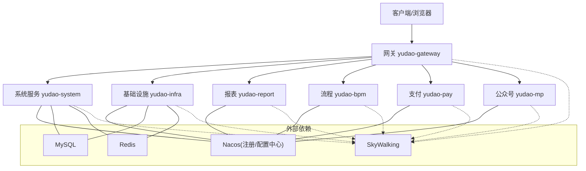
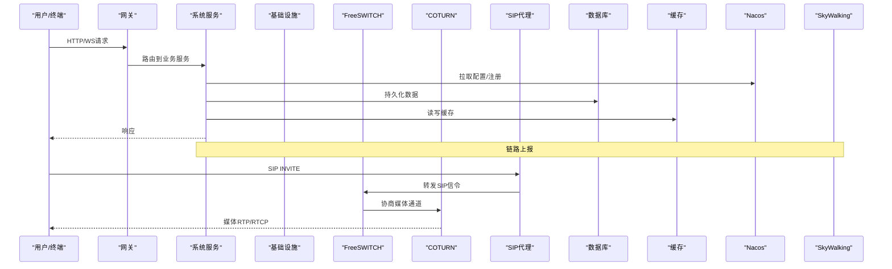
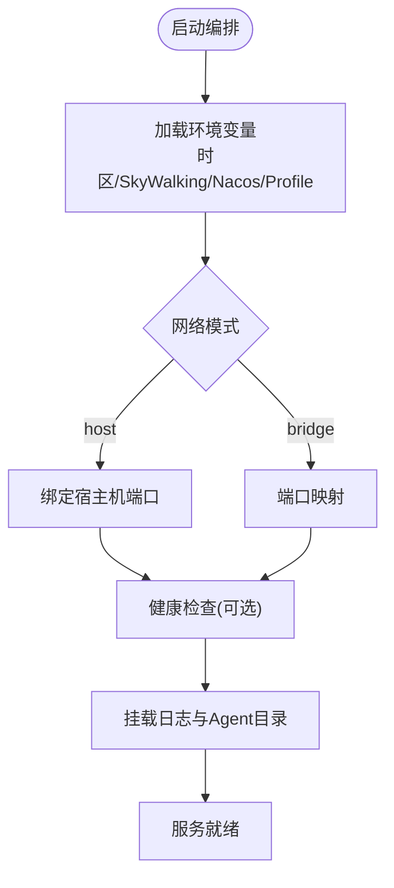
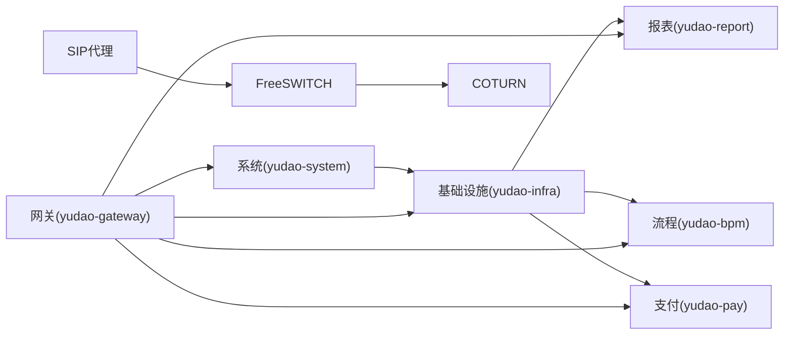

# 部署配置

<cite>
**本文引用的文件**
- [docker-compose.yml](file://yudao-cloud/script/docker/docker-compose.yml)
- [README.md](file://yudao-cloud/README.md)
- [coturn安装和配置参考.md](file://yudao-cloud/yudao-module-cc/doc/coturn服务/coturn安装和配置参考.md)
- [freeswitch部署脚本1.py](file://yudao-cloud/yudao-module-cc/doc/freeswitch服务/freeswitch部署脚本1.py)
- [freeswitch部署脚本2-用于集群部署-修改了主要端口.py](file://yudao-cloud/yudao-module-cc/doc/freeswitch服务/freeswitch部署脚本2-用于集群部署-修改了主要端口.py)
- [服务器公网ip回环问题/云服务器无法ping自有公网ip解决方案.md](file://yudao-cloud/yudao-module-cc/doc/服务器公网ip回环问题/云服务器无法ping自有公网ip解决方案.md)
</cite>

## 目录
1. [简介](#简介)
2. [项目结构](#项目结构)
3. [核心组件](#核心组件)
4. [架构总览](#架构总览)
5. [详细组件分析](#详细组件分析)
6. [依赖关系分析](#依赖关系分析)
7. [性能与资源调优](#性能与资源调优)
8. [故障排查指南](#故障排查指南)
9. [结论](#结论)
10. [附录](#附录)

## 简介
本指南面向生产环境，提供从容器化编排、环境变量与中间件配置，到COTURN、FreeSWITCH与SIP代理的完整部署说明；涵盖网络与防火墙策略、负载均衡、性能调优、监控指标、多环境配置管理与热更新机制。内容基于仓库中的Docker Compose编排、呼叫中心模块文档与脚本进行整理，确保可落地执行。

## 项目结构
- 微服务应用通过 Docker Compose 编排启动，包含网关、系统、基础设施、报表、流程、支付、公众号等模块。
- 呼叫中心相关能力（COTURN、FreeSWITCH、SIP代理）位于 yudao-module-cc/doc 下，提供部署脚本与参考文档。
- 平台技术栈与监控链路（Nacos、SkyWalking、Spring Cloud Gateway、Redis、MySQL等）在 README 中明确。

图表来源
- [docker-compose.yml:3-162](file://yudao-cloud/script/docker/docker-compose.yml#L3-L162)
- [README.md:327-375](file://yudao-cloud/README.md#L327-L375)

章节来源
- [docker-compose.yml:3-162](file://yudao-cloud/script/docker/docker-compose.yml#L3-L162)
- [README.md:327-375](file://yudao-cloud/README.md#L327-L375)

## 核心组件
- 网关与服务：yudao-gateway、yudao-system、yudao-infra、yudao-report、yudao-bpm、yudao-pay、yudao-mp。
- 中间件与支撑：Nacos（注册/配置）、MySQL、Redis、SkyWalking（链路追踪）。
- 呼叫中心：COTURN（NAT穿透）、FreeSWITCH（媒体会话）、SIP代理（SIP信令路由）。

章节来源
- [docker-compose.yml:3-162](file://yudao-cloud/script/docker/docker-compose.yml#L3-L162)
- [README.md:327-375](file://yudao-cloud/README.md#L327-L375)

## 架构总览
生产环境建议采用“网关统一入口 + 微服务按域拆分 + 中间件集中部署”的模式。所有Java服务通过环境变量接入Nacos获取配置并注册发现，日志与链路追踪通过SkyWalking采集。呼叫中心侧通过COTURN暴露STUN/TURN端口，FreeSWITCH承载媒体流，SIP代理负责SIP信令转发与路由。

图表来源
- [docker-compose.yml:3-162](file://yudao-cloud/script/docker/docker-compose.yml#L3-L162)
- [README.md:327-375](file://yudao-cloud/README.md#L327-L375)

## 详细组件分析

### 容器化与服务编排
- 使用 docker-compose 编排各微服务，统一设置时区、SkyWalking探针、运行环境与Nacos地址/命名空间。
- 关键要点
  - 时区：TZ=Asia/Shanghai
  - SkyWalking：注入javaagent，配置采集后端地址与忽略路径
  - 运行环境：SPRING_PROFILES_ACTIVE
  - 注册/配置中心：SPRING_CLOUD_NACOS_* 系列变量
  - 健康检查：部分服务定义健康检查端点
  - 网络模式：host模式便于直接绑定主机端口（适合网关与媒体服务）
  - 卷挂载：日志目录与SkyWalking agent目录持久化

图表来源
- [docker-compose.yml:3-162](file://yudao-cloud/script/docker/docker-compose.yml#L3-L162)

章节来源
- [docker-compose.yml:3-162](file://yudao-cloud/script/docker/docker-compose.yml#L3-L162)

### 环境变量与中间件配置
- 环境变量
  - 运行时：TZ、JAVA_TOOL_OPTIONS（SkyWalking探针）、SPRING_PROFILES_ACTIVE
  - 注册/配置中心：SPRING_CLOUD_NACOS_SERVER_ADDR、SPRING_CLOUD_NACOS_CONFIG_SERVER_ADDR、命名空间
  - 链路追踪：SW_AGENT_NAME、SW_AGENT_TRACE_IGNORE_PATH、SW_AGENT_COLLECTOR_BACKEND_SERVICES
- 中间件
  - Nacos：作为注册与配置中心，需提前部署并开放对应端口
  - MySQL：为业务与基础设施模块提供持久化存储
  - Redis：缓存与会话、分布式锁等
  - SkyWalking：收集APM指标与链路

章节来源
- [docker-compose.yml:6-16](file://yudao-cloud/script/docker/docker-compose.yml#L6-L16)
- [docker-compose.yml:25-35](file://yudao-cloud/script/docker/docker-compose.yml#L25-L35)
- [docker-compose.yml:50-60](file://yudao-cloud/script/docker/docker-compose.yml#L50-L60)
- [README.md:327-375](file://yudao-cloud/README.md#L327-L375)

### COTURN服务器配置
- 目标：为WebRTC/音视频提供NAT穿透，暴露STUN/TURN端口，支持认证与配额限制。
- 部署要点
  - 安装与基础配置参考文档
  - 开启UDP/TCP必要端口（如3478/5349），并在云安全组放行
  - 配置静态密钥或动态令牌认证
  - 根据并发规模调整最大连接数、带宽与日志级别
  - 结合FreeSWITCH与SIP代理的媒体协商参数，确保RTP/RTCP可达

章节来源
- [coturn安装和配置参考.md](file://yudao-cloud/yudao-module-cc/doc/coturn服务/coturn安装和配置参考.md)

### FreeSWITCH服务配置
- 目标：承载媒体会话、编解码、IVR、录音等。
- 部署要点
  - 使用提供的部署脚本快速拉起实例
  - 集群部署时注意主端口与媒体端口规划，避免冲突
  - 合理配置SIP Profile、Channel数量、编解码器优先级
  - 与COTURN集成，确保媒体流经TURN中继
  - 日志与统计：启用必要的mod_stats与事件订阅

章节来源
- [freeswitch部署脚本1.py](file://yudao-cloud/yudao-module-cc/doc/freeswitch服务/freeswitch部署脚本1.py)
- [freeswitch部署脚本2-用于集群部署-修改了主要端口.py](file://yudao-cloud/yudao-module-cc/doc/freeswitch服务/freeswitch部署脚本2-用于集群部署-修改了主要端口.py)

### SIP代理配置
- 目标：对SIP信令进行路由、鉴权、拓扑隐藏与负载均衡。
- 部署要点
  - 与FreeSWITCH对接SIP Profile/Domain
  - 配置ACL白名单、SIP鉴权、防重放与限流
  - 多节点部署时配合上游负载均衡器（如Nginx/LVS）做TCP/UDP转发
  - 与COTURN协同，保证后续媒体通道建立

章节来源
- [README.md:327-375](file://yudao-cloud/README.md#L327-L375)

### 网络配置、防火墙与安全组
- 端口开放
  - 网关HTTP/WS：80/443（或自定义）
  - 各微服务内部端口：按compose定义
  - COTURN：3478(TCP/UDP)、5349(TCP/UDP)
  - FreeSWITCH：SIP(5060/5061)、媒体(RTP范围)
- 防火墙/安全组
  - 仅开放必要端口，限制来源IP段
  - 内网服务间通信走私有网段
- 公网IP回环问题
  - 若出现公网IP回环导致连通性问题，参考解决方案文档处理路由与NAT反射

章节来源
- [docker-compose.yml:3-162](file://yudao-cloud/script/docker/docker-compose.yml#L3-L162)
- [服务器公网ip回环问题/云服务器无法ping自有公网ip解决方案.md](file://yudao-cloud/yudao-module-cc/doc/服务器公网ip回环问题/云服务器无法ping自有公网ip解决方案.md)

### 负载均衡与高可用
- 网关层：可在网关前部署反向代理（Nginx/云LB），实现HTTPS终止与健康检查
- 服务层：通过Nacos服务发现+客户端负载均衡
- 媒体面：COTURN与FreeSWITCH多副本部署，结合上游LB做TCP/UDP转发与会话保持

章节来源
- [docker-compose.yml:3-162](file://yudao-cloud/script/docker/docker-compose.yml#L3-L162)
- [README.md:327-375](file://yudao-cloud/README.md#L327-L375)

### 监控与可观测性
- 链路追踪：SkyWalking Agent随每个服务启动，上报至后端
- 指标与日志：结合Spring Boot Actuator与日志落盘（挂载卷）
- 健康检查：Compose中对关键服务定义健康检查，保障编排稳定性

章节来源
- [docker-compose.yml:6-16](file://yudao-cloud/script/docker/docker-compose.yml#L6-L16)
- [docker-compose.yml:39-44](file://yudao-cloud/script/docker/docker-compose.yml#L39-L44)
- [README.md:327-375](file://yudao-cloud/README.md#L327-L375)

### 多环境配置管理、配置中心与热更新
- 多环境：通过 SPRING_PROFILES_ACTIVE 切换不同环境配置
- 配置中心：Nacos统一管理配置，支持命名空间隔离
- 热更新：借助Nacos配置推送能力，无需重启即可生效（遵循各模块热更新支持情况）

章节来源
- [docker-compose.yml:6-16](file://yudao-cloud/script/docker/docker-compose.yml#L6-L16)
- [docker-compose.yml:25-35](file://yudao-cloud/script/docker/docker-compose.yml#L25-L35)
- [README.md:327-375](file://yudao-cloud/README.md#L327-L375)

## 依赖关系分析
- 服务间依赖：基础设施先于其他模块就绪，报表、流程、支付等模块依赖基础设施
- 外部依赖：Nacos、MySQL、Redis、SkyWalking
- 呼叫中心依赖：SIP代理与FreeSWITCH依赖COTURN的NAT穿透能力

图表来源
- [docker-compose.yml:72-96](file://yudao-cloud/script/docker/docker-compose.yml#L72-L96)
- [docker-compose.yml:97-118](file://yudao-cloud/script/docker/docker-compose.yml#L97-L118)
- [docker-compose.yml:119-140](file://yudao-cloud/script/docker/docker-compose.yml#L119-L140)

章节来源
- [docker-compose.yml:72-162](file://yudao-cloud/script/docker/docker-compose.yml#L72-L162)

## 性能与资源调优
- JVM与探针
  - 合理设置JVM堆大小与GC参数（依据容器资源限制）
  - SkyWalking采样率与忽略路径按需调整
- 数据库
  - 连接池大小、慢SQL监控、索引优化
- 缓存
  - Redis内存上限、淘汰策略、热点Key治理
- 媒体面
  - FreeSWITCH Channel与编解码器选择
  - COTURN并发连接数、带宽限制与日志级别
- 网络
  - 关闭不必要的NAT反射，减少往返开销
  - 合理划分RTP端口范围，避免与系统端口冲突

[本节为通用指导，不直接分析具体文件]

## 故障排查指南
- 启动失败
  - 检查Nacos连通性与命名空间是否正确
  - 确认端口未被占用（host模式下尤为关键）
  - 查看容器日志与挂载的日志目录
- 媒体不通
  - 核对COTURN端口是否放行，TURN认证是否生效
  - 检查FreeSWITCH媒体端口范围与防火墙规则
  - 验证公网IP回环问题是否影响连通
- 链路不可见
  - 确认SkyWalking后端地址与探针注入正确
  - 检查忽略路径是否误屏蔽关键调用

章节来源
- [docker-compose.yml:39-44](file://yudao-cloud/script/docker/docker-compose.yml#L39-L44)
- [服务器公网ip回环问题/云服务器无法ping自有公网ip解决方案.md](file://yudao-cloud/yudao-module-cc/doc/服务器公网ip回环问题/云服务器无法ping自有公网ip解决方案.md)

## 结论
通过统一的容器编排、集中的配置中心与完善的监控体系，本项目可实现稳定可靠的生产部署。呼叫中心侧以COTURN+FreeSWITCH+SIP代理构建高可用的音视频与信令通道。建议在上线前完成网络与安全策略校验、容量评估与压测，并制定回滚与应急预案。

## 附录
- 常用命令
  - 启动：docker compose up -d
  - 查看状态：docker compose ps
  - 查看日志：docker compose logs -f <service>
- 参考清单
  - 环境变量模板：参考compose中的环境变量键名
  - 健康检查端点：按compose中定义的探测URL访问
  - 监控面板：SkyWalking UI与Spring Boot Admin（如启用）

[本节为补充信息，不直接分析具体文件]