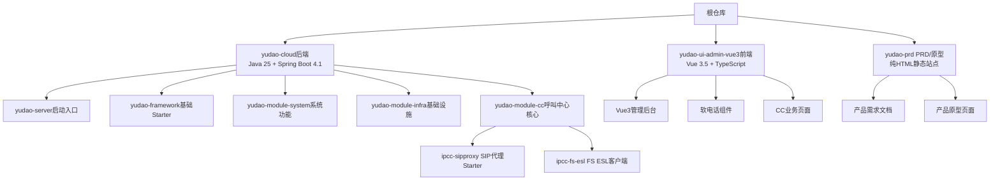
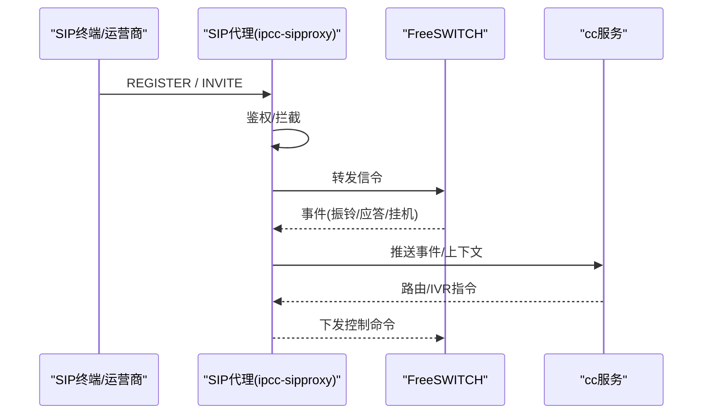
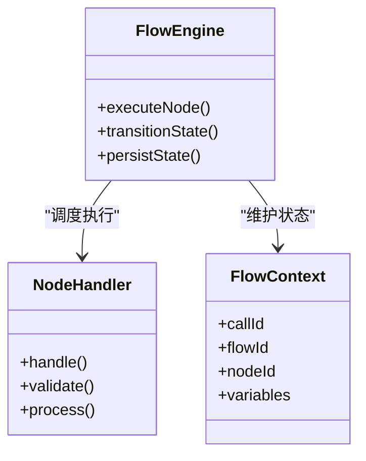
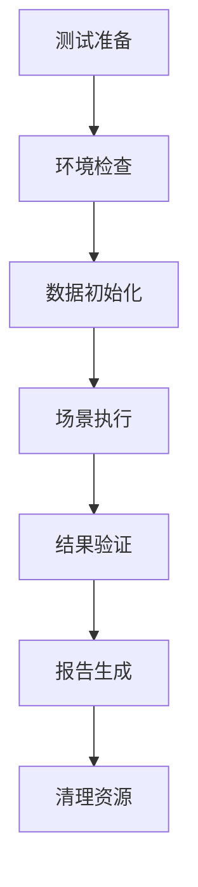

# 项目概述

<cite>
**本文引用的文件**
- [README.md](file://README.md)
- [README.en.md](file://README.en.md)
- [AGENTS.md](file://AGENTS.md)
- [yudao-cloud/pom.xml](file://yudao-cloud/pom.xml)
- [yudao-module-cc/pom.xml](file://yudao-cloud/yudao-module-cc/pom.xml)
- [FlowAiHandler.java](file://yudao-cloud/yudao-module-cc/yudao-module-cc-server/src/main/java/cn/iocoder/yudao/module/cc/ivr/handler/node/FlowAiHandler.java)
- [cc_concurrent_test.py](file://yudao-cloud/yudao-module-cc/doc/test-all/cc_concurrent_test.py)
- [ipcc-fs-esl/AGENTS.md](file://yudao-cloud/yudao-module-cc/ipcc-fs-esl/AGENTS.md)
- [ipcc-sipproxy/AGENTS.md](file://yudao-cloud/yudao-module-cc/ipcc-sipproxy/AGENTS.md)
</cite>

## 更新摘要
**变更内容**

- 新增了完整的英文文档套件（README.en.md），提供国际化支持
- 增强了中文文档的功能描述，涵盖可视化IVR流程引擎、坐席管理、智能外呼、SIP代理架构和AI对话能力
- 更新了技术栈信息，反映最新的Spring Boot 4.1 + Java 25版本
- 完善了开发环境配置和部署说明
- 增加了端到端测试套件和并发压测能力的详细说明

## 目录
1. [简介](#简介)
2. [核心特性](#核心特性)
3. [项目结构](#项目结构)
4. [技术架构](#技术架构)
5. [核心组件详解](#核心组件详解)
6. [开发环境搭建](#开发环境搭建)
7. [部署与运维](#部署与运维)
8. [测试与质量保证](#测试与质量保证)
9. [版本与许可](#版本与许可)
10. [总结](#总结)

## 简介

本项目是基于 **yudao-cloud**（Spring Boot 4.1 + Java 25 + Spring Cloud 2025.1 + Maven 多模块）二次开发的企业级智能呼叫中心系统，融合了
**FreeSWITCH** 通信能力与 **可视化 IVR 流程编排**。系统提供 SIP 软电话接入、坐席管理、智能外呼、AI 语音对话等全场景解决方案，100%
源码开放，支持私有化部署，数据完全自主可控。

核心价值主张：

- **企业级呼叫中心平台**：提供从SIP接入到通话记录的完整业务闭环
- **可视化流程编排**：拖拽式IVR设计器，降低业务流程配置复杂度
- **AI驱动的智能交互**：集成自研AI模块，实现多轮语音对话能力
- **高可用架构**：支持集群部署、负载均衡和故障转移
- **开源生态**：社区版免费开源，企业版提供完整源码和技术支持

## 核心特性

### 可视化 IVR 流程引擎

- **状态机驱动**：基于Redis持久化的流程状态管理，确保会话可靠性
- **拖拽式编排**：9+节点类型（start/condition/playback/receive/transfer/hangup/satisfaction/method）
- **灵活扩展**：支持自定义节点处理器和业务逻辑扩展

### 坐席与通话管理

- **坐席状态管理**：实时在线状态监控、技能组分配、工作状态切换
- **全程自动录音**：通话质量保障、质检评分、绩效统计
- **SIP软电话**：浏览器原生WebRTC通话，无需安装插件
- **来电弹屏**：客户信息自动弹出、历史记录查看

### 智能外呼系统

- **批量外呼任务**：支持CSV导入、号码去重、外呼策略配置
- **预测式外呼**：智能算法优化坐席利用率，减少空闲等待时间
- **AI语音机器人**：自动化外呼、意图识别、智能应答
- **黑名单管理**：合规性控制、用户偏好设置

### SIP代理与通信架构

- **B2BUA架构**：SIP over WebSocket背靠背用户代理
- **13个扩展点**：鉴权、拦截、路由、消息处理等能力解耦
- **集群广播**：多实例间会话状态同步和负载均衡

### AI对话与全场景测试

- **多轮语音交互**：集成yudao-module-ai实现自然语言对话
- **中断词匹配**：支持包含匹配、超时控制、轮次限制
- **端到端测试**：覆盖9大业务场景的自动化测试套件
- **并发压测**：分级并发呼入测试，验证系统稳定性

## 项目结构

仓库采用 **三子模块**组织方式，每个子模块都是独立的Git仓库，支持独立开发和部署：

| 目录                   | 说明                                                 | 技术栈                                              |
|------------------------|------------------------------------------------------|-----------------------------------------------------|
| `yudao-cloud/`         | 后端微服务（含自定义呼叫中心模块 `yudao-module-cc`） | Java 25 + Spring Boot 4.1 + Spring Cloud 2025.1     |
| `yudao-ui-admin-vue3/` | 管理后台前端                                         | Vue 3.5 + TypeScript 6 + Vite 8 + Element Plus 2.13 |
| `yudao-prd/`           | 产品需求文档静态站点                                 | Vue 3 CDN + Element Plus                            |



**章节来源**
- [AGENTS.md:5-15](file://AGENTS.md#L5-L15)
- [README.md:13-17](file://README.md#L13-L17)

## 技术架构

### 整体架构设计

系统采用 **单体服务 + 模块化**的架构形态，通过Maven多模块实现职责分离：

```mermaid
graph TB
subgraph "前端层"
FE["Vue3 管理后台<br/>软电话组件"]
end
subgraph "后端单体"
Srv["yudao-server<br/>聚合启动容器"]
Sys["system/infra 模块"]
CC["cc 模块<br/>呼叫中心核心"]
SIP["ipcc-sipproxy<br/>SIP代理B2BUA"]
ESL["ipcc-fs-esl<br/>ESL客户端"]
end
subgraph "基础设施层"
DB["MySQL"]
Cache["Redis"]
FS["FreeSWITCH"]
end
FE --> Srv
Srv --> Sys
Srv --> CC
CC --> SIP
CC --> ESL
CC --> DB
CC --> Cache
SIP < --> FS
ESL < --> FS
```

### 呼叫链路架构

完整的呼叫处理链路涉及多个组件协作：



**章节来源**

- [AGENTS.md:68-71](file://AGENTS.md#L68-L71)

## 核心组件详解

### 呼叫中心模块（yudao-module-cc）

呼叫中心模块是系统的核心业务域，包含以下关键子域：

- **autocall（外呼）**：批量外呼任务、预测式外呼、AI语音机器人
- **call（呼叫主数据）**：呼叫记录、通话详情、录音管理
- **esl（FS事件处理）**：FreeSWITCH事件监听、通道管理、状态同步
- **flow（IVR流程）**：可视化流程编排、节点执行引擎、状态持久化
- **fs（FS配置）**：网关配置、路由规则、拨号计划
- **sipproxy（SIP接入）**：SIP代理、会话管理、集群广播
- **sys（系统配置）**：字典管理、参数配置、权限控制
- **tts（语音合成）**：文本转语音、流式播放、音频处理
- **websocket（实时推送）**：WebSocket总线、消息分发、状态同步

### IVR流程引擎

IVR流程引擎采用状态机驱动的设计模式：



**章节来源**

- [AGENTS.md:72-75](file://AGENTS.md#L72-L75)

### AI对话节点

AI对话节点实现了完整的多轮语音交互能力：

- **ASR流式识别**：实时语音转文字，支持中断词检测
- **AI对话调用**：集成yudao-module-ai，保持对话上下文
- **TTS流式播报**：AI回复实时语音合成播放
- **容错机制**：超时控制、轮次限制、异常降级

**章节来源**

- [FlowAiHandler.java:37-55](file://yudao-cloud/yudao-module-cc/yudao-module-cc-server/src/main/java/cn/iocoder/yudao/module/cc/ivr/handler/node/FlowAiHandler.java#L37-L55)

### SIP代理（ipcc-sipproxy）

SIP代理提供完整的SIP信令处理能力：

- **B2BUA架构**：背靠背用户代理，隔离两端通信
- **扩展点机制**：13个SPI接口实现功能解耦
- **集群支持**：多实例间会话状态同步
- **安全控制**：IP白名单、认证鉴权、频率限制

**章节来源**
- [ipcc-sipproxy/AGENTS.md:3-62](file://yudao-cloud/yudao-module-cc/ipcc-sipproxy/AGENTS.md#L3-L62)

### FreeSWITCH ESL客户端（ipcc-fs-esl）

ESL客户端提供了FreeSWITCH事件处理能力：

- **Netty重写**：高性能异步I/O处理
- **事件路由**：注解驱动的事件处理器注册
- **分布式协调**：基于Redis的监听权竞争
- **连接管理**：单连接和多节点连接池

**章节来源**
- [ipcc-fs-esl/AGENTS.md:3-50](file://yudao-cloud/yudao-module-cc/ipcc-fs-esl/AGENTS.md#L3-L50)

## 开发环境搭建

### 环境要求

- **JDK 25**：必须使用JDK 25进行编译和运行
- **Node.js ≥ 20.19**：前端开发环境
- **pnpm ≥ 8.6**：包管理器
- **MySQL**：数据库存储
- **Redis**：缓存和会话存储
- **FreeSWITCH**：通信服务器

### 项目初始化

```bash
# 克隆主项目
git clone https://gitee.com/ipcc-ai/open-ipcc.git
cd open-ipcc

# 初始化子模块
git submodule update --init --recursive

# 构建后端
cd yudao-cloud && mvn clean install -DskipTests

# 安装前端依赖
cd ../yudao-ui-admin-vue3 && pnpm install

# 启动前端开发服务器
pnpm dev
```

### IDE配置

- **Multi-Project Workspace插件**：同时打开前后端项目
- **JDK 25配置**：确保IDE使用正确的JDK版本
- **Maven配置**：正确识别多模块项目结构

**章节来源**

- [AGENTS.md:19-49](file://AGENTS.md#L19-L49)
- [README.md:50-72](file://README.md#L50-L72)

## 部署与运维

### 生产环境部署

- **容器化部署**：支持Docker和Kubernetes部署
- **集群部署**：多实例负载均衡和故障转移
- **配置管理**：环境变量注入、配置文件管理
- **监控告警**：应用监控、性能指标、错误日志

### 运维工具

- **健康检查**：服务可用性监控
- **日志收集**：集中式日志管理和分析
- **性能监控**：关键指标采集和告警
- **备份恢复**：数据备份和灾难恢复

## 测试与质量保证

### 端到端测试套件

系统提供了完整的测试框架，覆盖9大业务场景：



### 并发压测能力

- **分级压测**：支持10/20/30/50/80/100级并发测试
- **场景覆盖**：呼入、呼出、IVR、坐席管理等场景
- **指标收集**：成功率、响应时间、资源使用情况
- **问题定位**：详细的错误日志和性能分析

**章节来源**

- [cc_concurrent_test.py:1-25](file://yudao-cloud/yudao-module-cc/doc/test-all/cc_concurrent_test.py#L1-L25)

## 版本与许可

### 版本说明

- **社区版**（免费开源）：包含完整的呼叫中心流程、可视化IVR、坐席管理与通话记录、端到端测试脚本
- **企业版**（面议）：社区版全部功能 + AI对话节点、自动外呼、多租户架构、集群部署、源码交付与一对一技术支持

### 许可证

- **社区版**：基于 Mulan PSL v2 开源协议
- **企业版**：一次性买断、源码交付、可私有化部署

## 总结

本项目以 yudao-cloud 为基础，将呼叫中心的核心能力封装为可复用的模块与 Starter，配合 Vue 管理后台与 PRD
文档，形成"前后端一体、产研协同"的交付体系。通过 SIP 代理与 ESL 事件驱动，实现了高内聚、可扩展的呼叫中心平台，适合快速搭建企业级客服、营销外呼、智能语音等场景。

三个独立 Git 子模块的设计使得各组件可以独立演进和部署，提高了系统的可维护性和扩展性。完善的测试体系和并发压测能力确保了系统的稳定性和可靠性，为企业级应用提供了坚实的技术基础。

**章节来源**

- [README.md:13-27](file://README.md#L13-L27)
- [README.en.md:13-33](file://README.en.md#L13-L33)