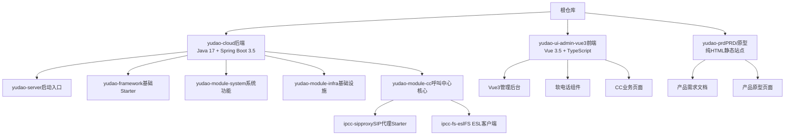
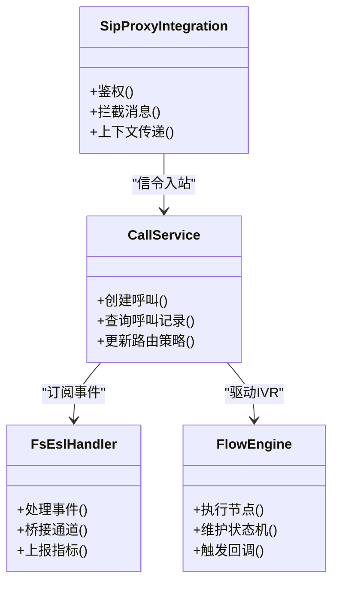
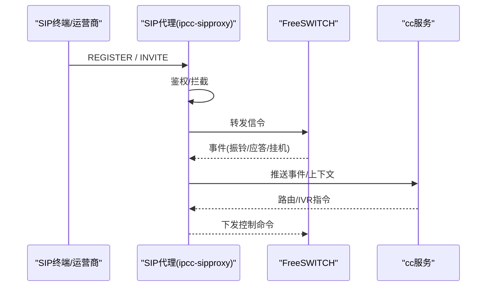
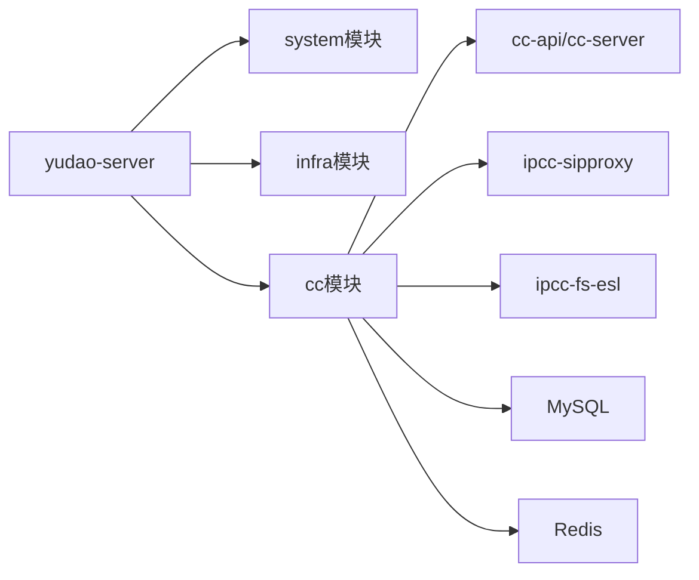

# 项目概述

<cite>
**本文引用的文件**
- [AGENTS.md](file://AGENTS.md)
- [README.md](file://README.md)
- [yudao-cloud/README.md](file://yudao-cloud/README.md)
- [pom.xml](file://yudao-cloud/pom.xml)
- [yudao-module-cc/pom.xml](file://yudao-cloud/yudao-module-cc/pom.xml)
- [系统数据初始化.sql](file://yudao-cloud/yudao-module-cc/doc/sql/系统数据初始化.sql)
- [package.json](file://yudao-ui-admin-vue3/package.json)
- [ipcc-fs-esl/AGENTS.md](file://yudao-cloud/yudao-module-cc/ipcc-fs-esl/AGENTS.md)
- [ipcc-sipproxy/AGENTS.md](file://yudao-cloud/yudao-module-cc/ipcc-sipproxy/AGENTS.md)
- [yudao-prd/AGENTS.md](file://yudao-prd/AGENTS.md)
</cite>

## 更新摘要
**变更内容**
- 更新了项目结构说明，强调三个独立Git子模块的架构设计
- 增强了技术栈描述，包含最新的技术版本和组件信息
- 完善了呼叫中心核心模块的详细架构说明
- 添加了各子模块独立的开发指南和约束条件
- 更新了部署和构建流程，反映最新的模块化架构

## 目录
1. [简介](#简介)
2. [项目结构](#项目结构)
3. [核心组件](#核心组件)
4. [架构总览](#架构总览)
5. [详细组件分析](#详细组件分析)
6. [依赖关系分析](#依赖关系分析)
7. [性能与可靠性](#性能与可靠性)
8. [故障排查指南](#故障排查指南)
9. [结论](#结论)
10. [附录](#附录)

## 简介
本项目是基于 yudao-cloud 二次开发的**企业级呼叫中心系统**，采用三个独立 Git 仓库（git submodule）组织方式，各自独立提交与分支管理。系统围绕"语音通信 + 业务编排 + 管理后台"构建完整的企业级呼叫中心解决方案，通过 AI 全栈开发设置提升研发效率。核心价值主张包括：
- **快速落地呼叫中心**：提供从 SIP 接入、号码路由、IVR 到通话记录的全链路能力
- **高内聚低耦合**：以模块划分职责，通过 API 边界解耦业务域
- **可观测与可运维**：结合 ESL 事件、Redis 状态机、日志与监控，保障生产稳定性
- **多租户与权限**：基于框架的多租户与细粒度权限控制，满足企业合规需求

## 项目结构
仓库采用**三子模块**组织方式，每个子模块都是独立的 Git 仓库，支持独立开发和部署：

| 目录 | 说明 | 技术栈 |
|---|---|---|
| `yudao-cloud/` | 后端微服务（含自定义呼叫中心模块 `yudao-module-cc`） | Java 17 + Spring Boot 3.5 + Maven 多模块 |
| `yudao-ui-admin-vue3/` | 管理后台前端 | Vue 3.5 + TypeScript + Vite 8 + Element Plus + pnpm |
| `yudao-prd/` | 产品需求文档静态站点（纯 HTML，无构建） | Vue 3 CDN + Element Plus |



**章节来源**
- [AGENTS.md:5-15](file://AGENTS.md#L5-L15)
- [README.md:1-29](file://README.md#L1-L29)

## 核心组件
- **启动容器**：yudao-server（单体模式唯一入口，禁用 Nacos）
- **基础能力**：yudao-framework（web、security、mybatis、redis、mq、job、websocket 等 Starter）
- **系统能力**：yudao-module-system（用户、角色、菜单、租户、字典等）
- **基础设施**：yudao-module-infra（代码生成、文件、定时任务、API 日志等）
- **呼叫中心**：yudao-module-cc（call、fs、esl、flow、sipproxy、sys、tts、ivr、websocket 等子域）
- **SIP 代理**：ipcc-sipproxy（SPI 可扩展的 SIP 代理 Starter，13个扩展点接口）
- **FreeSWITCH 事件**：ipcc-fs-esl（Netty 实现的 ESL 客户端，支持监控/拦截/指标/路由）

**章节来源**
- [AGENTS.md:50-67](file://AGENTS.md#L50-L67)
- [yudao-module-cc/pom.xml:10-15](file://yudao-cloud/yudao-module-cc/pom.xml#L10-L15)

## 架构总览
系统采用**单体服务 + 模块化**的架构形态，前端通过 REST/WebSocket 与后端交互；SIP 信令经 ipcc-sipproxy 接入，ESL 事件由 ipcc-fs-esl 采集并驱动 IVR/路由/统计等业务逻辑；数据库使用 MySQL，缓存使用 Redis，消息与队列在单体场景下通过内置能力实现。

```mermaid
graph TB
subgraph "前端层"
FE["Vue3 管理后台<br/>软电话组件"]
end
subgraph "后端单体"
Srv["yudao-server<br/>聚合启动容器"]
Sys["system/infra 模块"]
CC["cc 模块<br/>呼叫中心核心"]
SIP["ipcc-sipproxy<br/>SIP代理B2BUA"]
ESL["ipcc-fs-esl<br/>ESL客户端"]
end
subgraph "基础设施层"
DB["MySQL"]
Cache["Redis"]
FS["FreeSWITCH"]
end
FE --> Srv
Srv --> Sys
Srv --> CC
CC --> SIP
CC --> ESL
CC --> DB
CC --> Cache
SIP < --> FS
ESL < --> FS
```

## 详细组件分析

### 呼叫中心模块（yudao-module-cc）
- **子域划分**：autocall（外呼）、call（呼叫主数据与记录）、esl（FS 事件处理）、flow（IVR 流程）、fs（FS 配置与网关）、sipproxy（SIP 接入）、sys（系统配置与字典）、tts（语音合成）、websocket（实时推送）
- **关键包**：esl/handler（事件处理器）、ivr/handler（节点处理器）、sipproxy/integration（SPI 扩展点）、service（领域服务）、controller/admin（管理端接口）
- **数据模型**：按子域分表，前缀建议 call_/fs_/sys_/flow_/sipproxy_ 等；字典集中管理枚举与展示值



**章节来源**
- [AGENTS.md:54-67](file://AGENTS.md#L54-L67)

### SIP 代理（ipcc-sipproxy）
- **定位**：完全独立的 SIP 代理服务（B2BUA），提供 SIP over WebSocket、B2BUA 信令转发、会话管理、集群广播能力
- **扩展点**：13个扩展点接口与父程序解耦，包括 AgentInfoProvider、FsNodeProvider、GatewayProvider、MessageSourceIdentifier、OutboundGatewayRewriter、SdpProcessor、IpWhitelist、SipRateLimiter、SipAuthenticationProvider、WsHandshakeAuthenticator、AuthenticationCallback、SipMessageInterceptor、TraceContext、SipMessageTransport
- **典型流程**：SIP 注册/INVITE → 鉴权 → 路由至 FS → 事件回传 → 业务编排



**章节来源**
- [ipcc-sipproxy/AGENTS.md:3-62](file://yudao-cloud/yudao-module-cc/ipcc-sipproxy/AGENTS.md#L3-L62)

### FreeSWITCH ESL 客户端（ipcc-fs-esl）
- **定位**：独立的 FreeSWITCH ESL 客户端库，基于 Netty 4.x 重写，完全替代第三方库，提供 ESL 连接管理、事件路由、分布式监听权协调能力
- **分层架构**：
  - ① 基础设施层：配置、异常、指标
  - ② 传输层（Netty Pipeline）：帧解码器、编码器、协议处理器
  - ③ 连接管理层：单连接、多节点连接管理
  - ④ 事件路由层：事件处理器、注解、拦截器
  - ⑤ 分布式协调层：基于 Redis 的监听权竞争
- **关键点**：bgapi 使用同步消息收发；事件处理采用工厂+处理器模式；资源需正确释放；Redis 键设置 TTL

```mermaid
flowchart TD
Start(["连接FS"]) --> Sub["订阅事件"]
Sub --> Handle{"事件类型?"}
Handle --> |呼叫事件| Bridge["桥接/放音/转接"]
Handle --> |状态事件| Update["更新状态/指标"]
Handle --> |错误事件| Log["记录日志/告警"]
Bridge --> End(["完成/挂断"])
Update --> End
Log --> End
```



**章节来源**
- [ipcc-fs-esl/AGENTS.md:3-50](file://yudao-cloud/yudao-module-cc/ipcc-fs-esl/AGENTS.md#L3-L50)

### 管理后台（yudao-ui-admin-vue3）
- **技术栈**：Vue 3.5 + Vite 8 + Element Plus + TypeScript + Pinia + UnoCSS
- **约定**：API 基地址与环境变量分离；页面与接口按模块组织；统一错误处理与类型定义
- **脚本**：dev/build/lint/ts-check 等标准化命令
- **CC相关**：集中在 `src/views/cc/` 与 `src/api/cc/`（ivr、sysagent、autocalltask、callrecord、sipproxygateway 等）

**章节来源**
- [package.json:1-159](file://yudao-ui-admin-vue3/package.json#L1-L159)
- [AGENTS.md:68-72](file://AGENTS.md#L68-L72)

## 依赖关系分析
- **后端模块依赖**：yudao-server 聚合 system、infra、cc；cc 内部包含 api/server/sipproxy/fs-esl
- **运行时依赖**：MySQL、Redis、可选 MQ/监控（单体默认简化）
- **前端依赖**：Element Plus、Axios、Pinia、Vite 生态工具链
- **第三方库**：JAIN-SIP 1.2.1.4（统一版本避免跨版本 AbstractMethodError）



**章节来源**
- [pom.xml:10-33](file://yudao-cloud/pom.xml#L10-L33)
- [AGENTS.md:73-79](file://AGENTS.md#L73-L79)

## 性能与可靠性
- **事件驱动**：通过 ESL 事件驱动 IVR/路由/统计，降低阻塞
- **缓存与状态**：Redis 承载会话与状态机，注意 TTL 与键设计
- **资源管理**：Netty Channel、数据库连接、文件流等资源必须及时释放
- **并发与线程**：避免 new Thread，使用线程池或异步注解
- **可观测性**：结合日志、指标、链路追踪（可按需开启）
- **心跳机制**：sipproxy WebSocket 空闲超时 90s，JsSIP 客户端 OPTIONS 心跳间隔必须小于该值

## 故障排查指南
- **常见问题定位**：
  - 前端无法访问后端：检查环境变量与跨域配置
  - SIP 注册失败：核对 SIP 代理配置与 FS 端口/协议
  - ESL 事件丢失：检查连接状态、订阅与事件过滤
  - 数据库初始化：确保执行系统表与 cc 模块 SQL
- **建议步骤**：
  - 查看应用日志与 FS 日志
  - 检查 Redis 键是否存在与是否过期
  - 使用测试脚本验证 SIP/ESL 连通性
  - 逐步缩小范围：前端→网关→服务→FS
- **关键约束**：
  - fs-esl 仅支持 Inbound 模式
  - WebSocket sender-type 一致性要求
  - JAIN-SIP 版本必须统一为 1.2.1.4

**章节来源**
- [系统数据初始化.sql:1-200](file://yudao-cloud/yudao-module-cc/doc/sql/系统数据初始化.sql#L1-L200)
- [AGENTS.md:73-79](file://AGENTS.md#L73-L79)

## 结论
本项目以 yudao-cloud 为基础，将呼叫中心的核心能力封装为可复用的模块与 Starter，配合 Vue 管理后台与 PRD 文档，形成"前后端一体、产研协同"的交付体系。通过 SIP 代理与 ESL 事件驱动，实现了高内聚、可扩展的呼叫中心平台，适合快速搭建企业级客服、营销外呼、智能语音等场景。三个独立 Git 子模块的设计使得各组件可以独立演进和部署，提高了系统的可维护性和扩展性。

## 附录
- **启动与命令**
  - 后端：mvn clean install -DskipTests（全量构建）
  - 前端：pnpm dev/build/lint/ts-check
  - PRD：浏览器直接打开 index.html
- **数据库**
  - 系统表：sql/mysql/ruoyi-vue-pro.sql + quartz.sql
  - CC 业务表：yudao-module-cc/doc/sql/系统数据初始化.sql
- **部署参考**
  - FreeSWITCH/Coturn 部署脚本位于 doc/freeswitch服务 与 doc/coturn服务
- **开发指南**
  - 各模块详细的开发文档请参考对应模块的 AGENTS.md 文件
  - 代码注释提供了详细的实现说明和使用示例
  - IDE 需安装 Multi-Project Workspace 插件进行多项目同时开发
- **子模块导航**
  - 首次拉取需执行 `git submodule update --init --recursive`
  - 进入对应目录工作前先阅读各子模块的 AGENTS.md

**章节来源**
- [AGENTS.md:17-47](file://AGENTS.md#L17-L47)
- [系统数据初始化.sql:1-200](file://yudao-cloud/yudao-module-cc/doc/sql/系统数据初始化.sql#L1-L200)