# SIP通信系统信令与话务流程方案

> **版本**：v4.0　 **生效日期**：2026-09-02
> **适用范围**：yudao-cloud-cc 呼叫中心（cc）模块
> **核心设计原则**： **所有 INVITE 必须经过号码路由表正则匹配 → IVR 流程 → IVR 转接节点驱动后续行为**；网关 ID 仅作为 IVR
> 转接节点（routeType=2 外呼）的覆盖项。
> **验证事实源**：本文场景体系与 `test-all` 端到端测试套件（`cc_e2e_test.py`、`common/data_spec.py`、`common/config.py`
> ）一一对应；
> 路由/流程/节点/断言真值以 `test-all/common/data_spec.py` 的 FLOW_SPECS（route/flow 101-109）为准。

***

## 一、文档目的与版本说明

本方案定义 yudao-cloud-cc 呼叫中心 SIP 通信系统的：

- 系统组件角色定位与架构模式
- 核心设计原则（号码分析驱动路由 + 网关 ID 覆盖 + 注册绑定识别）
- 12 个端到端测试场景（编号 1-13，场景 4 已并入场景 3）的信令与媒体流程
- 通话记录（CDR）与录音绑定机制
- 异常场景处理与可靠性保障
- 生产环境必需的 SIP 补充机制
- 号码路由表配置规范

阅读对象：cc 模块开发、测试、运维、SRE 工程师，以及对接运营商/第三方网关的集成方工程师。

### 1.1 v3.0 → v4.0 变更摘要（2026-09-02）

| 变更项                | 说明                                                                                                                                                                                                                |
|-----------------------|---------------------------------------------------------------------------------------------------------------------------------------------------------------------------------------------------------------------|
| 场景体系对齐 test-all | 场景编号改用测试套件编号 1-13（12 个实现场景；场景 4 并入场景 3，见第五章对照表）；新增场景 5（保持/恢复）、8（客服组繁忙）、9（满意度评价）、10（AI 对话）、11（并发呼入压测）、12/13（注册模式 4G 网关呼入/呼出） |
| 图表全部 Mermaid 化   | 原 ASCII 时序图全部替换为 Mermaid（sequenceDiagram / flowchart），并抽取公共呼叫建立时序（3.6 节）供各场景复用                                                                                                      |
| 旧场景降级说明        | v3.0 的场景四（三方会议）、场景五（双向出局/中继透传）**代码已实现但无 e2e 自动化覆盖**，本文不再设独立场景章，机制说明并入 3.5 豁免场景清单与第十章转接边界                                                        |
| 事实修正              | 通话记录矩阵（v3.0 第十章 10.6）场景二/三命名漂移已修正；路由示例更新为库中真值 101-109                                                                                                                             |
| 新增机制章节          | 注册模式网关（REGISTER 绑定识别）信令路径、保持/恢复边界、AI 对话节点链路                                                                                                                                           |

***

## 二、系统组件角色定位

四个核心组件在系统中的职责：

| 组件                  | 角色                       | 关键职责                                                                                                                                                                                                                              |
|-----------------------|----------------------------|---------------------------------------------------------------------------------------------------------------------------------------------------------------------------------------------------------------------------------------|
| **JsSIP 客户端**      | UA（User Agent）           | 浏览器/Web 端坐席软电话，发起/接收呼叫，处理本地媒体（WebRTC）。**所有坐席均注册在 SIP 代理服务上**                                                                                                                                   |
| **SIP 代理服务**      | B2BUA（背靠背用户代理）    | **系统信令核心与控制大脑**。负责坐席注册管理、认证鉴权、请求路由、协议转换（WebSocket↔UDP/TCP）、网关选路、**通过 ESL 全权控制 FreeSWITCH 的呼叫逻辑**。是所有信令的必经节点                                                          |
| **FreeSWITCH 服务器** | Media Server（"哑"媒体层） | **仅负责媒体处理，是纯粹的被动执行者**。媒体协商、录音、转码、DTMF 收号、会议混音。收到 INVITE 后立即 park 住，等待 ESL 指令。**不配置任何 dialplan 业务逻辑**；系统中存在多台实例（fs1/fs2/fs3）；不负责坐席注册，不参与信令路由决策 |
| **第三方 FS/网关**    | 出局/入局网关              | 对接运营商/PSTN/外部 SIP 网络，完成内部 SIP 与外部电话网络的互通。分为两类：**静态网关**（由 FsSipGatewayDO 的 address 配置标识）与**注册模式网关**（如 4G 语音网关，REGISTER 后由代理记录注册 Contact 作为可达地址，address 可空）   |

### 2.1 关键架构说明

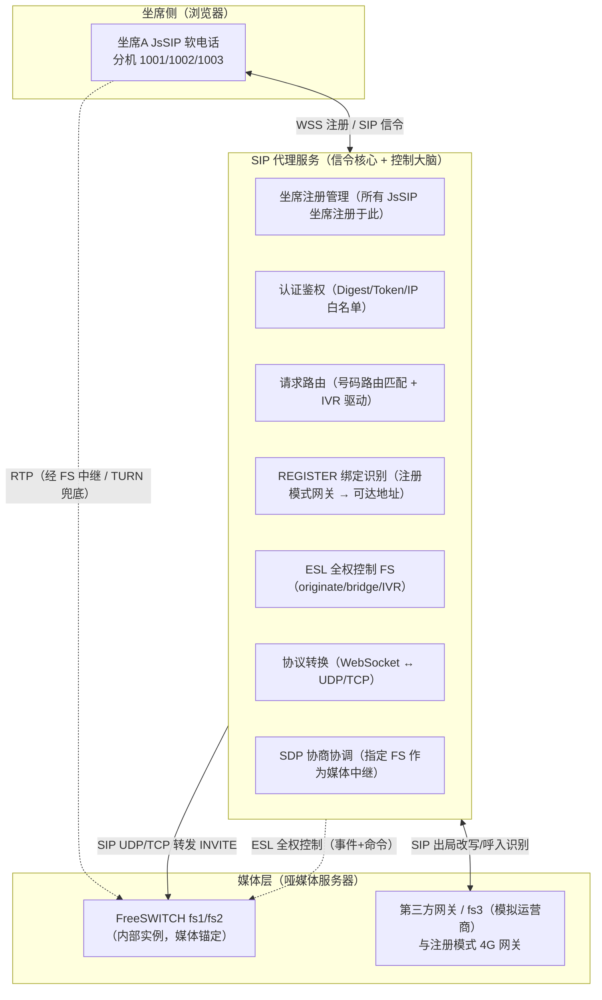
```mermaid
flowchart TB
    subgraph UA["坐席侧（浏览器）"]
        A["坐席A JsSIP 软电话<br/>分机 1001/1002/1003"]
    end
    subgraph SP["SIP 代理服务（信令核心 + 控制大脑）"]
        R1["坐席注册管理（所有 JsSIP 坐席注册于此）"]
        R2["认证鉴权（Digest/Token/IP 白名单）"]
        R3["请求路由（号码路由匹配 + IVR 驱动）"]
        R4["REGISTER 绑定识别（注册模式网关 → 可达地址）"]
        R5["ESL 全权控制 FS（originate/bridge/IVR）"]
        R6["协议转换（WebSocket ↔ UDP/TCP）"]
        R7["SDP 协商协调（指定 FS 作为媒体中继）"]
    end
    subgraph MED["媒体层（哑媒体服务器）"]
        F1["FreeSWITCH fs1/fs2<br/>（内部实例，媒体锚定）"]
        F2["第三方网关 / fs3（模拟运营商）<br/>与注册模式 4G 网关"]
    end
    A <-->|"WSS 注册 / SIP 信令"| SP
    SP -->|"SIP UDP/TCP 转发 INVITE"| F1
    SP <-->|"SIP 出局改写/呼入识别"| F2
    SP -.->|"ESL 全权控制（事件+命令）"| F1
    A -.->|"RTP（经 FS 中继 / TURN 兜底）"| F1
```

> **架构模式说明**：本系统采用 **SIP 代理独立信令层 + ESL 全权控制** 架构。SIP 代理服务作为唯一的信令入口与路由核心，所有坐席均注册在
> SIP 代理服务上。FreeSWITCH 仅作为"哑"媒体服务器——收到 INVITE 后立即 park 住，由 SIP 代理服务（cc-server 侧 ESL 客户端）监听
> `CHANNEL_PARK` 事件后接管控制，通过 ESL 命令（originate/uuid_bridge 等）驱动 FS 完成第二段呼叫和媒体桥接。FS **不配置任何
> dialplan 业务逻辑**。系统中部署多台 FreeSWITCH 实例，每台通过地址（IP:port）标识。

### 2.2 B2BUA 角色定位说明

SIP 代理服务在协议层面扮演的是 **B2BUA（Back-to-Back User Agent，背靠背用户代理）**，而非简单的 SIP Proxy：

| 维度             | SIP Proxy（代理）                        | B2BUA（背靠背用户代理）✅ 本系统角色                          |
|------------------|------------------------------------------|---------------------------------------------------------------|
| **对话模型**     | 透明转发请求，维护单一 SIP 对话          | 终结一侧对话，重新发起另一侧对话，形成**两段独立的 SIP 对话** |
| **From/To tag**  | 不修改 tag 值                            | 两段对话使用不同的 Call-ID 和 tag                             |
| **状态维护**     | 事务级状态（或无状态）                   | 维护完整对话状态（Dialog State）                              |
| **Record-Route** | 需添加自身到 Record-Route 以留在信令路径 | 天然位于两段对话中间，无需 Record-Route                       |
| **适用场景**     | 简单路由代理                             | 需要深度控制信令、媒体锚定、业务逻辑                          |

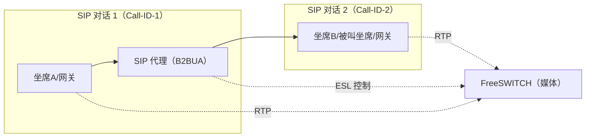
```mermaid
flowchart LR
    subgraph D1["SIP 对话 1（Call-ID-1）"]
        A["坐席A/网关"] --> SP["SIP 代理（B2BUA）"]
    end
    subgraph D2["SIP 对话 2（Call-ID-2）"]
        SP --> T["坐席B/被叫坐席/网关"]
    end
    SP -.->|"ESL 控制"| F["FreeSWITCH（媒体）"]
    A -.->|"RTP"| F
    T -.->|"RTP"| F
```

- **第一段对话**：主叫侧 ↔ SIP 代理（INVITE 终结于 FS 的 park，Call-ID-1）
- **第二段对话**：SIP 代理 ↔ 被叫坐席/网关（通过 ESL originate 发起新 INVITE，Call-ID-2）
- **两段对话独立**：不同的 Call-ID、From/To tag，BYE/Re-INVITE 等请求分别在各自对话内处理

> **影响**：B2BUA 定位意味着 BYE 挂断、Re-INVITE（如 hold/unhold、Session Timer 刷新）等请求在两段对话中是 **独立事务**，由
> SIP 代理在中间协调，而非简单透传。

***

## 三、核心设计原则：号码分析驱动路由 + 网关 ID 覆盖 + 注册绑定识别

SIP 代理服务的路由决策 **以号码分析为核心**：所有到达 SIP 代理的 INVITE 请求（ **包括内部坐席间呼叫**）必须经过号码路由表的正则匹配，
匹配到对应 IVR 流程后由 IVR 流程驱动后续呼叫行为。网关 ID 作为 IVR 转接节点的网关覆盖项；注册模式网关则按 REGISTER
绑定识别来源与呼出目标。

### 3.1 三大设计要点

1. **所有呼叫（含内部坐席间呼叫）必须走号码路由 + IVR**，统一走号码路由 → IVR → IVR 转接节点。
2. **网关 ID 仅作为 IVR 转接节点的覆盖项**——优先级：`CallInfo.gatewayId`（来自 INVITE 头 `X-Gateway-Id`）>
   `IVR 转接节点 routeValue`（来自 IVR 配置）> 当前连接的 FS 兜底。
3. **当前连接的 FS**——指 CHANNEL_PARK 事件来源的 FS 实例（即当前正在处理该呼叫腿的 FS，代码层面即
   `FsCallIRouteProcess.handler` 的 `address` 参数）。
4. **注册绑定识别**：注册模式网关（4G 语音网关，`register_enabled=1`）REGISTER 到代理后，代理在 Redis 记录
   `ipcc:sipproxy:gateway:register:{gatewayId}` 绑定（注册 Contact 地址）；呼出时按「注册 Contact > 静态配置 address」解析出局目标，
   **不依赖静态 address**（网关 46 即 address 为空）。

### 3.2 统一呼叫控制流程

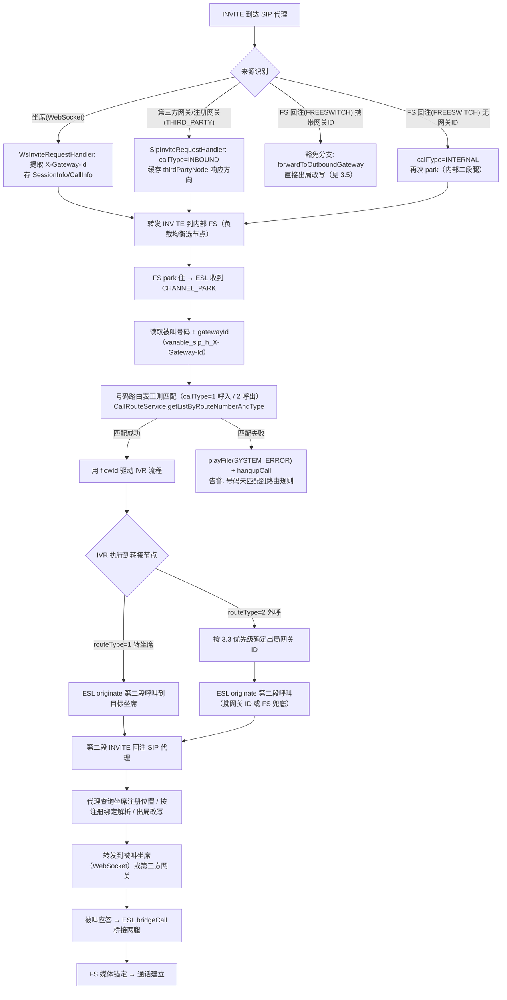
```mermaid
flowchart TD
    A["INVITE 到达 SIP 代理"] --> B{"来源识别"}
    B -->|"坐席(WebSocket)"| C["WsInviteRequestHandler: 提取 X-Gateway-Id<br/>存 SessionInfo/CallInfo"]
    B -->|"第三方网关/注册网关(THIRD_PARTY)"| D["SipInviteRequestHandler: callType=INBOUND<br/>缓存 thirdPartyNode 响应方向"]
    B -->|"FS 回注(FREESWITCH) 携带网关ID"| E["豁免分支: forwardToOutboundGateway<br/>直接出局改写（见 3.5）"]
    B -->|"FS 回注(FREESWITCH) 无网关ID"| F["callType=INTERNAL<br/>再次 park（内部二段腿）"]
    C --> G["转发 INVITE 到内部 FS（负载均衡选节点）"]
    D --> G
    F --> G
    G --> H["FS park 住 → ESL 收到 CHANNEL_PARK"]
    H --> I["读取被叫号码 + gatewayId（variable_sip_h_X-Gateway-Id）"]
    I --> J["号码路由表正则匹配（callType=1 呼入 / 2 呼出）<br/>CallRouteService.getListByRouteNumberAndType"]
    J -->|"匹配成功"| K["用 flowId 驱动 IVR 流程"]
    J -->|"匹配失败"| X["playFile(SYSTEM_ERROR) + hangupCall<br/>告警: 号码未匹配到路由规则"]
    K --> L{"IVR 执行到转接节点"}
    L -->|"routeType=1 转坐席"| M["ESL originate 第二段呼叫到目标坐席"]
    L -->|"routeType=2 外呼"| N["按 3.3 优先级确定出局网关 ID"]
    N --> O["ESL originate 第二段呼叫（携网关 ID 或 FS 兜底）"]
    M --> P["第二段 INVITE 回注 SIP 代理"]
    O --> P
    P --> Q["代理查询坐席注册位置 / 按注册绑定解析 / 出局改写"]
    Q --> R["转发到被叫坐席（WebSocket）或第三方网关"]
    R --> S["被叫应答 → ESL bridgeCall 桥接两腿"]
    S --> T["FS 媒体锚定 → 通话建立"]
```

### 3.3 网关 ID 覆盖优先级

| 优先级  | 网关 ID 来源                                           | 说明                                                                                               |
|---------|--------------------------------------------------------|----------------------------------------------------------------------------------------------------|
| 1（高） | `CallInfo.gatewayId`                                   | 来自 INVITE 头 `X-Gateway-Id`，业务侧显式指定，覆盖 IVR 配置                                       |
| 2（中） | `IVR 转接节点 routeValue`（routeType=2 时）            | 来自 IVR 流程配置，作为兜底网关 ID                                                                 |
| 3（低） | 当前连接的 FS（CHANNEL_PARK 事件来源 FS 的 `address`） | 上述两者都为空时，使用当前正在处理该呼叫腿的 FS 实例，由其本地 sofia profile external 配置路由出局 |

### 3.4 关键约束与告警

> **所有呼叫必须走号码路由 + IVR**：所有呼叫（包括内部坐席间呼叫、携带网关 ID 的出局呼叫、入局呼叫、自动外呼）统一经过号码路由表
> 正则匹配 → IVR 流程 → IVR 转接节点驱动后续呼叫行为。这保证了系统路由策略的统一性、可追溯性，所有呼叫都经过 IVR 流程的统一业务逻辑
> （录音、计费、CDR 等）。

> **网关 ID 职责定位**：网关 ID 作为"IVR 转接节点的覆盖项"，仅在 routeType=2 外呼时生效。INVITE 中携带的 `X-Gateway-Id`
> 会被存入 `CallInfo.gatewayId`，在 IVR 流程执行到转接节点时作为优先级最高的网关 ID 使用。

> **网关 ID 不得指向内部 FS**：网关 ID 必须指向第三方出局网关（`FsSipGatewayDO`），配置为内部 FS 地址会导致 INVITE 回环死循环；
> 系统在网关配置与 IVR 转接节点配置时应做前置校验。

### 3.5 豁免场景与直发场景清单

以下场景 **不走号码路由 + IVR**（或不经 sipproxy INVITE 转发），由 `SipInviteRequestHandler` 或业务层直接控制出局：

| # | 场景                                  | 触发形态                                                                                   | 处理路径                                                                                                | e2e 覆盖                                 |
|---|---------------------------------------|--------------------------------------------------------------------------------------------|---------------------------------------------------------------------------------------------------------|------------------------------------------|
| 1 | 三方会议 c-leg（旧场景四）            | ESL originate 携 `X-Gateway-Id`，FS 回注                                                   | `source=FREESWITCH && gatewayId 非空` → `forwardToOutboundGateway` 直接出局，接通后加入 conference      | **无**（代码已实现）                     |
| 2 | 双向出局/中继透传 a/b-leg（旧场景五） | 业务层双 originate 携两端网关 ID                                                           | 同上，两腿各自直发 + `bridgeCall(a, b)`                                                                 | **无**（代码已实现）                     |
| 3 | 转接（REFER）携 `X-Gateway-Id`        | 咨询/盲转转接外线                                                                          | `makeCall` 经网关直出（折中方案，见第十章节 10.3）                                                      | **无**（e2e 转接目标为坐席 C，见场景 6） |
| 4 | 机器人自动外呼                        | `AutocallServiceImpl` 经 ESL originate **直发网关**（`sofia/external`），**不走 sipproxy** | a-leg 直发 → 接通后 `autocallPark` 按 `ivr_flow` 显式指定驱动 IVR（跳过号码路由）；未指定时兜底号码路由 | ✅ 场景 7                                |
| 5 | 注册模式网关绑定识别                  | 网关 REGISTER → 代理记录绑定；后续呼入/呼出按绑定识别                                      | 呼出目标解析：注册 Contact > 静态 address                                                               | ✅ 场景 12/13                            |

> **设计约束**：豁免场景 c-leg 必须携带 `X-Gateway-Id` 直接出局，业务层负责在 originate 前确定网关 ID；走 IVR 会创建新腿破坏
> 会议/桥接时序。 **三方会议与双向出局属于能力但不在 test-all 自动化覆盖内**，回归验证依赖人工/专项脚本。

### 3.6 公共呼叫建立时序（所有走号码路由场景的第一段腿）

以下为「INVITE → FS park → 号码路由 → IVR → 转接 originate → 二段腿 → 桥接」的公共时序。后续各场景章节只描述差异段，编号接续本图。

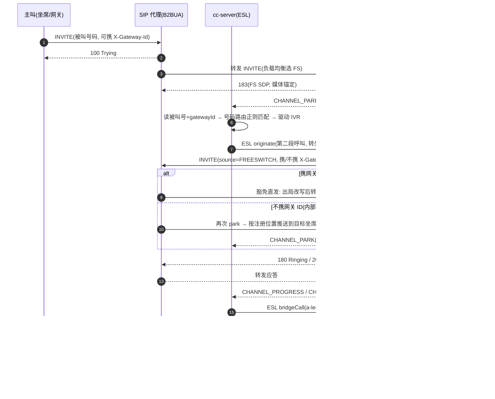
```mermaid
sequenceDiagram
    autonumber
    participant A as 主叫(坐席/网关)
    participant SP as SIP 代理(B2BUA)
    participant ES as cc-server(ESL)
    participant FS as FreeSWITCH(哑媒体)
    participant T as 被叫(坐席/网关)
    A->>SP: INVITE(被叫号码, 可携 X-Gateway-Id)
    SP-->>A: 100 Trying
    SP->>FS: 转发 INVITE(负载均衡选 FS)
    FS-->>SP: 183(FS SDP, 媒体锚定)
    FS-->>ES: CHANNEL_PARK 事件
    ES->>ES: 读被叫号+gatewayId → 号码路由正则匹配 → 驱动 IVR
    ES->>FS: ESL originate(第二段呼叫, 转坐席或携网关出局)
    FS->>SP: INVITE(source=FREESWITCH, 携/不携 X-Gateway-Id)
    alt 携网关 ID
        SP->>T: 豁免直发: 出局改写后转发第三方网关
    else 不携网关 ID(内部二段腿)
        SP->>FS: 再次 park → 按注册位置推送到目标坐席
        FS-->>ES: CHANNEL_PARK(二段腿)
    end
    T-->>SP: 180 Ringing / 200 OK
    SP-->>FS: 转发应答
    FS-->>ES: CHANNEL_PROGRESS / CHANNEL_ANSWER
    ES->>FS: ESL bridgeCall(a-leg, b-leg)
    FS-->>SP: 200 OK(桥接就绪)
    SP-->>A: 200 OK(FS SDP)
    Note over A,FS: 通话建立, RTP 经 FS 中继(A↔FS↔被叫)
```

> **号码路由表必须配置**：坐席分机号的正则规则（如 `^1\d{3}$` 或本系统真值 `^(9#).*`），指向包含转坐席节点的 IVR
> 流程，否则呼叫将被挂断。
> 生产环境路由真值见附录 A（route 101-109，与 `test-all/common/data_spec.py` 保持一致）。

***

## 四、高可用性（HA）设计

### 4.1 SIP 代理服务自身 HA

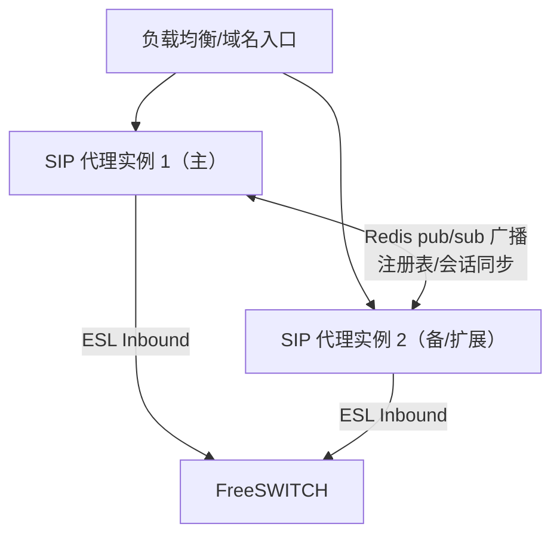
```mermaid
flowchart TB
    LB["负载均衡/域名入口"] --> SP1["SIP 代理实例 1（主）"]
    LB --> SP2["SIP 代理实例 2（备/扩展）"]
    SP1 <-->|"Redis pub/sub 广播<br/>注册表/会话同步"| SP2
    SP1 -->|"ESL Inbound"| FS["FreeSWITCH"]
    SP2 -->|"ESL Inbound"| FS
```

- 会话状态（注册表、CallInfo、转移上下文）持久化 Redis，实例间通过 Redis pub/sub（或 MQ）广播，任一侧故障可接管。
- 坐席 WSS 注册到任一实例；跨实例呼叫按注册位置转发。

### 4.2 FreeSWITCH 无状态化与故障切换

- FS 不保存呼叫业务状态（业务状态在 cc-server 的 CallInfo/Redis），收到 INVITE 后即 park，等待 ESL 指令——
  **可随时摘除/新增实例**。
- 多实例（fs1/fs2）由代理按负载均衡（hash）选择；某 FS 故障时，新呼叫路由到其他实例，ESL 重连后存量 bridge 通话不受影响（FS
  媒体层独立）。

### 4.3 ESL 连接断线后的通话保持

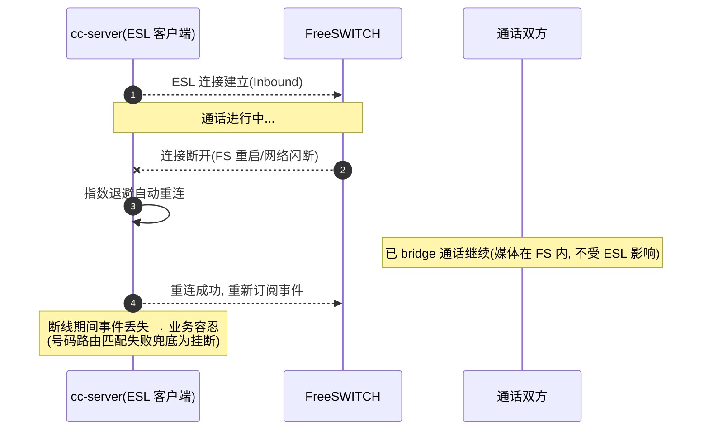
```mermaid
sequenceDiagram
    autonumber
    participant ES as cc-server(ESL 客户端)
    participant FS as FreeSWITCH
    participant U as 通话双方
    ES-->>FS: ESL 连接建立(Inbound)
    Note over ES,FS: 通话进行中...
    FS--xES: 连接断开(FS 重启/网络闪断)
    ES->>ES: 指数退避自动重连
    Note over U: 已 bridge 通话继续(媒体在 FS 内, 不受 ESL 影响)
    ES-->>FS: 重连成功, 重新订阅事件
    Note over ES: 断线期间事件丢失 → 业务容忍<br/>(号码路由匹配失败兜底为挂断)
```

> **约束**：fs-esl 仅支持 Inbound 模式；事件订阅与命令必须异步（Netty IO 线程内阻塞 `.get()` 会死锁）。

***

## 五、测试场景总览与编号说明

本文场景编号与 `test-all/cc_e2e_test.py` 的 `SCENARIOS` 注册表一致（VALID_SCENARIOS = {1,2,3,5,6,7,8,9,10,11,12,13}）。
**场景 4 不存在**：官方说明——「场景4 已并入场景3（外部呼入链路由场景3 pjsua 真实呼入覆盖）」。

### 5.1 场景对照表

| 编号 | 名称            | 默认/可选 | 入口                       | route/flow                | e2e 函数                                                   | 对应 v3.0 旧场景               |
|------|-----------------|-----------|----------------------------|---------------------------|------------------------------------------------------------|--------------------------------|
| 1    | 内部呼叫        | 默认      | 坐席拨 `9#1002`            | route102/flow102          | `scenario_1_internal_call`                                 | 场景一（内部呼叫）             |
| 2    | 出局呼叫        | 默认      | 坐席拨 `0#18600000000`     | route105/flow105 → 网关2  | `scenario_2_outbound_call`                                 | 场景二（出局）                 |
| 3    | 入局 IVR 全链路 | 默认      | pjsua 呼 `4001234`         | route101/flow101          | `scenario_3_inbound_ivr`                                   | 场景三（入局）                 |
| 5    | 保持/恢复       | 默认      | 通话中 UI 保持/恢复        | flow102 通话              | `scenario_5_hold_resume`                                   | 无（v3.0 无独立章）            |
| 6    | 咨询转接        | 默认      | REFER attended → 坐席 1003 | flow102 通话              | `scenario_6_consult_transfer`                              | 场景六（转接，目标改为坐席 C） |
| 7    | 自动外呼        | 默认      | 页面建任务（flow103）      | route103/flow103          | `scenario_7_autocall`                                      | 场景七（自动外呼）             |
| 8    | 客服组繁忙      | 可选      | 坐席拨 `00300xxx`          | route104/flow104          | `scenario_8_group_busy`                                    | 无                             |
| 9    | 满意度评价      | 可选      | 坐席拨 `00100xxx`          | route106/flow106          | `scenario_9_satisfaction`                                  | 无                             |
| 10   | AI 对话         | 可选      | 坐席拨 `00600`             | route107/flow107          | `scenario_10_ai_dialogue`                                  | 无                             |
| 11   | 并发呼入压测    | 可选      | pjsua 批量呼 `4001234`     | route101/flow101          | `scenario_11_concurrent_inbound` + `cc_concurrent_test.py` | 无                             |
| 12   | 注册网关呼入    | 可选      | pjsua 经 fs3 呼 `4005678`  | route108/flow108          | `scenario_12_register_gw_inbound`                          | 无                             |
| 13   | 注册网关呼出    | 可选      | 坐席拨 `8#18600000000`     | route109/flow109 → 网关46 | `scenario_13_register_gw_outbound`                         | 无                             |

默认运行场景 `1,2,3,5,6,7`（每场景最多 3 轮，轮间退避 10s）；场景 8-13 须显式 `--scenarios` 指定。

### 5.2 验证层级（L0 / 场景 / L5）

- **L0 环境/数据核对**：网络连通（后端 HTTPS 401、前端 HTTPS、ESL×2 18021/18121、MySQL 3311、Redis 6379、第三方 FS SIP 9988、第三方
  FS ESL 9966、sipproxy 5561）+ 数据核对（9 路由/9 流程/坐席 1001-1003/坐席组 1/网关 2/注册网关 46）+ 软电话注册 +
  坐席登录签入。失败快速退出码 2。
- **场景执行**：按编号顺序，每场景多轮重试（`--rounds`），失败自动截图至 `screenshots/`。
- **L5 数据校验**：通话记录（`cc_call_record`）生成数量与关键字段、坐席在线状态。
- **退出码**：0 = 全部通过；1 = 存在失败场景；2 = L0 失败或参数非法。
- 常用参数：`--scenarios`、`--headless`、`--rounds`、`--check-only`（只跑 L0）、`--auto-fix`（L0 数据缺失自动修复）、`--skip-l0`。

### 5.3 已记录的系统边界（测试套件已知边界）

1. **hold 音乐与流程误判**：咨询转接 hold 音乐使用 `silence_stream://300000`（5 分钟静音，该 FS 无 `local_stream://moh`
   ）；短时播放源 播放结束的 PLAYBACK_STOP 会被基线 IVR 流程误判为"放音完成"导致流程提前终止——已由
   `FsChannelExecuteCompleteEslEventHandler`
   过滤 hold 音乐播放完成/文件缺失事件，不参与流程流转。
2. **B-C 桥接后 BYE 481**：`uuid_bridge` 桥接后客户端 BYE 会被 FS 回 481（B2BUA 透传模式下 dialog tag 不一致），场景 6 收尾改用
   ESL 批量挂断。
3. **软电话心跳**：sipproxy WS 空闲超时 90s，JsSIP OPTIONS 心跳 30s（`SoftPhone.vue KEEP_ALIVE_INTERVAL`），任一侧调整需联动验证。

***

## 六、场景 1：内部呼叫（坐席A → 坐席B）

### 6.1 场景入口与信令路径

| 项   | 值                                                                                      | 说明                                                                    |
|------|-----------------------------------------------------------------------------------------|-------------------------------------------------------------------------|
| 拨号 | `9#1002`                                                                                | 前缀 `9#` 由 route102 的 delete_prefix 删除，剩余 `1002` 为被叫坐席分机 |
| 路由 | route102「呼出-内部电话」`^(9#).*`（direction=2）                                       | 断言关键词 `[删除前缀]`、`[进入callRoute电话]`                          |
| 流程 | flow102：start → transfer（routeType=1 转坐席，routeValue=`${start-node.callee}`）→ end | 目标坐席来自被叫号码变量                                                |
| e2e  | `scenario_1_internal_call`：A-B 通话建立、双方通话中、挂断联动、CDR                     | 坐席 A=1001（user 1）、B=1002（user 100），domain `1.com:1`             |

> **关键说明**：内部呼叫同样强制走「号码路由 → IVR → 转接节点」。坐席A 拨 `9#1002` 后，ESL 处理器读取被叫号码 `1002`，
> 匹配 route102（呼出方向），驱动 flow102 直接执行转坐席节点（routeType=1），目标 = `${start-node.callee}`（即 1002 分机），
> 经 ESL originate 发起第二段呼叫回注代理，代理查询坐席 1002 注册位置后经 WebSocket 推送振铃。

### 6.2 全链路时序

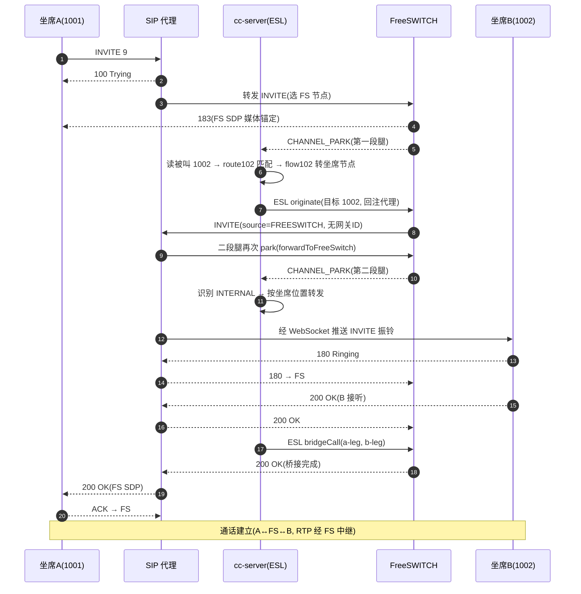
```mermaid
sequenceDiagram
    autonumber
    participant A as 坐席A(1001)
    participant SP as SIP 代理
    participant ES as cc-server(ESL)
    participant FS as FreeSWITCH
    participant B as 坐席B(1002)
    A->>SP: INVITE 9#1002(WSS)
    SP-->>A: 100 Trying
    SP->>FS: 转发 INVITE(选 FS 节点)
    FS-->>A: 183(FS SDP 媒体锚定)
    FS-->>ES: CHANNEL_PARK(第一段腿)
    ES->>ES: 读被叫 1002 → route102 匹配 → flow102 转坐席节点
    ES->>FS: ESL originate(目标 1002, 回注代理)
    FS->>SP: INVITE(source=FREESWITCH, 无网关ID)
    SP->>FS: 二段腿再次 park(forwardToFreeSwitch)
    FS-->>ES: CHANNEL_PARK(第二段腿)
    ES->>ES: 识别 INTERNAL → 按坐席位置转发
    SP->>B: 经 WebSocket 推送 INVITE 振铃
    B-->>SP: 180 Ringing
    SP-->>FS: 180 → FS
    B-->>SP: 200 OK(B 接听)
    SP-->>FS: 200 OK
    ES->>FS: ESL bridgeCall(a-leg, b-leg)
    FS-->>SP: 200 OK(桥接完成)
    SP-->>A: 200 OK(FS SDP)
    A-->>SP: ACK → FS
    Note over A,B: 通话建立(A↔FS↔B, RTP 经 FS 中继)
```

### 6.3 分步处理

1. **WsInviteRequestHandler.doHandle**：提取 From/To 头，发送 100 Trying，调用 `nodeManager.selectFreeSwitchNode` 选择 FS
   节点； 设置 `callType=OUTBOUND`（统一标记）；提取 `X-Gateway-Id`（如有）→ `SessionInfo.gatewayId`（本场景无）；缓存
   SessionInfo，
   `messageForwarder.forwardToFreeSwitch` 转发到 FS。
2. **FS 收到 INVITE → 媒体锚定 → 183 → park**。
3. **ESL `CHANNEL_PARK` → FsChannelParkEslEventHandler.outboundCall**：读取 `variable_sip_h_X-Gateway-Id`（空）→ 构造
   `CallInfo(callType=IVR, direction=2, gatewayId=null)`，`process=CALL_ROUTE` 提交 `FsCallIRouteProcess`。
4. **FsCallIRouteProcess.handler**：`getCallRouteNoTenant(callee=1002, direction=2)` 匹配 route102 → 取 flowId=102 驱动
   IVR； 同时触发录音（`fsClient.record`，路径存入 `CallInfo.record`）。
5. **flow102 转接节点（routeType=1）**：`FlowTransferHandler` 触发，目标 = `${start-node.callee}`（1002），
   `fsClient.originate` 发起第二段呼叫。
6. **FS 发第二段 INVITE → SipInviteRequestHandler**：`source=FREESWITCH`、`gatewayId=null` → `callType=INTERNAL` →
   `forwardToFreeSwitch` 再次 park。
7. **二段腿 CHANNEL_PARK → 按坐席位置转发**：`forwardToWebSocketByUser` 推送坐席 1002 → JsSIP 振铃 → 接听 → 200 OK。
8. **ESL `bridgeCall`** 桥接 a-leg（坐席A FS 通道）与 b-leg（坐席B FS 通道）→ 通话建立。

> **注意**：内部坐席间呼叫通常不携带 `X-Gateway-Id`。`X-Gateway-Id` 仅在 IVR 转接节点（routeType=2 外呼）时作为网关覆盖项使用。

### 6.4 BYE 挂断流程

BYE 挂断需在两段对话中分别处理：

1. **坐席A 发起 BYE**（Call-ID-1）→ `WsDefaultRequestHandler` 透传到 FS → FS 触发 `CHANNEL_HANGUP`。
2. **SIP 代理监听到 hangup → FsChannelHangUpEslEventHandler**：从 `CallInfo.channelMap` 取 a-leg/b-leg UUID，调用
   `fsClient.uuidKill(address, legUuid)` 释放另一侧（避免漏挂断）；清理 CallInfo 与 Redis 缓存。
3. **SIP 代理向坐席B 转发 BYE**（Call-ID-2）→ 坐席B 端 JsSIP 收到 BYE → 回 200 OK。

> **已实现**：`FsChannelHangUpEslEventHandler` 读取 `Other-Leg-Unique-ID` 后调用 `fsClient.hangupCall` 释放关联腿，并更新
> `CallInfo.channelMap`/`uniqueIdList`，保证缓存与 FS 通道状态一致；`hangupCall` 失败不中断流程，由
> `CHANNEL_HANGUP_COMPLETE` 兜底清理。

### 6.5 错误处理

| 错误场景                                       | 检测点                         | 处理策略                                       |
|------------------------------------------------|--------------------------------|------------------------------------------------|
| 号码路由未匹配（如拨号非 9# 前缀且无其它规则） | `FsCallIRouteProcess` 匹配失败 | `playFile(SYSTEM_ERROR)` + `hangupCall` + 告警 |
| 目标坐席未注册/离线                            | originate 无注册位置           | 返回 404/振铃失败，CDR 记录                    |
| 目标坐席忙                                     | 486 Busy                       | 可选转接策略或播放忙音                         |
| 主叫早释                                       | `CHANNEL_HANGUP`               | `uuidKill` 释放对端；CDR 记录"主叫早释"        |

### 6.6 自动化验证对应

`cc_e2e_test.py --scenarios 1`：断言 Java 日志 `[进入callRoute电话]`、`[删除前缀]`、坐席 B 来电/接听/通话建立、 坐席 A 挂断后
B 联动挂断、`cc_call_record` 生成（caller=1001）、flow102 实例终态。

***

## 七、场景 2：出局呼叫（坐席A → 外部手机，经第三方网关）

### 7.1 场景入口与信令路径

| 项   | 值                                                                                     | 说明                                                       |
|------|----------------------------------------------------------------------------------------|------------------------------------------------------------|
| 拨号 | `0#18600000000`                                                                        | 前缀 `0#` 由 route105 delete_prefix 删除，剩余为被叫手机号 |
| 路由 | route105「呼出-外部电话」`^(0#).*`（direction=2）                                      | 断言 `[删除前缀]`                                          |
| 流程 | flow105：start → transfer（routeType=2 外呼，routeValue=2 → 网关2「第三方网关」）→ end | 网关 2：username 18600000000、address <A服务器公网>        |
| e2e  | `scenario_2_outbound_call`：经网关出局、对端（pjsua 模拟手机）应答、RTP 收流、CDR      | 断言 answer_flag=1、RTP rxBytes 增长                       |

> **关键说明**：坐席A 拨 `0#` 前缀命中外呼路由 flow105，转接节点 routeType=2 且 routeValue=2（网关 2），由当前连接的 FS
> 经 `sofia/gateway/2/...` 出局到第三方网关（fs3 模拟运营商），再由 fs3 桥接 pjsua 软电话（模拟手机 18600000000）。
> 本场景 INVITE 未携带 `X-Gateway-Id`，网关 ID 走 IVR routeValue 兜底（优先级 2）。

### 7.2 全链路时序

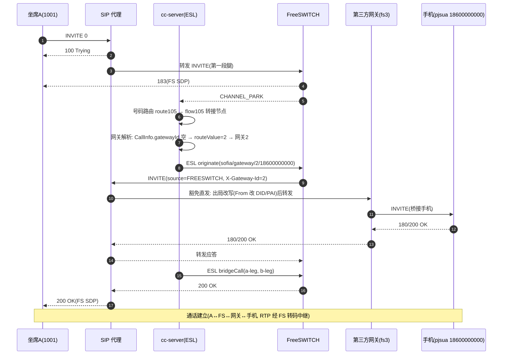
```mermaid
sequenceDiagram
    autonumber
    participant A as 坐席A(1001)
    participant SP as SIP 代理
    participant ES as cc-server(ESL)
    participant FS as FreeSWITCH
    participant GW as 第三方网关(fs3)
    participant M as 手机(pjsua 18600000000)
    A->>SP: INVITE 0#18600000000(WSS)
    SP-->>A: 100 Trying
    SP->>FS: 转发 INVITE(第一段腿)
    FS-->>A: 183(FS SDP)
    FS-->>ES: CHANNEL_PARK
    ES->>ES: 号码路由 route105 → flow105 转接节点
    ES->>ES: 网关解析: CallInfo.gatewayId 空 → routeValue=2 → 网关2
    ES->>FS: ESL originate(sofia/gateway/2/18600000000)
    FS->>SP: INVITE(source=FREESWITCH, X-Gateway-Id=2)
    SP->>GW: 豁免直发: 出局改写(From 改 DID/PAI)后转发
    GW->>M: INVITE(桥接手机)
    M-->>GW: 180/200 OK
    GW-->>SP: 180/200 OK
    SP-->>FS: 转发应答
    ES->>FS: ESL bridgeCall(a-leg, b-leg)
    FS-->>SP: 200 OK
    SP-->>A: 200 OK(FS SDP)
    Note over A,M: 通话建立(A↔FS↔网关↔手机, RTP 经 FS 转码中继)
```

### 7.3 分步处理

1. **第一段 INVITE 处理同场景 1**（3.6 公共图 1-6 步）。
2. **IVR 转接节点（routeType=2 外呼）→ FlowCallOutRouteHandler**：
    - 网关 ID 三级优先级解析：`CallInfo.gatewayId`（空）→ `properties.routeValue`（=2）→ 使用网关 2；
   - 查询 `FsSipGatewayDO`（id=2：username 18600000000、address <A服务器公网>）；
    - `fsClient.makeCall(..., sipGateway=2)` → `{sip_h_X-Gateway-Id=2}sofia/gateway/2/18600000000@代理地址`。
3. **第二段 INVITE 豁免识别**：`SipInviteRequestHandler` 检测 `source=FREESWITCH && gatewayId=2` → **豁免分支**：
   `forwardToOutboundGateway(request, gw2)` → 改写 From 头（DID）、注入 PAI、移除 Record-Route → 转发第三方网关。
4. **出局响应处理**：网关 183/180/200 → `UnifiedResponseHandler`（`THIRD_PARTY × OUTBOUND → FREESWITCH` 策略表）→ 转发 FS；
   200 OK → FS → `bridgeCall` 桥接两腿 → 向坐席A 转发 200 OK。

### 7.4 错误处理

| 错误场景                                | 检测点                              | 处理策略                                                                               |
|-----------------------------------------|-------------------------------------|----------------------------------------------------------------------------------------|
| 号码路由未匹配到手机号规则              | `FsCallIRouteProcess` 匹配失败      | `playFile(SYSTEM_ERROR)` + `hangupCall` + 告警                                         |
| 网关 ID 无效（FsSipGatewayDO 不存在）   | `FlowCallOutRouteHandler` 查询失败  | 回退 routeValue；再空 → 当前 FS 兜底；告警"网关 ID 无效"                               |
| 第三方网关不可达                        | INVITE 32s 超时 / 503               | `playFile(SYSTEM_ERROR)` + `hangupCall`；ESL `uuidKill` 释放 a-leg；CDR 记录"出局失败" |
| 网关返回 407 Proxy Auth                 | 响应路径                            | 重新注入 Authorization 头并重发 INVITE（去除旧 To tag，RFC 3261）                      |
| 网关返回 401 Unauthorized               | 同上                                | 注入 Authorization 头并重发 INVITE                                                     |
| 主叫早释                                | `CHANNEL_HANGUP`                    | `uuidKill` 释放外呼 b-leg；CDR 记录"主叫早释"                                          |
| 二段 INVITE 网关 ID 指向内部 FS（违规） | `forwardToOutboundGateway` 前置校验 | 阻断并返回 500，告警"网关 ID 指向内部 FS，疑似回环"                                    |

### 7.5 自动化验证对应

`cc_e2e_test.py --scenarios 2`：断言 `[进入callRoute电话]`、`[删除前缀]`、pjsua 应答、双向通话建立、 挂断后 `cc_call_record`
（caller=1001、answer_flag=1、RTP rxBytes 增长）与 flow105 终态。

***

## 八、场景 3：入局 IVR 全链路（外部手机 → 坐席）

### 8.1 场景入口与信令路径

| 项   | 值                                                                                                                                                                            | 说明                                                                  |
|------|-------------------------------------------------------------------------------------------------------------------------------------------------------------------------------|-----------------------------------------------------------------------|
| 呼入 | pjsua（模拟手机 18600000000）呼 `4001234`                                                                                                                                     | 经 fs3（模拟运营商 9988）拨入 CC                                      |
| 路由 | route101「呼入-4001234」`^(4001234).*`（direction=1 呼入）                                                                                                                    | 断言：`流式播放完成`、`分支命中`、`ivr方法调用节点处理`、`[转坐席组]` |
| 流程 | flow101：start → receive(收号按 1) → condition(IF result==1) → playback×4（收号提示/分支放音/转接提示等）→ method → condition(IF 非空) → transfer(routeType=4 坐席组 1) → end | DTMF=1                                                                |
| e2e  | `scenario_3_inbound_ivr`：IVR 放音（含 TTS 流式）、收号、IF 分支、转坐席组、坐席接听、挂断联动、CDR                                                                           | 覆盖原「场景 4」外部呼入链路                                          |

> **关键说明**：入局呼叫由第三方网关（fs3 模拟运营商）发起：pjsua 注册 fs3 后呼叫 4001234，fs3 dialplan `outbound_to_gateway`
> 将 INVITE 桥接到 sipproxy（<A服务器公网>:5561）。代理识别 `source=THIRD_PARTY` → `callType=INBOUND`，缓存 thirdPartyNode
> 用于响应回传；INVITE 转发内部 FS park 后，ESL 按被叫 4001234 匹配 **呼入方向**路由 route101 → 驱动 flow101 完整 IVR。
> **入局必须匹配呼入路由表**（type=1）：未配置 DID 呼入规则时呼叫将被挂断。

### 8.2 全链路时序

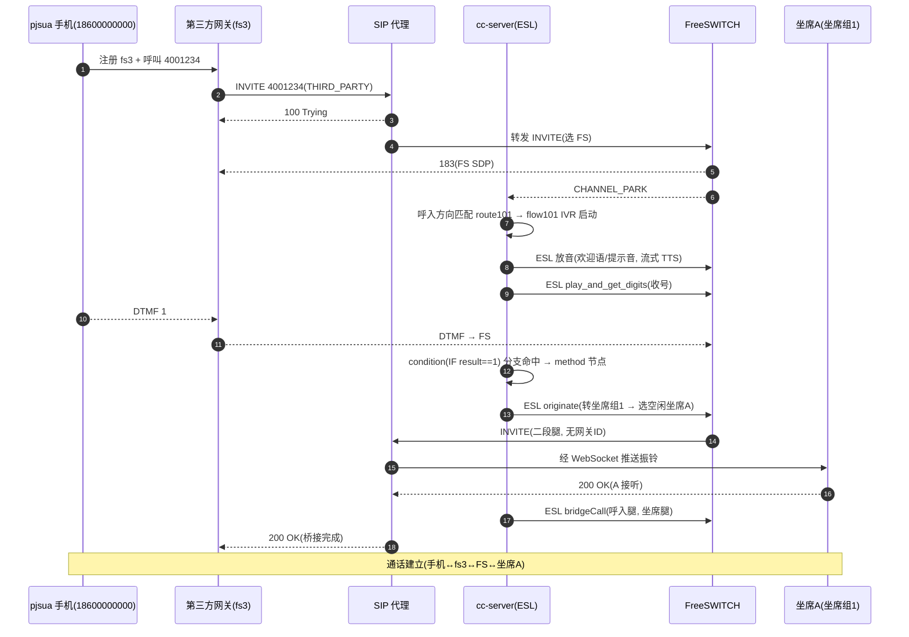
```mermaid
sequenceDiagram
    autonumber
    participant P as pjsua 手机(18600000000)
    participant GW as 第三方网关(fs3)
    participant SP as SIP 代理
    participant ES as cc-server(ESL)
    participant FS as FreeSWITCH
    participant A as 坐席A(坐席组1)
    P->>GW: 注册 fs3 + 呼叫 4001234
    GW->>SP: INVITE 4001234(THIRD_PARTY)
    SP-->>GW: 100 Trying
    SP->>FS: 转发 INVITE(选 FS)
    FS-->>GW: 183(FS SDP)
    FS-->>ES: CHANNEL_PARK
    ES->>ES: 呼入方向匹配 route101 → flow101 IVR 启动
    ES->>FS: ESL 放音(欢迎语/提示音, 流式 TTS)
    ES->>FS: ESL play_and_get_digits(收号)
    P-->>GW: DTMF 1
    GW-->>FS: DTMF → FS
    ES->>ES: condition(IF result==1) 分支命中 → method 节点
    ES->>FS: ESL originate(转坐席组1 → 选空闲坐席A)
    FS->>SP: INVITE(二段腿, 无网关ID)
    SP->>A: 经 WebSocket 推送振铃
    A-->>SP: 200 OK(A 接听)
    ES->>FS: ESL bridgeCall(呼入腿, 坐席腿)
    SP-->>GW: 200 OK(桥接完成)
    Note over P,A: 通话建立(手机↔fs3↔FS↔坐席A)
```

### 8.3 分步处理

1. **SipInviteRequestHandler.handleIncomingRequest**：`source=THIRD_PARTY`（`identifyMessageSource` 识别）→
   `callType=INBOUND`； 缓存 `thirdPartyNode`（响应转发方向）；`forwardToFreeSwitch` 转发 FS park。
2. **ESL `CHANNEL_PARK` → FsChannelParkEslEventHandler.inboundCall**（非 JsSIP UA）：构造
   `CallInfo(callType=IVR, direction=1)`， 走 `handleIvrRoute` → `FsCallIRouteProcess`。
3. **FsCallIRouteProcess**：`getCallRouteNoTenant(callee=4001234, direction=1)` 匹配 route101 → flow101；触发录音。
4. **flow101 节点链执行**：start → receive（收号，按键 1）→ condition（IF result==1）→ 分支放音（流式播放）→ method（
   `ivr方法调用节点处理`）→ condition（IF 非空）→ transfer（ **routeType=4 转坐席组**，routeValue=1 → 坐席组
   1：1001/1002/1003）→ end。
5. **坐席组选座**：ACD 空闲坐席选择（Redis 状态 + Lua CAS 原子抢占，见第十五章节并发经验）；ESL originate 到选中坐席。
6. **第二段 INVITE 同场景 1**（`source=FREESWITCH, gatewayId=null`）→ park → `forwardToWebSocketByUser` 推送坐席。
7. **坐席接听 → 200 OK** → ESL `bridgeCall` + 向第三方网关转发 200 OK（策略表：`THIRD_PARTY × INBOUND` → 200 OK 回网关）。

### 8.4 错误处理

| 错误场景            | 处理策略                                                            |
|---------------------|---------------------------------------------------------------------|
| 号码路由未匹配 DID  | `playFile(SYSTEM_ERROR)` + 挂断 + 告警                              |
| IVR 收号超时/无按键 | receive 节点超时策略（按配置重放或走超时分支）                      |
| 坐席组全忙          | 转接节点按 full_busy 策略（排队/溢出/播放忙音，见场景 8 与场景 11） |
| 主叫早释            | `uuidKill` 释放坐席腿；CDR 记录                                     |

### 8.5 自动化验证对应

`cc_e2e_test.py --scenarios 3`：断言后端日志 `流式播放完成`、`分支命中`、`ivr方法调用节点处理`、`[转坐席组]`、
坐席接听/双向通话/挂断联动、`cc_call_record` 生成、flow101 终态。

***

## 九、场景 5：保持/恢复（Hold / Resume）

### 9.1 场景入口与信令路径

| 项   | 值                                                                       | 说明                     |
|------|--------------------------------------------------------------------------|--------------------------|
| 入口 | 内部通话建立后（flow102，如坐席A ↔ 坐席B），坐席A 点 UI「保持」/「恢复」 | 浏览器坐席操作           |
| 断言 | hold 播放 `silence_stream://300000`（5 分钟静音 MOH）；恢复后通话继续    | `scenario_5_hold_resume` |
| e2e  | 保持成功轮 ≥ 1（3 轮中）即降级通过                                       | 网络抖动容忍             |

> **关键说明（已知边界）**：该 FS 无 `local_stream://moh` 媒体源，hold 音乐使用 `silence_stream://300000`。短时播放源
> （silence_stream://1、tone_stream）播放结束的 PLAYBACK_STOP 事件会被基线 IVR 流程误判为"放音完成"导致流程提前终止；且
> `uuid_bridge` 解除 hold 时播放器 STOP 上报的 FILE PLAYED 同样会误判推进流程。 **已由
`FsChannelExecuteCompleteEslEventHandler`
> 过滤 hold 音乐播放完成/文件缺失事件，不参与 IVR 流程流转**。

### 9.2 信令时序（保持/恢复）

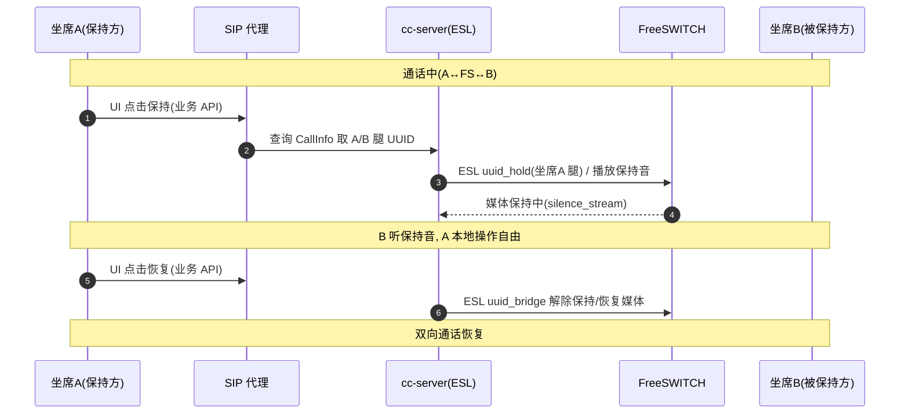
```mermaid
sequenceDiagram
    autonumber
    participant A as 坐席A(保持方)
    participant SP as SIP 代理
    participant ES as cc-server(ESL)
    participant FS as FreeSWITCH
    participant B as 坐席B(被保持方)
    Note over A,B: 通话中(A↔FS↔B)
    A->>SP: UI 点击保持(业务 API)
    SP->>ES: 查询 CallInfo 取 A/B 腿 UUID
    ES->>FS: ESL uuid_hold(坐席A 腿) / 播放保持音
    FS-->>ES: 媒体保持中(silence_stream)
    Note over A,B: B 听保持音, A 本地操作自由
    A->>SP: UI 点击恢复(业务 API)
    ES->>FS: ESL uuid_bridge 解除保持/恢复媒体
    Note over A,B: 双向通话恢复
```

> **实现要点**：保持/恢复通过业务 API 触发 ESL `uuid_hold`/恢复指令（与场景 6 咨询转接中的 hold 同机制）；保持期间
> `FsChannelExecuteCompleteEslEventHandler` 对 hold 音乐相关事件做白名单过滤，避免污染 IVR 流程状态机。

### 9.3 自动化验证对应

`cc_e2e_test.py --scenarios 5`：通话中保持 → 验证保持成功（3 轮中 ≥1 轮通过即降级通过）→ 恢复后双方仍可通话 → 挂断联动。

***

## 十、场景 6：咨询转接（坐席A 咨询坐席C 后桥接坐席B）

### 10.1 场景入口与信令路径

| 项   | 值                                                                                 | 说明                                          |
|------|------------------------------------------------------------------------------------|-----------------------------------------------|
| 入口 | 坐席A ↔ 坐席B 通话中（flow102），坐席A 发起咨询转接 REFER → 坐席 C（1003）         | 浏览器坐席 UI「咨询转接」                     |
| 流程 | A-B 基线 → hold(B) → originate C(1003) → A-C 咨询 → A 挂断确认 → B-C `uuid_bridge` | `scenario_6_consult_transfer`                 |
| e2e  | 断言：A-C 咨询、A 挂断、B-C 桥接、CDR                                              | 收尾用 ESL 批量挂断（BYE 481 边界，见 5.3-2） |

> **关键说明**：test-all 的转接目标是 **坐席 C（1003）**（非 v3.0 的外部手机）；转外线（携 `X-Gateway-Id` 直发网关）属 3.5
> 豁免场景机制，无 e2e 覆盖。REFER 流程由 `WsReferRequestHandler` 处理：解析 `Refer-To`/`X-Transfer-Type`，按坐席分机反查
> 通话通道（`findChannelByAgentNumber`），hold 基线腿后 originate 咨询目标。

### 10.2 信令时序（咨询转接）

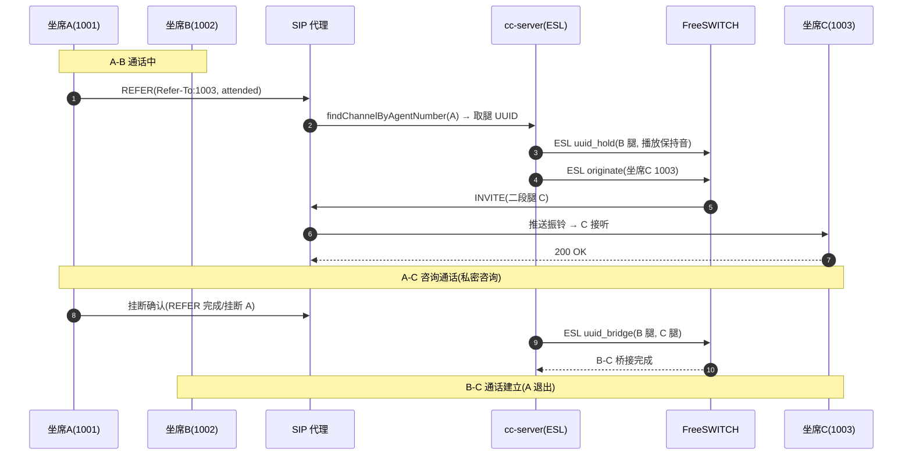
```mermaid
sequenceDiagram
    autonumber
    participant A as 坐席A(1001)
    participant B as 坐席B(1002)
    participant SP as SIP 代理
    participant ES as cc-server(ESL)
    participant FS as FreeSWITCH
    participant C as 坐席C(1003)
    Note over A,B: A-B 通话中
    A->>SP: REFER(Refer-To:1003, attended)
    SP->>ES: findChannelByAgentNumber(A) → 取腿 UUID
    ES->>FS: ESL uuid_hold(B 腿, 播放保持音)
    ES->>FS: ESL originate(坐席C 1003)
    FS->>SP: INVITE(二段腿 C)
    SP->>C: 推送振铃 → C 接听
    C-->>SP: 200 OK
    Note over A,C: A-C 咨询通话(私密咨询)
    A->>SP: 挂断确认(REFER 完成/挂断 A)
    ES->>FS: ESL uuid_bridge(B 腿, C 腿)
    FS-->>ES: B-C 桥接完成
    Note over B,C: B-C 通话建立(A 退出)
```

### 10.3 分步处理与边界

1. **WsReferRequestHandler.doHandle**：解析 `Refer-To`、`X-Transfer-Type`(attended/blind)、`X-Gateway-Id`（本场景无）；
   `findChannelByAgentNumber(agentNumber, domain)` 遍历 CallInfo 的 channelMap 匹配 A 的分机通道； 通过
   `nodeManager.getSessionNode(callId)` 取会话绑定 FS 节点（避免随机选错 FS）；发送 202 Accepted。
2. **attended（咨询转接）**：`uuidHold(a_leg)` → originate 目标坐席 C → A-C 咨询 → A 挂断确认 → `bridgeCall(B_leg, C_leg)`。
3. **blind（盲转）**：originate 目标 → `bridgeCall(B_leg, C_leg)` → 挂断 A 腿（REPLACES 语义）。
4. **转外线折中**（机制说明，无 e2e）：携 `X-Gateway-Id` → `makeCall` 直出网关（跳过 IVR，最低延迟）；未携 → 走号码路由 + IVR
   兜底。
5. **边界**：B-C `uuid_bridge` 后客户端 BYE 会被 FS 回 481（B2BUA 透传 dialog tag 不一致）——场景 6 收尾改用 ESL 批量挂断。

### 10.4 自动化验证对应

`cc_e2e_test.py --scenarios 6`：A-B 基线 → hold → originate C → C 接听 → A-C 咨询 → A 挂断确认 → B-C 桥接 → CDR 校验。

***

## 十一、场景 7：机器人自动外呼（页面任务 → flow103）

### 11.1 场景入口与信令路径

| 项   | 值                                                                                      | 说明                                          |
|------|-----------------------------------------------------------------------------------------|-----------------------------------------------|
| 入口 | 页面新建自动外呼任务（目标 18600000001）                                                | 任务上下文预置 Redis `autocall:task:{taskId}` |
| 路由 | route103「呼出-自动外呼」`^(00200).*`（direction=2）                                    | 断言 `[自动外呼][号码路由匹配]`               |
| 流程 | flow103：start → receive → end（本场景验证外呼接通链路；任务自带 IVR 流程则显式驱动）   | `scenario_7_autocall`                         |
| e2e  | 任务上下文预置、页面建任务、外呼接通、记录状态（待呼叫0/呼叫中1/已接通2/未接通3/失败4） | 三表 call_id 一致（任务/记录/流程实例）       |

> **关键说明**：自动外呼的 a-leg 由 `AutocallServiceImpl` 经 ESL originate **直发第三方网关**（`sofia/external` profile，目标
> `target@gateway.realm`）， **不走 sipproxy INVITE 转发**、不注入 `X-Gateway-Id`。接通后
> `FsChannelParkEslEventHandler.autocallPark`
> 读取 `variable_task_id` → Redis 取 `ivr_flow`： **显式指定优先**（跳过号码路由直接驱动
> IVR）；未指定则兜底号码路由（route103 → flow103）。

### 11.2 信令时序

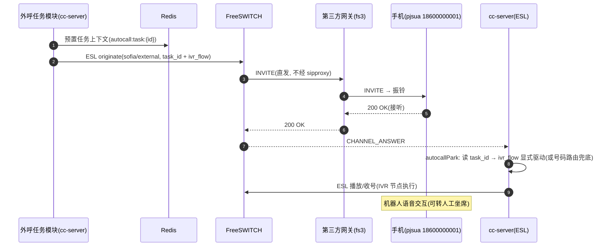
```mermaid
sequenceDiagram
    autonumber
    participant T as 外呼任务模块(cc-server)
    participant R as Redis
    participant FS as FreeSWITCH
    participant GW as 第三方网关(fs3)
    participant M as 手机(pjsua 18600000001)
    participant ES as cc-server(ESL)
    T->>R: 预置任务上下文(autocall:task:{id})
    T->>FS: ESL originate(sofia/external, task_id + ivr_flow)
    FS->>GW: INVITE(直发, 不经 sipproxy)
    GW->>M: INVITE → 振铃
    M-->>GW: 200 OK(接听)
    GW-->>FS: 200 OK
    FS-->>ES: CHANNEL_ANSWER
    ES->>ES: autocallPark: 读 task_id → ivr_flow 显式驱动(或号码路由兜底)
    ES->>FS: ESL 播放/收号(IVR 节点执行)
    Note over M: 机器人语音交互(可转人工坐席)
```

### 11.3 错误处理与并发控制

| 错误场景               | 处理策略                                           |
|------------------------|----------------------------------------------------|
| 网关不可达             | `uuidKill` c-leg；任务标记"出局失败"；CDR 记录     |
| ivr_flow 不存在        | 挂断 c-leg；任务标记"IVR 流程无效"                 |
| 坐席不在线（转人工时） | IVR 继续播放"请等待"语音，定期重试选座，超阈值挂断 |
| CPS 限流               | 令牌桶/漏桶排队等待，超 maxWait 挂断标记"系统繁忙" |

> **并发控制**：批量外呼需控制 ESL originate 并发速率（cps/maxConcurrent），实时监控指标（Micrometer）为遗留项（见第二十一章）。

### 11.4 自动化验证对应

`cc_e2e_test.py --scenarios 7`：Redis 任务上下文预置 → 页面建任务 → 外呼接通 → 任务记录状态流转 →
`cc_call_record`/任务表/flow103 实例 call_id 一致。

***

## 十二、场景 8：客服组繁忙（占线提示）

### 12.1 场景入口与信令路径

| 项   | 值                                                                         | 说明                                                        |
|------|----------------------------------------------------------------------------|-------------------------------------------------------------|
| 拨号 | `00300xxx`                                                                 | 路由 route104「呼出-客服组繁忙」`^(00300).*`（direction=2） |
| 流程 | flow104：start → playback（文件 fileId=10，「客服组繁忙请稍等再拨」）→ end | 断言：日志含 `客服组繁忙请稍等再拨`                         |
| e2e  | `scenario_8_group_busy`：忙提示音播放、流程终态                            | 可选场景                                                    |

> **关键说明**：该场景验证「坐席组全忙/溢出分支的语音提示链路」——号码直接命中专用于繁忙提示的 IVR 流程（flow104 纯放音流程），
> 播放完成后流程进入终态。真实排队/溢出行为由转坐席组的 full_busy 策略驱动（见场景 11 并发压测的排队/溢出分支）。

### 12.2 信令时序

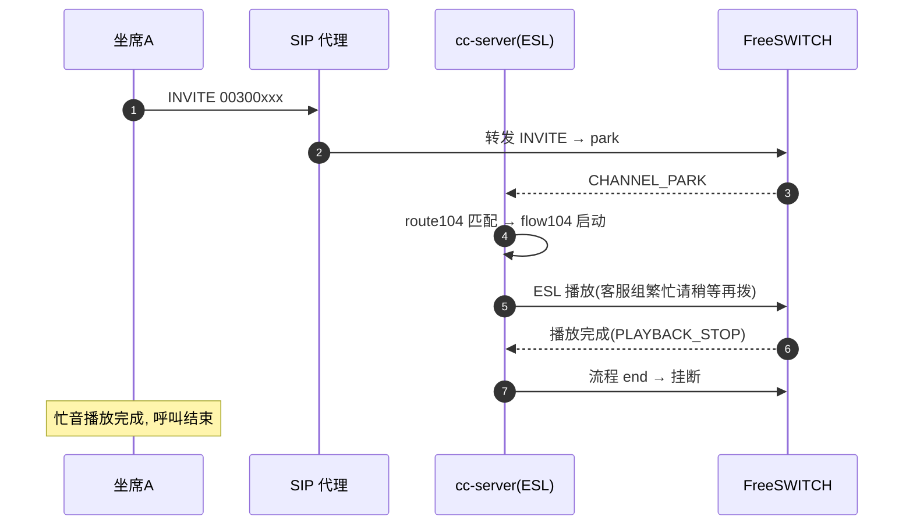
```mermaid
sequenceDiagram
    autonumber
    participant A as 坐席A
    participant SP as SIP 代理
    participant ES as cc-server(ESL)
    participant FS as FreeSWITCH
    A->>SP: INVITE 00300xxx
    SP->>FS: 转发 INVITE → park
    FS-->>ES: CHANNEL_PARK
    ES->>ES: route104 匹配 → flow104 启动
    ES->>FS: ESL 播放(客服组繁忙请稍等再拨)
    FS-->>ES: 播放完成(PLAYBACK_STOP)
    ES->>FS: 流程 end → 挂断
    Note over A: 忙音播放完成, 呼叫结束
```

### 12.3 自动化验证对应

`cc_e2e_test.py --scenarios 8`：断言后端日志 `客服组繁忙请稍等再拨`、flow104 实例终态。

***

## 十三、场景 9：满意度评价（收号 + 方法节点）

### 13.1 场景入口与信令路径

| 项   | 值                                                                                            | 说明                                                        |
|------|-----------------------------------------------------------------------------------------------|-------------------------------------------------------------|
| 拨号 | `00100xxx`                                                                                    | 路由 route106「呼出-满意度评价」`^(00100).*`（direction=2） |
| 流程 | flow106：start → receive（收号，按 1）→ method（方法节点）→ end（播放「感谢您的评价，再见」） | 断言：`感谢您的评价`、`ivr方法调用节点处理`                 |
| e2e  | `scenario_9_satisfaction`：DTMF 收号、方法节点执行、流程终态                                  | 可选场景                                                    |

> **关键说明**：满意度评价典型应用于回访/外呼收尾：用户按键（如 1=满意）后由 method 节点回调业务接口落评价结果，再播放结束语。

### 13.2 信令时序

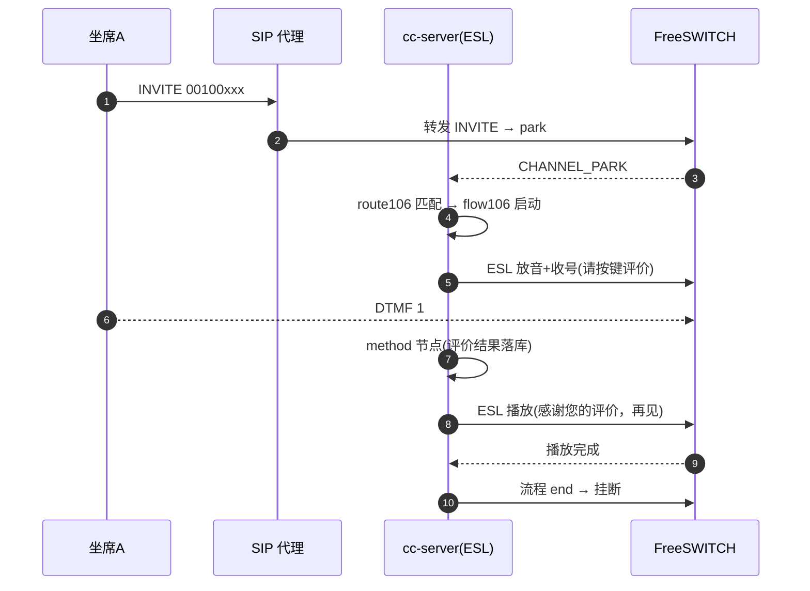
```mermaid
sequenceDiagram
    autonumber
    participant A as 坐席A
    participant SP as SIP 代理
    participant ES as cc-server(ESL)
    participant FS as FreeSWITCH
    A->>SP: INVITE 00100xxx
    SP->>FS: 转发 INVITE → park
    FS-->>ES: CHANNEL_PARK
    ES->>ES: route106 匹配 → flow106 启动
    ES->>FS: ESL 放音+收号(请按键评价)
    A-->>FS: DTMF 1
    ES->>ES: method 节点(评价结果落库)
    ES->>FS: ESL 播放(感谢您的评价，再见)
    FS-->>ES: 播放完成
    ES->>FS: 流程 end → 挂断
```

### 13.3 自动化验证对应

`cc_e2e_test.py --scenarios 9`：断言后端日志 `ivr方法调用节点处理`、`感谢您的评价`、flow106 实例终态。

***

## 十四、场景 10：AI 对话（00600 → flow107，中断词转人工）

### 14.1 场景入口与信令路径

| 项   | 值                                                                                                                                                                                        | 说明                                                                                        |
|------|-------------------------------------------------------------------------------------------------------------------------------------------------------------------------------------------|---------------------------------------------------------------------------------------------|
| 拨号 | `00600`                                                                                                                                                                                   | 路由 route107「呼出-AI对话」`^(00600).*`（direction=2），专属 AI 路由不与其他路由混用       |
| 流程 | flow107：start(ASR/TTS) → ai（聊天角色 + 开场语 + 中断词「转人工」）→ condition(interruptWord EQ 转人工) → transfer（routeType=1 → 坐席 1002）→ end；else 分支 → playback(对话失败) → end | 断言：`[进入callRoute电话]`、`[ivrAI对话]`、`中断词命中`、`[ivr-转接-坐席处理节点]`、`1002` |
| e2e  | `scenario_10_ai_dialogue`：假麦克风循环播放「转人工」WAV（`--use-file-for-fake-audio-capture`）→ ASR 识别中断词 → 转接坐席 1002 接听                                                      | 可选场景                                                                                    |

> **关键说明**：AI 对话节点（ai-node）复用自研 AI 模块（yudao-module-ai）：ASR/TTS 走 mod_audio_fork 流式采集（非 MRCP）；
> ai-node 可配置聊天角色（AI 角色库 roleId）、开场语（可选）、最大轮次（0-100）、静默超时（3-120s）、中断词列表；
> 识别到任一中断词即结束本节点并输出该词（输出值 `interruptWord`），失败/识别异常/超时时固定输出 `ai对话失败`，可在判断器按该值分支。
> AI 会话经 `aiChatApi.createConversation(roleId)` 落库 **`ai_chat_conversation`** 表。

### 14.2 信令时序

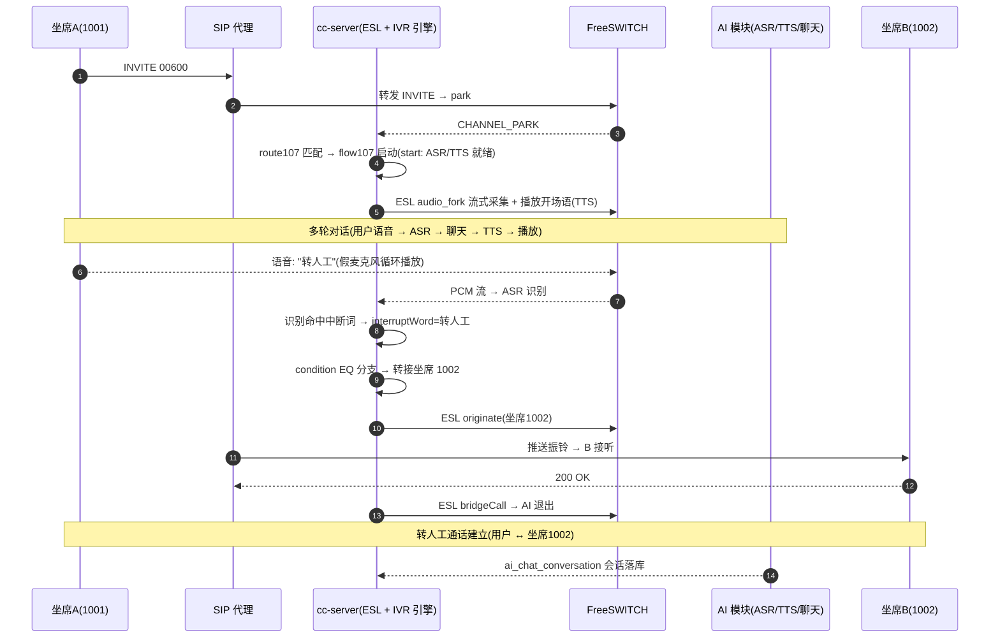
```mermaid
sequenceDiagram
    autonumber
    participant A as 坐席A(1001)
    participant SP as SIP 代理
    participant ES as cc-server(ESL + IVR 引擎)
    participant FS as FreeSWITCH
    participant AI as AI 模块(ASR/TTS/聊天)
    participant B as 坐席B(1002)
    A->>SP: INVITE 00600
    SP->>FS: 转发 INVITE → park
    FS-->>ES: CHANNEL_PARK
    ES->>ES: route107 匹配 → flow107 启动(start: ASR/TTS 就绪)
    ES->>FS: ESL audio_fork 流式采集 + 播放开场语(TTS)
    Note over A,AI: 多轮对话(用户语音 → ASR → 聊天 → TTS → 播放)
    A-->>FS: 语音: "转人工"(假麦克风循环播放)
    FS-->>ES: PCM 流 → ASR 识别
    ES->>ES: 识别命中中断词 → interruptWord=转人工
    ES->>ES: condition EQ 分支 → 转接坐席 1002
    ES->>FS: ESL originate(坐席1002)
    SP->>B: 推送振铃 → B 接听
    B-->>SP: 200 OK
    ES->>FS: ESL bridgeCall → AI 退出
    Note over A,B: 转人工通话建立(用户 ↔ 坐席1002)
    AI-->>ES: ai_chat_conversation 会话落库
```

### 14.3 分步处理与边界

1. **路由命中**：拨 00600 → route107（呼出方向）→ flow107；start 节点初始化 ASR/TTS 引擎（引擎按 flowData 下发，SPI 可插拔）。
2. **AI 会话创建**：`FlowAiHandler` 经 `aiChatApi.createConversation(roleId)` 创建会话（日志 `[ivrAI对话][创建会话成功]`）。
3. **开场语播放**：TTS 流式合成并播放（日志 `流式放音完成`），播完才进入监听（避开 busy 门控）。
4. **多轮对话**：audio_fork 采集用户 PCM → 流式 ASR（NLS SpeechTranscriber）→ 聊天（yudao-module-ai 多轮上下文）→ 流式 TTS
   播放； 每轮检查中断词（`[ivrAI对话][中断词命中]`）。
5. **转人工**：中断词命中 → condition 节点 EQ 分支 → transfer 节点（routeType=1，routeValue=1002）→
   `[ivr-转接-坐席处理节点]` → 坐席 B 接听。
6. **边界**：AI 失败/识别异常/超时输出固定值 `ai对话失败`；对话循环次数/时长受最大轮次与静默超时约束； 通话终态由 CAS
   保证单终态（并发安全）。

### 14.4 自动化验证对应

`cc_e2e_test.py --scenarios 10`：路由命中 → AI 会话创建 → 开场语播放完成 → 中断词命中（假麦克风播「转人工」）→ 转接坐席
1002 → 坐席 B 接听双向通话 → 挂断联动 → `cc_call_record` 生成 + flow107 终态 + `ai_chat_conversation` 新增记录。

***

## 十五、场景 11：并发呼入压测（分级 10-100）

### 15.1 场景说明与入口

| 项       | 值                                                                                                                       | 说明                                 |
|----------|--------------------------------------------------------------------------------------------------------------------------|--------------------------------------|
| 入口     | pjsua 批量注册 fs3（18600000000~18600000099 共 100 账户）后并发呼叫 4001234                                              | route101 → flow101 → 转坐席组 1      |
| 独立脚本 | `cc_concurrent_test.py` 分级 10/20/30/50/80/100（`--levels` 自定义），`--queue-test` 排队子测试                          | 报告 `reports/concurrent_report_*.md |json` |
| 轻量入口 | `cc_e2e_test.py --scenarios 11 --rounds 1`（两级 10/20）                                                                 | 可选场景                             |
| 验证点   | 坐席状态更新正确性（Redis `fs:agent:status` 轨迹 + DB `online_status`）、空闲坐席获取无重复分配、排队/溢出行为、分级统计 |                                      |

### 15.2 并发验证点与修复经验（2026-08-29 修复并部署回归）

| 问题                   | 根因                                                                                                                                                                        | 修复                                                                                                                             |
|------------------------|-----------------------------------------------------------------------------------------------------------------------------------------------------------------------------|----------------------------------------------------------------------------------------------------------------------------------|
| P1 排队分发失效        | `fsAcd()` multiGet 传 `Collections.singleton` 抛 ClassCastException；空闲过滤用恒 null 的 status；调度线程无租户上下文 MyBatis 租户插件 NPE；队列条目残留与异步 remove 竞争 | multiGet 传 List；过滤改 onlineStatus；DB 查询包 `TenantUtils.executeIgnore`；队列操作 synchronized；挂断清理；remove 移出异步块 |
| P2 空闲坐席获取竞态    | 多任务并发选中同一坐席                                                                                                                                                      | Lua 原子 CAS 抢占（`occupyAgentAsRinging`，仅 READY → RINGING），失败方重新选座/走全忙分支                                       |
| P3 audioFork 放音瓶颈  | fork/stream 线程池过小                                                                                                                                                      | 线程池扩容（4→8/16→24）+ 启动命令失败重试 1 次                                                                                   |
| P4 溢出目标配置无效    | 前端下拉误绑路由正则                                                                                                                                                        | 下拉改用流程列表，value 绑定流程 ID；后端非数字降级挂机                                                                          |
| P5 无会话 BYE 回弹循环 | 无会话 BYE 按 To 头注册状态转发形成 11 次/秒无限弹跳，占满 EventScannerThread                                                                                               | 无会话 BYE 直接丢弃不转发（BYE 为终止性请求）                                                                                    |

### 15.3 自动化验证对应

独立运行 `cc_concurrent_test.py`（推荐）或 `cc_e2e_test.py --scenarios 11 --rounds 1 --headless`；
产物：每级发起/注册/接通/坐席分配分布、状态轨迹摘要、重复分配清单 + 缺陷清单（`reports/`）。

***

## 十六、场景 12：注册网关呼入（注册模式 4G 网关）

### 16.1 场景入口与信令路径

| 项   | 值                                                                         | 说明                                                                      |
|------|----------------------------------------------------------------------------|---------------------------------------------------------------------------|
| 前置 | fs3 模拟 4G 网关以 `gw1001` REGISTER 到 sipproxy                           | 代理记录绑定 `ipcc:sipproxy:gateway:register:46`（Redis），含注册 Contact |
| 呼入 | pjsua 经 fs3 呼叫 `4005678`                                                | 路由 route108「注册网关呼入」`^4005678$`（direction=1）                   |
| 流程 | flow108：start → transfer（routeType=4 → 坐席组 1）→ end                   | 断言：`[进入callRoute电话]`、`[转坐席组]`                                 |
| e2e  | `scenario_12_register_gw_inbound`：注册绑定存在性前置校验、坐席组接听、CDR | 可选场景                                                                  |

> **关键说明**：呼入来源识别为 **注册绑定网关**（4G 语音网关在运营商内网，无固定公网 address，REGISTER 后由代理记录可达地址）；
> 呼入链路：pjsua → fs3（9988）→ sipproxy（5561）→ 按被叫 4005678 匹配 route108（呼入方向）→ flow108 直接转坐席组 1。

### 16.2 信令时序

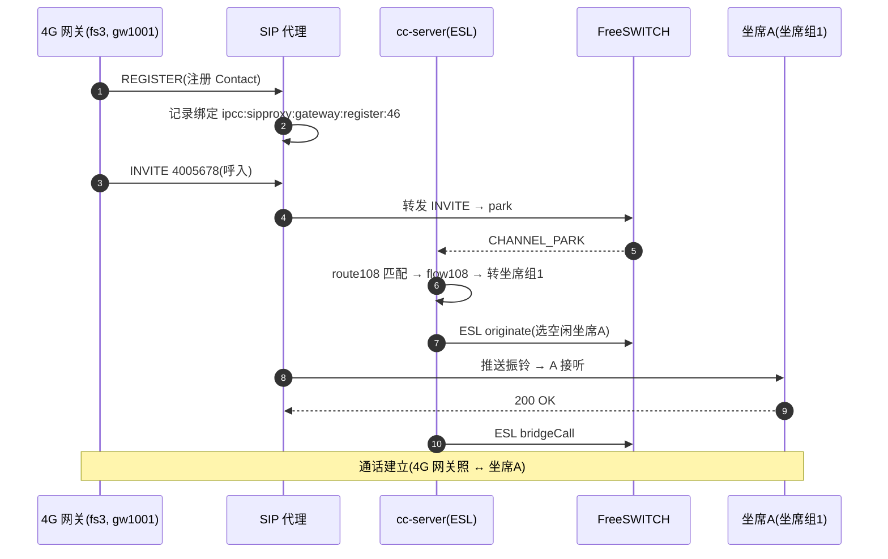
```mermaid
sequenceDiagram
    autonumber
    participant G as 4G 网关(fs3, gw1001)
    participant SP as SIP 代理
    participant ES as cc-server(ESL)
    participant FS as FreeSWITCH
    participant A as 坐席A(坐席组1)
    G->>SP: REGISTER(注册 Contact)
    SP->>SP: 记录绑定 ipcc:sipproxy:gateway:register:46
    G->>SP: INVITE 4005678(呼入)
    SP->>FS: 转发 INVITE → park
    FS-->>ES: CHANNEL_PARK
    ES->>ES: route108 匹配 → flow108 → 转坐席组1
    ES->>FS: ESL originate(选空闲坐席A)
    SP->>A: 推送振铃 → A 接听
    A-->>SP: 200 OK
    ES->>FS: ESL bridgeCall
    Note over G,A: 通话建立(4G 网关照 ↔ 坐席A)
```

### 16.3 自动化验证对应

`cc_e2e_test.py --scenarios 12`：前置校验 Redis 注册绑定存在（缺失时给出可操作提示而非盲目超时）→ pjsua 呼 4005678 →
坐席组接听 → CDR 与 flow108 终态。

***

## 十七、场景 13：注册网关呼出（注册模式 4G 网关）

### 17.1 场景入口与信令路径

| 项       | 值                                                                                                       | 说明                                                                                                                          |
|----------|----------------------------------------------------------------------------------------------------------|-------------------------------------------------------------------------------------------------------------------------------|
| 拨号     | 坐席拨 `8#18600000000`                                                                                   | 前缀 `8#`（非 0#，避免与 route105 冲突）由 route109 delete_prefix 删除；路由 route109「注册网关呼出」`^(8#).*`（direction=2） |
| 流程     | flow109：start → transfer（routeType=2 外呼，routeValue=46 → 注册模式网关 46）→ end                      | 断言：`[删除前缀]`                                                                                                            |
| 出局解析 | 网关 46 address 为空 → 按注册绑定（Contact <A服务器内网>:9977）解析目标                                  | `scenario_13_register_gw_outbound`                                                                                            |
| e2e      | 坐席拨号 → FS originate(X-Gateway-Id=46) → sipproxy 按注册 Contact 出局 → fs3 external 9977 → pjsua 接听 | 可选场景                                                                                                                      |

> **关键说明**：注册型网关呼出时 sipproxy **不依赖静态 address**（网关 46 address 为空），而是按 GatewayRegistry 绑定
> 获取可达地址（fs3 external profile 通告 <A服务器内网>:9977）。呼出目标解析优先级： **注册 Contact > 静态配置**。

### 17.2 信令时序

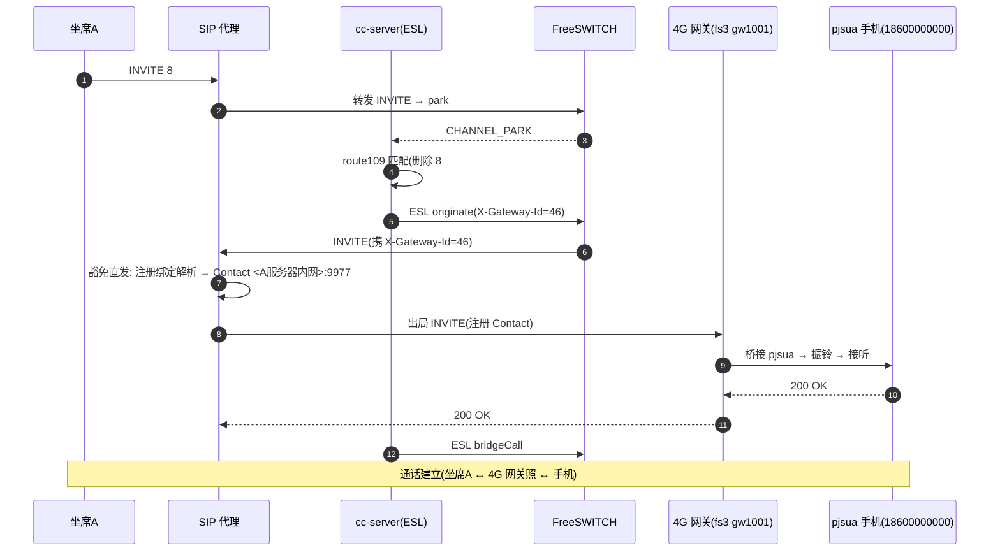
```mermaid
sequenceDiagram
    autonumber
    participant A as 坐席A
    participant SP as SIP 代理
    participant ES as cc-server(ESL)
    participant FS as FreeSWITCH
    participant G as 4G 网关(fs3 gw1001)
    participant M as pjsua 手机(18600000000)
    A->>SP: INVITE 8#18600000000
    SP->>FS: 转发 INVITE → park
    FS-->>ES: CHANNEL_PARK
    ES->>ES: route109 匹配(删除 8#) → flow109 → 网关46
    ES->>FS: ESL originate(X-Gateway-Id=46)
    FS->>SP: INVITE(携 X-Gateway-Id=46)
    SP->>SP: 豁免直发: 注册绑定解析 → Contact <A服务器内网>:9977
    SP->>G: 出局 INVITE(注册 Contact)
    G->>M: 桥接 pjsua → 振铃 → 接听
    M-->>G: 200 OK
    G-->>SP: 200 OK
    ES->>FS: ESL bridgeCall
    Note over A,M: 通话建立(坐席A ↔ 4G 网关照 ↔ 手机)
```

### 17.3 自动化验证对应

`cc_e2e_test.py --scenarios 13`：坐席 A 拨 8#18600000000 → flow109 → 网关 46（注册 Contact 动态解析）→ fs3 9977 → pjsua
接听 → CDR（gateway_id=46）与 flow109 终态。

***

## 十八、通话记录（CDR）与录音绑定机制

> **适用范围**：全部 12 个实现场景。走号码路由 + IVR 的场景由 `FsCallIRouteProcess` 驱动录音 + `transfer(CallInfo)` 构造
> CDR；
> 豁免场景（三方会议 c-leg、双向出局、REFER 转外线）由 ESL 通道变量注入 + `transferFromEslEvent(EslEvent)` 构造 CDR（路径
> B，机制保留）。
> 两条路径最终都写入同一张 `cc_call_record` 表。

### 18.1 数据表结构：cc_call_record

| 字段                                                | 类型     | 说明                    | IVR 场景来源           | 豁免场景来源                  |
|-----------------------------------------------------|----------|-------------------------|------------------------|-------------------------------|
| `call_id`                                           | varchar  | 呼叫唯一 ID             | `CallInfo.callId`      | ESL 变量 `cc_call_id`         |
| `caller_number`                                     | varchar  | 主叫号码                | `CallInfo.caller`      | `Caller-Caller-ID-Number`     |
| `callee_number`                                     | varchar  | 被叫号码                | `CallInfo.callee`      | `Caller-Destination-Number`   |
| `agent_id`                                          | bigint   | 坐席 ID                 | `CallInfo.agentId`     | ESL 变量 `cc_agent_id`        |
| `direction`                                         | tinyint  | 呼叫方式(1-呼出 2-呼入) | `CallInfo.direction`   | 固定 1(呼出)                  |
| `call_start_time` / `answer_time` / `call_end_time` | datetime | 呼叫起止/接通时间       | `CallInfo`             | ESL 标准时间字段(微秒)        |
| `hangup_cause_code`                                 | int      | 挂机原因                | `CallInfo.hangupCause` | `Hangup-Cause`                |
| `file_path`                                         | varchar  | 录音文件地址            | `CallInfo.record`      | ESL 变量 `cc_record_path`     |
| `gateway_id`                                        | varchar  | 网关 ID                 | `CallInfo.gatewayId`   | `variable_sip_h_X-Gateway-Id` |
| `call_type`                                         | int      | 呼叫类型                | `CallInfo.callType`    | ESL 变量 `cc_call_type`       |
| `tenant_id`                                         | bigint   | 租户 ID                 | `CallInfo.tenantId`    | ESL 变量 `cc_tenant_id`       |

`call_type` 取值规范：

| 取值 | 含义           | 典型场景                     | 路由方式                 |
|------|----------------|------------------------------|--------------------------|
| 1    | 呼入 IVR       | 场景 3/12（呼入方向）        | 号码路由 + IVR           |
| 2    | 呼出           | 场景 2/8/9/10/13（呼出方向） | 号码路由 + IVR           |
| 3    | 内部呼叫       | 场景 1/5/6 基线              | 号码路由 + IVR           |
| 4    | 三方会议 c-leg | 豁免（旧场景四，无 e2e）     | 豁免（直接出局）         |
| 5    | 双向出局       | 豁免（旧场景五，无 e2e）     | 豁免（直接出局）         |
| 6    | 转接 c-leg     | REFER 转外线（无 e2e）       | 豁免（直接出局）         |
| 7    | 自动外呼       | 场景 7 a-leg                 | ESL originate 直发 → IVR |

### 18.2 两条 CDR 构建路径

CDR 构建统一在 `FsChannelHangUpCompleteEslEventHandler.handleEslEvent`，根据 `CallInfo` 是否存在分两条路径：

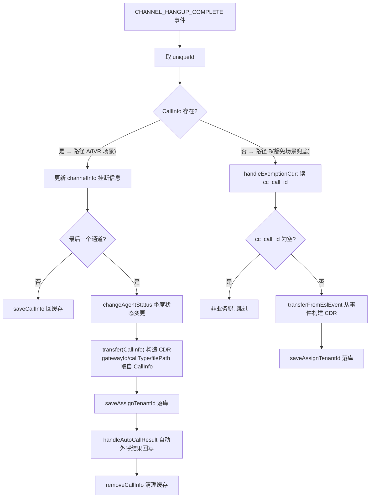
```mermaid
flowchart TD
    H["CHANNEL_HANGUP_COMPLETE 事件"] --> U["取 uniqueId"]
    U --> C{"CallInfo 存在?"}
    C -->|"是 → 路径 A(IVR 场景)"| A1["更新 channelInfo 挂断信息"]
    A1 --> A2{"最后一个通道?"}
    A2 -->|"否"| SAVE["saveCallInfo 回缓存"]
    A2 -->|"是"| A3["changeAgentStatus 坐席状态变更"]
    A3 --> A4["transfer(CallInfo) 构造 CDR<br/>gatewayId/callType/filePath 取自 CallInfo"]
    A4 --> A5["saveAssignTenantId 落库"]
    A5 --> A6["handleAutoCallResult 自动外呼结果回写"]
    A6 --> A7["removeCallInfo 清理缓存"]
    C -->|"否 → 路径 B(豁免场景兜底)"| B1["handleExemptionCdr: 读 cc_call_id"]
    B1 --> B2{"cc_call_id 为空?"}
    B2 -->|"是"| SKIP["非业务腿, 跳过"]
    B2 -->|"否"| B3["transferFromEslEvent 从事件构建 CDR"]
    B3 --> B5["saveAssignTenantId 落库"]
```

### 18.3 路径 A：IVR 场景（号码路由 + IVR）

**适用场景**：场景 1/2/3/5/6/7/8/9/10/12/13（走号码路由 + IVR 的腿）。

- **录音触发**：`FsCallIRouteProcess.handler` 匹配号码路由后、驱动 IVR 前调用 `fsClient.record`，路径存入
  `CallInfo.record`； 自动外呼 a-leg 已有 `execute_on_answer` 录音时跳过（避免重复录音）。
- **CDR 构造**：`transfer(CallInfo)` 在最后一个通道挂断时（count==1）构造 `CallRecordDO`，保证一次通话一条 CDR；
  支持坐席状态变更、自动外呼结果回写等后处理。
- **录音文件命名**：`{recordFile}/{tenantId}/{yyyy-MM-dd}/{agentNumber}_{callId}_{timestamp}.wav`（tenantId 空兜底
  default，agentNumber 空兜底 unknown）。

### 18.4 路径 B：豁免场景（ESL 通道变量注入 + 挂断事件读取）

**适用场景**：三方会议 c-leg、双向出局 a/b-leg、REFER 转外线 c-leg（均无 e2e 覆盖的能力）。

业务层 originate 时注入通道变量：

```
originate {sip_h_X-Gateway-Id=gw3, cc_call_id=T001, cc_call_type=4, cc_tenant_id=1,
           cc_agent_id=1001, cc_record_path=/recordings/1/2026-07-22/R001.wav,
           execute_on_answer='record_session /recordings/1/2026-07-22/R001.wav'}
          sofia/gateway/gw3/13800138000@代理 &park()
```

挂断时 `transferFromEslEvent(event)` 从事件标准字段与通道变量读回各字段（`cc_call_id`/`cc_call_type`/`cc_tenant_id`/
`cc_agent_id`/
`cc_record_path` 及 Created/Answered/Hangup/Progress 时间、Hangup-Cause 等），正常挂机 call_state=1 否则 2，direction 固定
1，answer_flag 固定 0。

> **演进建议**：长期将录音/CDR 逻辑统一抽离为 `execute_on_answer` + 通道变量注入 + 挂断事件读取，实现与路由方式解耦。

### 18.5 各场景适配矩阵（按 test-all 编号修正）

| 场景                           | 路由方式                     | CDR 路径                               | 录音触发                                | call_type |
|--------------------------------|------------------------------|----------------------------------------|-----------------------------------------|-----------|
| 1 内部呼叫                     | 号码路由+IVR                 | A: transfer(CallInfo)                  | FsCallIRouteProcess                     | 3         |
| 2 出局呼叫                     | 号码路由+IVR                 | A                                      | FsCallIRouteProcess                     | 2         |
| 3 入局 IVR                     | 号码路由+IVR                 | A                                      | FsCallIRouteProcess                     | 1         |
| 5 保持/恢复                    | 号码路由+IVR（基线通话）     | A                                      | FsCallIRouteProcess                     | 3         |
| 6 咨询转接（坐席 C）           | 号码路由+IVR（基线+二段腿）  | A                                      | FsCallIRouteProcess                     | 3         |
| 7 自动外呼                     | ESL originate 直发→IVR       | A（AutocallServiceImpl 构造 + IVR 段） | execute_on_answer + FsCallIRouteProcess | 7         |
| 8 客服组繁忙                   | 号码路由+IVR                 | A                                      | FsCallIRouteProcess                     | 2         |
| 9 满意度评价                   | 号码路由+IVR                 | A                                      | FsCallIRouteProcess                     | 2         |
| 10 AI 对话                     | 号码路由+IVR                 | A                                      | FsCallIRouteProcess                     | 2         |
| 12 注册网关呼入                | 号码路由+IVR                 | A                                      | FsCallIRouteProcess                     | 1         |
| 13 注册网关呼出                | 号码路由+IVR（注册绑定出局） | A                                      | FsCallIRouteProcess                     | 2         |
| 三方会议/双向出局/REFER 转外线 | 豁免                         | B: transferFromEslEvent                | execute_on_answer                       | 4/5/6     |

***

## 十九、异常场景与可靠性

### 19.1 异常场景处理矩阵（含对应测试场景）

| 异常场景                           | 检测点                          | 处理策略                                                              | 对应场景                        |
|------------------------------------|---------------------------------|-----------------------------------------------------------------------|---------------------------------|
| 号码路由表未匹配到任何规则         | `FsCallIRouteProcess` 匹配失败  | `playFile(SYSTEM_ERROR)` + `hangupCall` + 告警                        | 1/2/3 等（L0 数据核对前置拦截） |
| 号码路由匹配但 flowId 为空         | `CallRouteDO.flowId == null`    | 同上 + 告警                                                           | L0                              |
| IVR 流程不存在（flowId 无效）      | `FlowNoticeService.notice` 异常 | 同上                                                                  | 7（ivr_flow 无效）              |
| 网关 ID 指向内部 FS（违规配置）    | `forwardToOutboundGateway` 前置 | 阻断并返回 500；告警"疑似回环"                                        | 2                               |
| 网关 ID 在 FsSipGatewayDO 中不存在 | 查询失败                        | 回退 routeValue → 当前 FS 兜底；告警                                  | 2/13                            |
| 第三方网关不可达                   | INVITE 32s 超时 / 503           | `playFile(SYSTEM_ERROR)` + 挂断；`uuidKill` 释放 a-leg；CDR"出局失败" | 2/7                             |
| 网关返回 407/401                   | 响应路径                        | 重新注入 Authorization 重发 INVITE（去旧 To tag）                     | 2                               |
| 主叫挂断（早释）                   | `CHANNEL_HANGUP`                | `uuidKill` 释放对端；CDR"主叫早释"                                    | 1/3                             |
| 被叫忙/无应答/拒接                 | 486/480/603                     | `playFile(BUSY)` + 挂断；CDR                                          | 1/6                             |
| 坐席组全忙                         | ACD 无空闲坐席                  | 排队/溢出/忙音（full_busy 策略）                                      | 8/11                            |
| 中断词/识别超时（AI）              | ai-node 监听超时                | 输出固定 `ai对话失败` → 判断器分支                                    | 10                              |
| ESL 连接断开                       | 重连机制                        | 自动重连；已 bridge 通话继续；断线期间事件丢失由业务层容忍            | 通用                            |
| SIP 代理自身故障（SPOF）           | 心跳                            | HA 主备/集群；已 bridge 通话可继续                                    | 通用                            |
| FS 在 bridge 后故障                | RTP 流中断                      | 终端 RTP 超时（30s）挂断重拨；代理经 ESL 心跳摘除故障 FS              | 通用                            |
| 无会话 BYE 回弹                    | SessionInfo 不存在              | **直接丢弃不转发**（终止性请求；曾导致 11 次/秒回弹循环，P5 已修复）  | 11                              |
| ACK 丢失                           | ACK Timeout 32s                 | FS 64×T1 后释放；代理正确转发 ACK 不吞没                              | 通用                            |
| CPS 过载                           | 令牌桶/漏桶超限                 | 503 + Retry-After；坐席指数退避                                       | 7/11                            |

### 19.2 B2BUA 错误协调策略

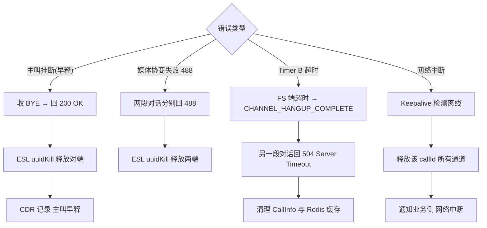
```mermaid
flowchart TD
    E{"错误类型"}
    E -->|"主叫挂断(早释)"| H1["收 BYE → 回 200 OK"]
    H1 --> H2["ESL uuidKill 释放对端"]
    H2 --> H3["CDR 记录 主叫早释"]
    E -->|"媒体协商失败 488"| M1["两段对话分别回 488"]
    M1 --> M2["ESL uuidKill 释放两端"]
    E -->|"Timer B 超时"| T1["FS 端超时 → CHANNEL_HANGUP_COMPLETE"]
    T1 --> T2["另一段对话回 504 Server Timeout"]
    T2 --> T3["清理 CallInfo 与 Redis 缓存"]
    E -->|"网络中断"| N1["Keepalive 检测离线"]
    N1 --> N2["释放该 callId 所有通道"]
    N2 --> N3["通知业务侧 网络中断"]
```

### 19.3 Timer B 可配置性

不同运营商网关对 Timer B 有差异化要求（部分国际长途要求 60s，运营商内网可能 15s），SIP 代理应支持按网关 ID 维度配置 Timer B：

```java
// 伪代码
public long getTimerB(String gatewayId) {
    FsSipGatewayDO gateway = fsSipGatewayService.getFsSipGateway(gatewayId);
    return gateway != null ? gateway.getTimerB() : 32_000L; // 默认 32s
}
```

***

## 二十、SIP 代理服务核心能力总结

### 20.1 请求路由能力

| 能力                 | 实现要点                                                                                                                                                                                     |
|----------------------|----------------------------------------------------------------------------------------------------------------------------------------------------------------------------------------------|
| 号码路由匹配（核心） | 所有 INVITE 统一转发内部 FS park → ESL 读被叫号码 → `getListByRouteNumberAndType` 按正则匹配（type=1 呼入/2 呼出）→ 用 flowId 驱动 IVR。**所有呼叫（含内部坐席间呼叫）必须走号码路由 + IVR** |
| IVR 流程驱动         | flowId 驱动 IVR；转接节点（routeType=1 转坐席 / routeType=2 外呼 / routeType=4 坐席组）经 ESL originate 发第二段呼叫                                                                         |
| 网关 ID 覆盖         | 优先级：`CallInfo.gatewayId` > IVR routeValue > 当前连接的 FS（见 3.3）                                                                                                                      |
| 注册位置管理         | JSSIP 坐席注册于代理；维护 Contact 地址（GRUU 待启用，见 23.3）                                                                                                                              |
| 注册绑定识别         | 注册模式网关 REGISTER 记录绑定（`ipcc:sipproxy:gateway:register:{id}`），呼出目标按注册 Contact 解析                                                                                         |
| 网关选路             | 多 FS/网关间 Failover、按主叫/被叫选路                                                                                                                                                       |
| 号码路由豁免         | 三方会议/双向出局/REFER 携网关直发豁免号码路由；自动外呼 ESL 直发不经 sipproxy（见 3.5）                                                                                                     |

### 20.2 认证鉴权能力

```
请求到达
├── IP 白名单检查（第三方网关 IP）
├── Digest 认证（坐席用户名密码）
├── Token/Session 校验（业务系统集成）
├── 呼叫权限校验（内呼/外呼/国际权限）
└── 防盗打机制（频率限制、异常检测）
```

### 20.3 ESL 全权控制能力（核心）

SIP 代理（cc-server）通过 ESL **全权控制** FreeSWITCH 的呼叫行为，FS 是纯粹的被动执行者：

```
ESL 控制能力:
├── 呼叫腿控制: originate / uuid_bridge / uuid_kill
├── 媒体播放: uuid_broadcast / playback
├── DTMF 收号: play_and_get_digits
├── 录音控制: uuid_record / record_session(execute_on_answer)
├── 会议控制: conference
├── 音频流: uuid_audio_fork(mod_audio_fork, 流式 TTS/ASR)
├── 事件监听: CHANNEL_PARK/PROGRESS/ANSWER/BRIDGE/HANGUP 等
└── 变量操作: uuid_setvar
```

统一呼叫控制流程见 3.2（Mermaid 图）；豁免直发场景见 3.5。

### 20.4 协议转换能力

| 转换类型 | 说明                                                         |
|----------|--------------------------------------------------------------|
| 传输层   | WebSocket(JsSIP) ↔ UDP/TCP/TLS(FreeSWITCH/网关)              |
| 媒体协议 | WebRTC(SRTP/DTLS) ↔ 传统 RTP/SDES-SRTP（由 FreeSWITCH 完成） |
| 编解码   | Opus/VP8 ↔ G.711/G.729（由 FreeSWITCH 转码）                 |
| SDP 协调 | 代理协调 SDP 媒体锚定，确保媒体流经过指定 FreeSWITCH         |

### 20.5 媒体处理协调

- **所有媒体流必须经过 FreeSWITCH 中继**（系统设计原则）。
- 通过负载均衡选择内部 FS 实例处理媒体；网关 ID 仅作 IVR 转接节点出局覆盖项。
- 转接节点最终网关 ID 为空时使用当前连接的 FS（CHANNEL_PARK 来源）作为出局目标。
- 协调录音、监听、转码等媒体能力的开启。

### 20.6 豁免场景识别（关键代码点）

`SipInviteRequestHandler.handleIncomingRequest` 识别"FS 源 + 携带 X-Gateway-Id"组合，直接走 `forwardToOutboundGateway`：

```java
// SipInviteRequestHandler.java（豁免分支，L125-130 附近）
if (SipProxyConstants.FREESWITCH.equals(source) && StrUtil.isNotBlank(gatewayId)) {
    log.info("[handleIncomingRequest][检测到FS c-leg携带X-Gateway-Id,直接出局]...");
    messageForwarder.forwardToOutboundGateway(request, gatewayId);
    return;
}
// 其他场景: messageForwarder.forwardToFreeSwitch(request, freeSwitchNode);
```

***

## 二十一、遗留问题与未来演进

本方案场景体系与 test-all 对齐（12 个实现场景）。并发稳定性问题（P1-P5）已于 2026-08-29 修复并回归，详见第十五章节与
`test-all/README.md`。当前仍存在的遗留项：

### 21.1 中优先级（影响可维护性或非核心场景）

| #      | 问题                | 影响模块 | 修复方向                                   | 状态     |
|--------|---------------------|----------|--------------------------------------------|----------|
| M-指标 | Micrometer 业务指标 | 全局     | CPS 限流指标、ESL 重连次数、断线丢失事件数 | 暂不处理 |
| M-TURN | TURN 证书（5349）   | coturn   | TLS 证书配置后启用 TURN over TLS           | 待部署   |

### 21.2 低优先级（增强型 / 未来演进）

| #  | 问题                         | 修复方向                                                                |
|----|------------------------------|-------------------------------------------------------------------------|
| F1 | 录音转写 + 质检              | 集成 ASR 转写服务，自动生成通话摘要、关键词命中、坐席质检评分           |
| F2 | 全链路号码路由可视化         | 管理后台展示号码路由命中链路、IVR 执行路径、异常统计                    |
| F3 | WebRTC 视频呼叫              | 集成 mod_av 视频编解码                                                  |
| F4 | SIP over TCP/TLS 出局        | 第三方网关走 TCP/TLS 时启用，配置证书                                   |
| F5 | 多 FS 负载均衡优化           | 一致性哈希（按 Call-ID）减少单腿切换                                    |
| F6 | FS 故障后已 bridge 通话恢复  | 业务层 ESL 重建呼叫腿/媒体路径切换（复杂度高，当前 RTP 超时兜底）       |
| F7 | Session Timer B2BUA 两侧维护 | B2BUA 两侧分别维护 re-INVITE 刷新（当前 FS `session-timeout-sec` 兜底） |
| F8 | 三方会议/双向出局 e2e 覆盖   | 将豁免场景纳入 test-all（当前仅代码实现、无自动化）                     |

***

## 二十二、端到端信令路径汇总表

| 场景                                 | 号码路由处理                                              | 信令路径                                                                         | 媒体路径           |
|--------------------------------------|-----------------------------------------------------------|----------------------------------------------------------------------------------|--------------------|
| **1** 内部呼叫（9#1002）             | 走号码路由（route102/flow102）                            | A→代理→FS(park)→route102→flow102 转坐席→originate→FS→代理→B                      | A↔FS↔B             |
| **2** 出局呼叫（0#18600000000）      | 走号码路由（route105/flow105，routeValue=网关2）          | A→代理→FS(park)→flow105→originate(携 X-Gateway-Id=2)→FS→代理(豁免直发)→网关→手机 | A↔FS↔网关↔手机     |
| **3** 入局 IVR（4001234）            | 走号码路由（route101/flow101，呼入方向）                  | 手机→网关→代理→FS(park)→flow101(放音/收号/分支/转坐席组)→originate→坐席          | 手机↔网关↔FS↔坐席  |
| **5** 保持/恢复                      | 基线通话（flow102）                                       | 通话中 → UI 保持 → ESL uuid_hold(保持音) → 恢复                                  | 媒体保持/恢复      |
| **6** 咨询转接（→1003）              | 基线+二段腿（flow102 通话）                               | A-B 通话 → REFER → hold(B) → originate C → A-C 咨询 → A 挂断确认 → bridge(B,C)   | B↔FS↔C             |
| **7** 自动外呼（18600000001）        | ESL 直发 + ivr_flow 显式/号码路由兜底（route103/flow103） | 任务→ESL originate(sofia/external)→网关→手机→IVR                                 | 手机↔网关↔FS(IVR)  |
| **8** 客服组繁忙（00300xxx）         | 走号码路由（route104/flow104）                            | A→代理→FS(park)→flow104 放忙音→end                                               | A↔FS               |
| **9** 满意度评价（00100xxx）         | 走号码路由（route106/flow106）                            | A→FS(park)→flow106 收号→method→感谢→end                                          | A↔FS               |
| **10** AI 对话（00600）              | 走号码路由（route107/flow107）                            | A→FS(park)→flow107 start(ASR/TTS)→ai 多轮→中断词→condition→转坐席 1002           | A↔FS(AI 音频)↔坐席 |
| **11** 并发呼入（4001234 ×N）        | 同场景 3                                                  | pjsua×N→网关→代理→FS→flow101→坐席组分配/排队                                     | N×FS↔坐席          |
| **12** 注册网关呼入（4005678）       | 走号码路由（route108/flow108）                            | 4G 网关(REGISTER 绑定)→代理→FS(park)→flow108 转坐席组                            | 网关↔FS↔坐席       |
| **13** 注册网关呼出（8#18600000000） | 走号码路由（route109/flow109，网关46 注册绑定解析）       | A→FS(park)→flow109→originate(46)→代理(注册 Contact)→网关→手机                    | A↔FS↔网关↔手机     |

***

## 二十三、生产环境必需的 SIP 补充机制

上述场景描述了核心呼叫流程。在生产环境中，以下 SIP 标准机制对保障通话可靠性至关重要，需在 SIP 代理服务和 FreeSWITCH 中配置启用：

### 23.1 Session Timer（会话定时器，RFC 4028）

**目的**：防止"僵尸通话"——通话一方网络异常断开后，另一方的会话永远挂起不释放。

**机制**：在 INVITE/200 OK 中协商 `Session-Expires`，周期性发送 re-INVITE 或 UPDATE 刷新会话。若刷新超时，主动释放呼叫。

```
Session Timer 协商示例:
INVITE sip:B@domain SIP/2.0
  Session-Expires: 1200;refresher=uac     ← 会话最长 1200 秒，主叫侧刷新
  Min-SE: 90                               ← 最小刷新间隔 90 秒

200 OK:
  Session-Expires: 1200;refresher=uac     ← 被叫接受参数
```

| 组件           | 配置                                                                                         |
|----------------|----------------------------------------------------------------------------------------------|
| **FreeSWITCH** | sofia profile 启用 `enable-timer`，设置 `session-timeout-sec`（如 1200 秒）                  |
| **SIP 代理**   | 作为 B2BUA，需在两段对话中分别维护 Session Timer，分别向坐席和 FS/网关方向发送刷新 re-INVITE |
| **最小 SE**    | 建议不低于 90 秒，避免频繁刷新影响性能                                                       |

> **B2BUA 下的 Session Timer**：两段对话的 Session Timer 独立维护，任一侧超时则通过 ESL 释放整个呼叫。

### 23.2 PRACK / 100rel（可靠临时响应，RFC 3262）

**目的**：确保携带 SDP 的 183 临时响应可靠传输——1xx 不触发重传，若 183 携带 SDP answer 但丢失会导致媒体路径建立失败。

```
PRACK/100rel 协商示例:
INVITE sip:B@domain SIP/2.0
  Supported: 100rel                         ← 声明支持 100rel

183 Session Progress:
  Require: 100rel                           ← 要求对 183 进行确认
  RSeq: 1

PRACK sip:B@domain SIP/2.0
  RAck: 1 183 INVITE                        ← 确认 183
```

| 组件           | 配置                                                             |
|----------------|------------------------------------------------------------------|
| **FreeSWITCH** | sofia profile 启用 `enable-100rel`                               |
| **SIP 代理**   | 透传 `Require: 100rel` / `RSeq` / `RAck` 头域；不吞没 PRACK 请求 |
| **JsSIP**      | 默认支持 100rel（`extraHeaders: ['Supported: 100rel']`）         |

### 23.3 GRUU（Globally Routable User Agent URI，RFC 5627）

**目的**：多设备注册场景下精确路由到特定设备实例（Web 端 + 移动端同时登录时区分）。

**机制**：REGISTER 携带 `+sip.instance`，注册服务器返回 GRUU（`sip:A@domain;gr=urn:uuid:xxx`），后续 INVITE 可用 GRUU 精确路由。

| 组件         | 配置                                                                         |
|--------------|------------------------------------------------------------------------------|
| **SIP 代理** | 注册服务器支持 GRUU 生成与存储，维护 AOR→GRUU 映射                           |
| **JsSIP**    | REGISTER 携带 `+sip.instance`                                                |
| **路由逻辑** | Request-URI 含 `gr` 参数精确路由；否则按 AOR 多设备策略（最后注册/并行振铃） |

> **遗留优化点**：当前注册成功后仅缓存 registerInfo，未实现 GRUU。

### 23.4 ICE 协商（Interactive Connectivity Establishment）

**目的**：JSSIP 使用 WebRTC，客户端可能位于 NAT/防火墙后，通过 ICE 候选（host/srflx/relay）确保媒体可达；TURN 中继兜底对称
NAT。

| 组件           | 配置                                                                                                                                                               |
|----------------|--------------------------------------------------------------------------------------------------------------------------------------------------------------------|
| **FreeSWITCH** | sofia profile 启用 `rtp-ip`、`ext-rtp-ip`；生产保持 `disable_ice=true` + `apply-candidate-acl=localnet.auto`（历史 488 根因，见《呼叫中心网络架构与部署拓扑》6.1） |
| **JsSIP**      | 配置 STUN/TURN 服务器（coturn 3478/49152-49200）                                                                                                                   |
| **SIP 代理**   | 不参与 ICE 协商，确保 SDP 透传完整                                                                                                                                 |

### 23.5 各机制在生产环境中的重要性

| 机制              | 重要性                | 不启用的风险                           |
|-------------------|-----------------------|----------------------------------------|
| **Session Timer** | **高**                | 网络中断后僵尸通话、媒体资源泄漏       |
| **PRACK/100rel**  | **中**                | 183 SDP 丢失时早期媒体不可靠、单通     |
| **GRUU**          | **中**                | 多设备登录路由不精确                   |
| **ICE**           | **高**（WebRTC 必需） | NAT 环境下 WebRTC 媒体不可达、通话无声 |

***

## 附录 A：号码路由表配置规范

所有呼叫（含内部坐席间呼叫）必须经过号码路由表的正则匹配 → IVR 流程。号码路由表（`CallRouteDO`）成为路由决策核心，其配置完整性直接决定
系统是否能正常处理呼叫。 **本文档的路由/流程真值 = `test-all/common/data_spec.py` 的 FLOW_SPECS**（route/flow
101-109），数据变更只改该文件一处。

### A.1 配置强制性要求

| 要求项                        | 说明                                                                            |
|-------------------------------|---------------------------------------------------------------------------------|
| **必须配置至少一条规则**      | 路由表为空时所有呼叫（含内部坐席间）都会因匹配失败被挂断                        |
| **必须配置坐席分机号规则**    | 内部坐席间呼叫需分机号正则，指向含转坐席节点（routeType=1）的 IVR               |
| **必须配置 DID/呼入号码规则** | 入局呼叫需 type=1 呼入规则（如 4001234/4005678），指向对应 IVR                  |
| **必须配置呼出前缀规则**      | 出局到外部号码需 type=2 呼出规则（如 9#/0#/8# 前缀），指向含外呼/转接节点的 IVR |
| **条目数建议 < 1000 条**      | 当前实现先按 status + type 过滤再做正则匹配，条目过多时性能下降                 |

### A.2 库中真值（route 101-109，与 data_spec.py 一致）

| route_id | 名称            | 正则（route_num） | direction | 删除前缀 | flow_id | 用途/场景                                               |
|----------|-----------------|-------------------|-----------|----------|---------|---------------------------------------------------------|
| 101      | 呼入-4001234    | `^(4001234).*`    | 1 呼入    | -        | 101     | 场景 3/11：入局 IVR 全链路（放音/收号/分支/转坐席组 1） |
| 102      | 呼出-内部电话   | `^(9#).*`         | 2 呼出    | `9#`     | 102     | 场景 1/5/6：内部呼叫/保持基线/咨询转接基线              |
| 103      | 呼出-自动外呼   | `^(00200).*`      | 2 呼出    | -        | 103     | 场景 7：自动外呼（兜底路径）                            |
| 104      | 呼出-客服组繁忙 | `^(00300).*`      | 2 呼出    | -        | 104     | 场景 8：忙音提示                                        |
| 105      | 呼出-外部电话   | `^(0#).*`         | 2 呼出    | `0#`     | 105     | 场景 2：出局呼叫（routeValue=网关 2）                   |
| 106      | 呼出-满意度评价 | `^(00100).*`      | 2 呼出    | -        | 106     | 场景 9：收号 + 方法节点                                 |
| 107      | 呼出-AI对话     | `^(00600).*`      | 2 呼出    | -        | 107     | 场景 10：AI 对话（中断词转人工 1002）                   |
| 108      | 注册网关呼入    | `^4005678$`       | 1 呼入    | -        | 108     | 场景 12：4G 网关注册呼入转坐席组 1                      |
| 109      | 注册网关呼出    | `^(8#).*`         | 2 呼出    | `8#`     | 109     | 场景 13：4G 网关注册呼出（routeValue=网关 46）          |

### A.3 兜底规则建议

- **默认兜底规则 `.*`**：建议同时配置 type=1（呼入）与 type=2（呼出）两条，level 设为最低（如 1），flowId 指向默认 IVR。
- **坐席分机号规则**：本系统坐席经软电话拨号走 `9#` 前缀路由（route102）；如配置直拨分机号规则（如 `^1\d{3}$`），同样指向含
  routeType=1 转坐席节点的 IVR。

### A.4 号码路由匹配流程

```
ESL 处理器收到 CHANNEL_PARK 事件
├── 读取被叫号码 callee + 方向 direction（1-呼入/2-呼出）
├── 调用 CallRouteService.getListByRouteNumberAndType(callee, direction):
│   ├── 按 status=启用 + type=direction 过滤候选列表
│   ├── 对候选列表按 routeNum 正则匹配 callee
│   ├── 取 level 最高的匹配路由条目（level 越大优先级越高）
│   └── 返回匹配的 CallRouteDO（含 flowId）
├── 匹配成功 → 用 flowId 驱动 IVR 流程
└── 匹配失败（无任何正则匹配）:
    ├── 挂断呼叫 + 播放失败提示音（或返回 503）
    ├── 生成失败话单
    └── 记录告警日志提示运维人员补充号码路由规则
```

### A.5 多租户隔离策略

号码路由已实现租户隔离：`FsCallIRouteProcess` 从 `CallInfo.tenantId` 读取租户 ID，通过租户上下文查询路由规则。

- **tenantId 非空**（呼出场景）：`TenantUtils.execute(tenantId, ...)` 设置租户上下文查询（MyBatis-Plus 租户插件自动隔离），保证
  A 租户呼叫不匹配 B 租户路由；
- **tenantId 为空**（呼入场景）：回退 `getCallRouteNoTenant`（无租户隔离查询）并打印告警，保证呼入主流程不受影响；
- **异步/调度线程**：无租户上下文时须包 `TenantUtils.executeIgnore`（并发分发等场景，见场景 11 P1 修复经验）。

### A.6 号码路由匹配失败的处理策略

| 失败场景                         | 处理策略                                                           |
|----------------------------------|--------------------------------------------------------------------|
| 号码路由表为空（无任何规则）     | 挂断呼叫，播放"系统配置错误"提示音，记录告警                       |
| 有规则但无任何正则匹配到被叫号码 | 挂断呼叫，播放失败提示音，记录告警"号码 [被叫号] 未匹配到路由规则" |
| 匹配到路由但 flowId 为空         | 挂断呼叫，播放"系统配置错误"提示音，记录告警                       |
| 匹配到路由但 IVR 流程不存在      | 挂断呼叫，播放"系统配置错误"提示音，记录告警                       |

### A.7 配置清单

系统部署时，运维侧需确认以下号码路由表已配置：

- [ ] 内部呼叫前缀 `9#`（route102）→ flow102（转坐席）
- [ ] 外呼前缀 `0#`（route105）→ flow105（外呼，网关 2）
- [ ] 注册网关呼出前缀 `8#`（route109）→ flow109（外呼，网关 46 注册模式）
- [ ] 入局 DID `4001234`（route101）→ flow101（入局 IVR）
- [ ] 入局 4G 网关号 `4005678`（route108）→ flow108（转坐席组）
- [ ] 专用流程号段：`00200`(103)/`00300`(104)/`00100`(106)/`00600`(107)
- [ ] 默认兜底规则 `.*`（type=1 呼入 / type=2 呼出各一条）
- [ ] 坐席直拨分机号规则（按需，如 `^1\d{3}$`）
- [ ] 400/800 客服热线、紧急号码（按运营商约定）

***

**文档完成时间**：2026-09-02　 **对应代码版本**：yudao-cloud-cc main 分支（v4.0，场景体系与 test-all 对齐）　 **维护人**：cc
模块开发组 **反馈渠道**：项目 AGENTS.md / 团队 Wiki　 **事实源提醒**：路由/流程/节点/断言真值变更时同步更新
`test-all/common/data_spec.py` 与本附录 A.2。
