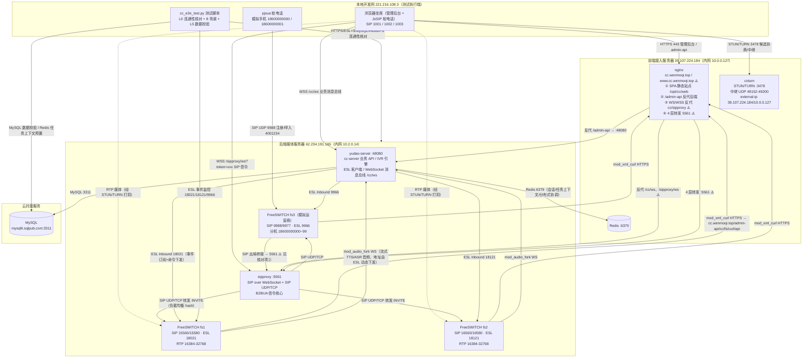
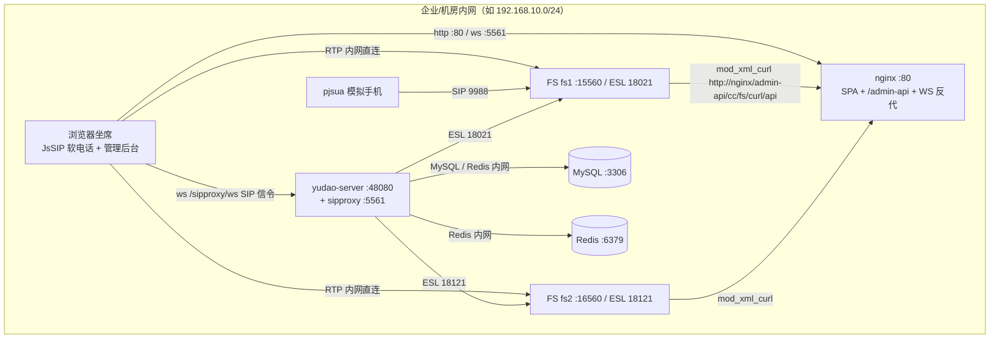
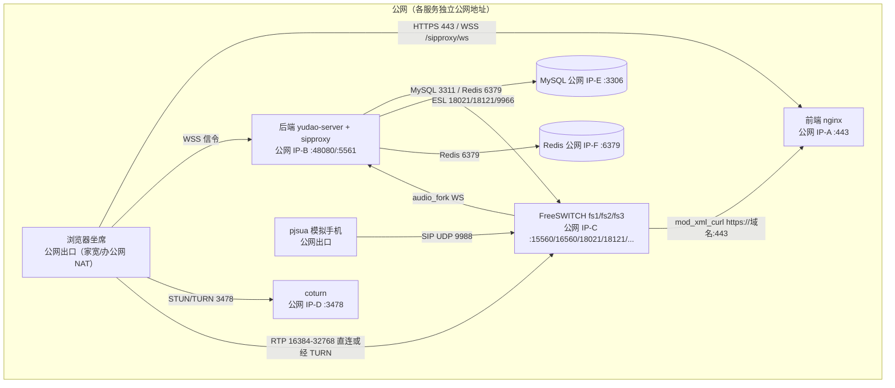
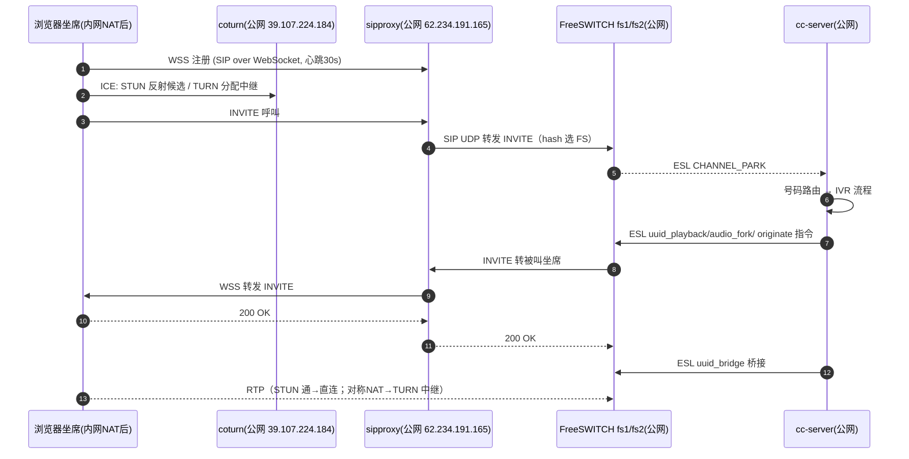
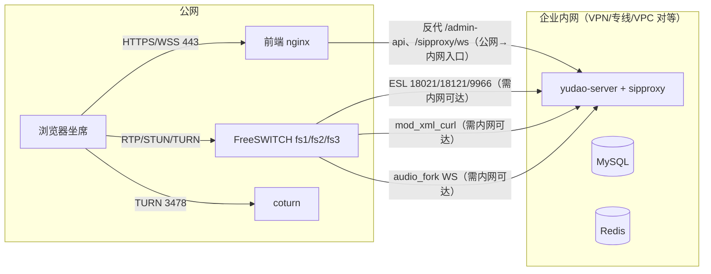

# 呼叫中心系统网络架构与部署拓扑

> **版本**：v1.0　 **整理日期**：2026-08-22
> **依据**：`test-all/` 端到端测试脚本（`common/config.py`、`cc_e2e_test.py`）、`coturn服务/coturn部署脚本.py`、
> `freeswitch服务/` 三个 FS 部署脚本、`后端远程部署脚本.py`、`前端远程部署脚本.py`
> **适用范围**：yudao-module-cc 呼叫中心的部署运维、网络规划、安全评审与排障

---

## 〇、阅读约定

| 标记 | 含义                                                       |
|------|------------------------------------------------------------|
| ✅   | 脚本/配置中明确记载的事实                                  |
| ⚠️   | 由现有脚本推断（DNS 归属、nginx 转发等），部署时需实际核对 |
| 🔒   | 涉及凭据（密码等），文档不落盘，仅说明其存在               |

文中图示均为 **Mermaid 源码**（GitHub / VSCode / Typora / Obsidian 可直接渲染），如需 PNG/SVG 可用
`npx @mermaid-js/mermaid-cli` 导出。

---

## 一、服务清单与角色定位

当前生产环境共 5 个网络节点（2 台云服务器 + 1 个云托管数据库 + 1 个云托管缓存 + 本地开发机）：

| #  | 节点                                                   | 角色                      | 承载服务                                                                                                                       | 监听端口（协议）                                                                                                                     |
|----|--------------------------------------------------------|---------------------------|--------------------------------------------------------------------------------------------------------------------------------|--------------------------------------------------------------------------------------------------------------------------------------|
| 1  | **62.234.191.165**（阿里云，ubuntu，内网 10.2.0.14）✅ | 后端 + 媒体 + 信令服务器  | `yudao-server`（Spring Boot，内嵌 cc-server 业务与 sipproxy）                                                                  | 48080（TCP/HTTP，Tomcat）、5561（TCP+UDP/SIP，sipproxy）                                                                             |
| 1a | 同上（Docker host 网络）✅                             | 媒体服务器 ×2（集群）     | FreeSWITCH **fs1** `freeswitch_15560_18021_*` / **fs2** `freeswitch_16560_18121_*`                                             | fs1：SIP 15560/15580、ESL 18021；fs2：SIP 16560/16580、ESL 18121；RTP 16384-32768（UDP）                                             |
| 1b | 同上（Docker host 网络）✅                             | 第三方网关/运营商模拟     | FreeSWITCH **fs3** `freeswitch_9988_9966_*`（模拟分机 18600000000~18600000099）                                                | SIP 9988（internal）/9977（external）、ESL 9966                                                                                      |
| 2  | **39.107.224.184**（阿里云，root，内网 10.0.0.127）✅  | 前端接入 + 基础服务服务器 | nginx（SPA 静态站点 + API/WS 反向代理 ⚠️）、Redis、coturn                                                                      | 80/443（TCP/HTTPS）、6379（TCP/Redis）、3478（TCP+UDP/STUN-TURN）、5349（TCP+UDP/TLS，未配证书不监听）、49152-49200（UDP/TURN 中继） |
| 3  | **mysql6.sqlpub.com:3311** ✅                          | 云托管 MySQL              | `yudao_cc` 业务库                                                                                                              | 3311（TCP/MySQL）                                                                                                                    |
| 4  | **本地开发机 221.216.108.3**（Mac）✅                  | 测试执行端                | `cc_e2e_test.py`、Playwright 浏览器（坐席 UI + JsSIP 软电话 1001/1002/1003）、pjsua 软电话（模拟手机 18600000000/18600000001） | 出站连接为主，无入站监听                                                                                                             |

**关键角色说明（依据 `SIP通信系统信令与话务流程方案.md`）**：

- **sipproxy**（B2BUA）：唯一的信令入口与"控制大脑"，所有坐席注册于此；负责协议转换（WebSocket↔UDP/TCP）、号码路由、通过 ESL 全权控制
  FreeSWITCH。 **不直连 ESL、不做呼叫决策之外的媒体处理**。
- **FreeSWITCH**（哑媒体层）：仅负责媒体处理，收到 INVITE 后 park，等待 ESL 指令（originate/uuid_bridge 等）驱动。
- **fs3**：模拟运营商/第三方网关，仅用于测试（外部电话网络 ↔ CC 系统互通）。
- **coturn**：为浏览器 WebRTC 提供 STUN 反射候选与 TURN 中继，解决本地 NAT 后坐席与云上 FS 的媒体（RTP）互通。

---

## 二、当前生产网络拓扑总览

> ⚠️ **两处需核对的推断**：
> 1. `cc.wenmoqi.top` DNS 解析目标 —— 依据 `config.py` 注释「同证书域 cc.wenmoqi.top 证书合法且 **托管同一套前端 SPA**
     」推断指向 39.107.224.184（与 www 同站），`/admin-api` 由该 nginx 反代到 62.234.191.165:48080。
> 2. 模拟运营商脚本 `OUTBOUND_SERVER = "39.107.224.184:5561"` 与 `config.py` 的
     `SIP_PROXY_PUBLIC_IP = "62.234.191.165:5561"` 不一致 —— 推断 39.107.224.184 的 nginx 以 4 层（stream）方式将 5561
     转发至后端 sipproxy，或历史遗留； **部署前需核对实际监听与转发配置**。

---

## 三、服务间连接关系矩阵

| #  | 源            | 目标                            | 协议/端口                                   | 用途                                                                      | 方向（主动方）                 |
|----|---------------|---------------------------------|---------------------------------------------|---------------------------------------------------------------------------|--------------------------------|
| 1  | 浏览器坐席    | nginx 39.107.224.184            | HTTPS 443                                   | 管理后台 SPA、`/admin-api` 接口                                           | 浏览器                         |
| 2  | 浏览器坐席    | sipproxy 62.234.191.165         | WSS `/sipproxy/ws`（nginx 反代 ⚠️）         | JsSIP 注册与 SIP 信令（唯一信令入口）                                     | 浏览器                         |
| 3  | 浏览器坐席    | yudao-server                    | WSS `/cc/ws`（nginx 反代 ⚠️）               | 坐席状态/来电等业务消息推送                                               | 浏览器                         |
| 4  | 浏览器坐席    | coturn 39.107.224.184           | STUN/TURN 3478（TCP+UDP）                   | WebRTC ICE 候选协商、RTP 中继                                             | 浏览器                         |
| 5  | 浏览器坐席    | fs1/fs2 62.234.191.165          | RTP/UDP 16384-32768                         | 通话媒体（媒体锚定 FS）                                                   | 双向媒体                       |
| 6  | pjsua（本地） | fs3                             | SIP/UDP 9988                                | 模拟手机注册 + 呼叫 4001234 呼入                                          | pjsua                          |
| 7  | fs3           | sipproxy 入口                   | SIP 9977→5561 ⚠️                            | 外部网络呼入 CC（outbound_to_gateway 路由）                               | fs3                            |
| 8  | sipproxy      | fs1/fs2/fs3                     | SIP UDP/TCP 15560/16560/9988                | INVITE 转发、媒体锚定选择（hash 负载均衡）                                | sipproxy                       |
| 9  | yudao-server  | fs1/fs2/fs3                     | ESL/TCP 18021/18121/9966                    | 事件订阅（CHANNEL_PARK 等）+ 命令下发（originate/uuid_bridge/audio_fork） | yudao-server（Inbound 客户端） |
| 10 | fs1/fs2/fs3   | nginx cc.wenmoqi.top            | HTTPS 443 `/admin-api/cc/fs/curl/api`       | mod_xml_curl 动态配置（dialplan/directory/configuration/phrases）         | FS                             |
| 11 | fs1/fs2       | yudao-server                    | WS（地址由 ESL `uuid_audio_fork` 动态下发） | mod_audio_fork 流式 TTS/ASR 音频上行/下行                                 | FS                             |
| 12 | yudao-server  | MySQL mysql6.sqlpub.com         | TCP 3311                                    | 业务数据持久化（呼叫记录、路由、坐席、IVR 配置）                          | yudao-server                   |
| 13 | yudao-server  | Redis 39.107.224.184            | TCP 6379                                    | IVR 流程状态、自动外呼任务上下文、分布式监听权协调、会话广播              | yudao-server                   |
| 14 | 本地开发机    | 62.234.191.165 / 39.107.224.184 | SSH 22                                      | 部署后端/FS/coturn/前端、运维排查                                         | 本地                           |
| 15 | cc_e2e_test   | fs1/fs2/fs3                     | ESL/TCP 18021/18121/9966                    | 事件监控、通道统计、场景挂断收尾                                          | 测试脚本                       |
| 16 | cc_e2e_test   | MySQL / Redis                   | TCP 3311 / 6379                             | 数据核对、自动外呼任务上下文预置                                          | 测试脚本                       |

**链路时序要点**（详见《SIP通信系统信令与话务流程方案》）：

- 呼入（场景 3）：pjsua → fs3 (9988) → dialplan `outbound_to_gateway` → sipproxy (5561) → 号码路由 `route101`(callType=1,
  匹配 `4001234`) → `flow101` IVR → ESL 控制 fs1/fs2 park 腿 → IVR 放音/收号/分支 → 转坐席组 → originate 坐席
  1001/1002/1003（JsSIP，注册于 sipproxy）→ 桥接。
- 内部呼叫（场景 1）：浏览器 `9#1002` → sipproxy → `route102`/`flow102` → IVR 转接节点 → originate 1002。
- 出局呼叫（场景 2）：浏览器 `0#18600000000` → sipproxy → `route105`/`flow105` → IVR 转接节点（routeType=2 外呼，网关按
  `X-Gateway-Id` → IVR routeValue → 当前 FS 兜底）→ 经第三方网关出局。
- 自动外呼（场景 7）：`flow103`，任务上下文预先写入 Redis（`autocall:task:{taskId}`），FS originate 呼叫被叫 18600000001。

---

## 四、网络环境一：全内网（隔离/局域网部署）

所有组件（后端、FS、前端、DB、Redis、坐席）位于同一内网，无公网 IP、无 NAT。

### 4.1 需要修改的配置项

| 配置                                                | 全内网要求                                                                                              |
|-----------------------------------------------------|---------------------------------------------------------------------------------------------------------|
| FS `vars.xml` `external_sip_ip` / `external_rtp_ip` | 改为 FS 本机内网 IP（不再通告公网 IP）                                                                  |
| FS SIP Profile `sip-ip`                             | `0.0.0.0` 或内网 IP（无 lo 公网 IP 监听需求，hairpin 问题不存在）                                       |
| `xml_curl.conf.xml` gateway-url                     | 改 `http://内网后端:48080/admin-api/cc/fs/curl/api`（或内网 nginx，可省略 HTTPS）                       |
| 前端 `VITE_BASE_URL`                                | 内网地址；WSS→WS（`getSipWsUrl` 由 `http` 替换自动得到 `ws://`）                                        |
| coturn                                              | **可不部署**（无 NAT，WebRTC 内网候选直连即可）；若保留：`external-ip=内网IP/内网IP`、`relay-ip=内网IP` |
| ESL ACL `event_socket.auto`                         | 从 `0.0.0.0/0` 收紧为内网 CIDR（如 `192.168.10.0/24`）                                                  |
| MySQL / Redis                                       | 仅绑定内网地址，禁止公网暴露                                                                            |
| 测试脚本 `config.py`                                | `LOCAL_BACKEND_URL` / `LOCAL_FRONTEND_URL` / `ESL_HOST` / `MYSQL_HOST` / `REDIS_HOST` 全部改为内网地址  |
| `sipproxy.public-ip`                                | 通告内网 IP                                                                                             |

### 4.2 注意事项

1. **无需 STUN/TURN 也无需 ICE 特判**：同网段 RTP 直连，`disable_ice`/candidate ACL 可按需保留默认；但若坐席与 FS 在不同
   VLAN（有防火墙），仍需放行 RTP 16384-32768。
2. **证书可全部省略**：HTTP + WS 即可，减少证书运维；若企业安全要求 TLS，需内网 CA 或自签证书分发。
3. **心跳约束不变**：sipproxy 空闲超时 90s / JsSIP OPTIONS 心跳 30s，任一侧调整需联动验证。
4. **多 FS 集群**：fs1/fs2 间 SIP 端口（15560/16560）内网互通即可；FS 内部回连后端（xml_curl、audio_fork、ESL）全部走内网，延迟最低。
5. **安全**：虽无公网暴露，仍建议 DB/Redis 仅对后端 IP 放行，ESL 仅对后端 IP 放行（勿用 0.0.0.0/0）。
6. **云镜像拉取**：全内网无外网时，需提前离线导入 FS/coturn Docker 镜像（`docker save/load`）与 Maven/npm 依赖，部署脚本中
   `docker pull` 与 `apt-get` 步骤会失败。

---

## 五、网络环境二：全外网（各服务均有公网可达地址）

所有服务（含 FS、后端、前端、DB、Redis、坐席出口）均具备公网 IP，云主机支持 NAT 回环（hairpin）或公网 IP 直绑网卡。

### 5.1 需要修改的配置项

| 配置                                     | 全外网要求                                                                                                                                                                                                                      |
|------------------------------------------|---------------------------------------------------------------------------------------------------------------------------------------------------------------------------------------------------------------------------------|
| FS `external_sip_ip` / `external_rtp_ip` | 通告各自公网 IP（脚本常量 `PUBLIC_IP` 填对应公网地址）                                                                                                                                                                          |
| FS `sip-ip`                              | `0.0.0.0`（公网 IP 已直绑网卡时最稳，兼容 hairpin 正常的情况）                                                                                                                                                                  |
| `xml_curl.conf.xml` gateway-url          | `https://公网域名:443/admin-api/cc/fs/curl/api`（hairpin 正常则无需内网回退）                                                                                                                                                   |
| 前端 `VITE_BASE_URL`                     | 公网域名；WSS 正常启用                                                                                                                                                                                                          |
| coturn                                   | **建议保留**：坐席多在 NAT 后（家宽对称 NAT 常见），RTP 直连仍可能失败；`external-ip=公网IP/内网IP`、`relay-ip` 按主机实际网卡填写                                                                                              |
| 云安全组                                 | 放行：80/443、48080（可仅内网）、5561（SIP UDP/TCP + WSS）、15560/15580/16560/16580/9988/9977（SIP）、18021/18121/9966（ESL，建议源 IP 白名单）、16384-32768（UDP/RTP）、3478/5349/49152-49200（TURN）、6379/3311（建议白名单） |
| ESL ACL                                  | 收紧为仅后端/测试机 IP（全外网下 `0.0.0.0/0` 风险极高）                                                                                                                                                                         |

### 5.2 注意事项

1. **安全组是主要风险面**：SIP/ESL/Redis/MySQL 均公网可达时，必须做源 IP 白名单；ESL 端口有密码但建议叠加 ACL；Redis
   勿用弱口令（当前生产 Redis 即公网可达，生产环境应迁移内网或加白名单）。
2. **多 FS 集群**：FS 间信令走公网 IP 互通即可；若同一云 VPC，建议改内网 IP 互通以降低延迟与丢包。
3. **TURN 中继带宽**：全外网场景坐席 NAT 仍可能命中 TURN 中继，UDP 49152-49200 的带宽即通话带宽，需评估峰值并发（每路
   G.711 ≈ 100Kbps，Opus 更低）。
4. **ICE/488 处置**：坐席在 NAT 后时，FS 侧建议保留 `disable_ice=true` + `apply-candidate-acl=localnet.auto`（历史 488
   问题根因），媒体走 TURN 中继。
5. **证书**：WSS/HTTPS 需公网可信 CA 证书（当前生产用 cc.wenmoqi.top 域证书，注意 www 前缀 SAN 缺失问题）。
6. **mod_xml_curl 超时**：跨公网回连延迟增大，`timeout=2000ms` 可能偏紧，若 FS 启动报 xml_curl 超时可适当调大。

---

## 六、网络环境三：内网 + 外网混合（各服务分别部署于内网/外网）

**当前生产即此形态**（图见第二节）：后端/FS 在云公网、坐席与测试端在内网 NAT、前端接入与 TURN 在另一台公网服务器、DB
在第三方云。按"哪个角色在内网"细分三种典型子情况：

### 6.1 子情况 C1：后端/FS 在公网，坐席/测试端在内网（= 当前生产 ✅）

**注意事项**：

1. **媒体是最大风险点**：云上 FS + 内网坐席的 RTP 必须靠 STUN 反射候选 + TURN 中继兜底（当前生产即此方案）；历史出现过
   488/无声问题，需保持 `disable_ice` + 放宽 candidate ACL + TURN 可用的组合。
2. **hairpin NAT 陷阱**：云主机（尤其腾讯云系）不支持 NAT 回环时，FS 容器内访问 `公网域名:443` 可能不通 ——
   部署脚本已实现自动检测（先公网域名 → 失败改用本机内网 IP）， **FS 与后端同机时此回退路径必须可用**；若后端与 FS 分机部署，则
   xml_curl 应直配后端内网 IP。
3. **坐席出口 IP 白名单**：pjsua 直连云端 fs3 的 9988 时，云安全组需放行坐席公网出口 IP（当前测试需放行 125.33.53.38），坐席
   IP 变化会导致注册/呼叫失败。
4. **WSS 入口**：浏览器只访问一个公网域名（当前 cc.wenmoqi.top），nginx 统一反代 `/admin-api`、`/cc/ws`、`/sipproxy/ws`
   ，跨域与证书问题最少；sipproxy 通告给 FS/网关的公网地址与 nginx 转发入口需保持一致（见 4.6 核对项）。
5. **双 FS 集群**：fs1/fs2 同机（host 网络）共用 RTP 端口段 16384-32768 无冲突（UDP 动态分配）；若分机部署需规划不同 RTP 段，且
   FS 间 SIP 互通端口放行。
6. **数据层公网可达（现状风险）**：MySQL（第三方托管 3311）与 Redis（公网 6379）均可公网访问，仅靠口令保护 —— 生产建议迁移至内网/VPC
   或加 IP 白名单。

### 6.2 子情况 C2：后端/DB/Redis 在纯内网，FS/前端/TURN 在公网

**注意事项**：

1. **三条反向依赖必须打通**：FS 主动回连后端的 mod_xml_curl（HTTPS）、audio_fork（WS）、以及后端主动连 FS 的 ESL ——
   内网与公网之间必须有稳定通道（VPN/专线/VPC 对等/安全组双向放行），否则 FS 启动即阻塞（xml_curl connect 超时 135s）、IVR
   放音失败、通话记录不落库。
2. **入口收敛**：公网只暴露 nginx（443）与 TURN（3478）最理想；`/admin-api`、`/sipproxy/ws` 由 nginx 反代进内网；SIP 5561
   如需对网关开放，建议同样经 nginx stream 转发而非直连内网。
3. **延迟敏感路径**：ESL 命令往返、audio_fork 音频流、xml_curl 配置拉取均跨网络边界，公网链路抖动会直接影响 IVR
   放音与呼叫建立；建议内部走专线。
4. **心跳**：跨公网 WSS 链路更易抖动，JsSIP 30s 心跳 + sipproxy 90s 空闲超时的余量已较小，链路抖动时可能误清会话，可考虑把
   idle-timeout 适当调大并联动验证。

### 6.3 子情况 C3：前后端在不同云/数据中心，DB 在第三方托管（多公有云混合）

**注意事项**：

1. **跨云互通只能靠公网 IP + 安全组白名单**（或云专线/云联网），需把对端公网 IP 精确加入白名单，避免全放行。
2. **域名与证书**：统一用一层公网域名入口（如当前 cc.wenmoqi.top），各云内网地址不对外通告，减少攻击面与配置漂移。
3. **TURN 就近部署**：坐席分布广时，TURN 应就近（同区域）部署，中继 RTP 跨区域延迟会显著劣化通话质量（>150ms 一程需优化）。
4. **FS 集群跨云**：避免 fs1/fs2 分属不同云（SIP 信令 + 媒体跨云延迟不可控）；如必须，FS 间用专线。
5. **数据层**：MySQL/Redis 只允许后端服务器 IP 访问；测试脚本直连公网数据库的用法仅限测试环境。

---

## 七、跨环境通用注意事项（所有网络形态均适用）

| #  | 事项                             | 说明                                                                                                                                                                                                 |
|----|----------------------------------|------------------------------------------------------------------------------------------------------------------------------------------------------------------------------------------------------|
| 1  | **软电话心跳联动**               | sipproxy WS 空闲超时 90s（`sipproxy.heartbeat.idle-timeout`）必须大于 JsSIP OPTIONS 心跳 30s（`SoftPhone.vue KEEP_ALIVE_INTERVAL`）；修改任一侧需两侧联调，否则坐席被僵尸会话清理导致来话失败（408） |
| 2  | **fs-esl 异步约束**              | 仅支持 Inbound 模式；事件订阅与命令必须异步（Netty IO 线程内阻塞 `.get()` 会死锁）；API 命令必须带 `api ` 前缀                                                                                       |
| 3  | **WebSocket sender-type 一致性** | `cc.websocket.sender-type` 必须与 `yudao.websocket.sender-type` 一致，否则分布式下 CC 消息无法跨节点投递                                                                                             |
| 4  | **mod_audio_fork 配置**          | ws-url 仅通过 ESL `uuid_audio_fork` 命令动态下发，conf 不写连接地址（避免歧义）；模块依赖 libwebsockets/libev/libuv 需随 .so 一并注入容器并建 SONAME 软链                                            |
| 5  | **ESL ACL 收紧**                 | 脚本默认 `0.0.0.0/0` 仅适合测试；任何环境都建议收窄到后端/运维 IP                                                                                                                                    |
| 6  | **FS sip-ip 监听**               | 云厂商 NAT 模式（公网 IP 绑 lo）下，`sip-ip` 需为公网 IP 或 0.0.0.0，否则服务器内部访问公网 SIP 端口被内核丢弃（发卡）                                                                               |
| 7  | **coturn external-ip/relay-ip**  | NAT 环境必须显式配置 `external-ip=公网/内网` 与 `relay-ip=内网`，否则向客户端通告内网中继地址导致分配失败                                                                                            |
| 8  | **xml_curl 启动阻塞**            | 后端未启动时 FS 启动会因 connect 超时（~135s/次）阻塞 10+ 分钟；部署期可用 mock backend（48080）应急，部署完成即停                                                                                   |
| 9  | **多实例端口规划**               | 同主机多 FS 实例必须错开 SIP/ESL 端口（当前 15560/16560/9988 与 18021/18121/9966），容器名与配置目录带端口+随机后缀防冲突                                                                            |
| 10 | **测试脚本网络依赖**             | `cc_e2e_test.py` L0 会核对：后端/前端 HTTPS、ESL×2、第三方 FS、MySQL、Redis、sipproxy 连通性 + 路由/流程/坐席/组/网关数据；任一网络边界不通都会卡在 L0（退出码 2）                                   |
| 11 | **部署通道**                     | 后端部署走 SSH 密钥（62.234.191.165）、前端走 sshpass 密码（39.107.224.184）；两个仓库三个子仓库独立提交（yudao-cloud / yudao-ui-admin-vue3 / yudao-prd）                                            |
| 12 | **安全底线**                     | 所有凭据（SSH/ESL/Redis/TURN/MySQL）不写入本文档；生产环境 DB/Redis 禁止公网裸奔，ESL/SIP 端口加白名单                                                                                               |

---

## 八、附录：端口清单汇总

### 62.234.191.165（后端媒体服务器）

| 端口          | 协议    | 服务                         | 说明                                            |
|---------------|---------|------------------------------|-------------------------------------------------|
| 22            | TCP     | SSH                          | 部署/运维                                       |
| 48080         | TCP     | yudao-server                 | Tomcat，业务 API + `/cc/ws`                     |
| 5561          | TCP+UDP | sipproxy                     | SIP over WebSocket（WSS 经 nginx）/ SIP UDP/TCP |
| 15560 / 15580 | TCP+UDP | FS fs1 internal/external SIP | TLS 15561/15581 未启用                          |
| 18021         | TCP     | FS fs1 ESL                   |                                                 |
| 16560 / 16580 | TCP+UDP | FS fs2 internal/external SIP | TLS 16561/16581 未启用                          |
| 18121         | TCP     | FS fs2 ESL                   |                                                 |
| 9988 / 9977   | TCP+UDP | FS fs3 internal/external SIP | 模拟运营商                                      |
| 9966          | TCP     | FS fs3 ESL                   |                                                 |
| 16384-32768   | UDP     | RTP                          | fs1/fs2 共用                                    |

### 39.107.224.184（前端接入/基础服务服务器）

| 端口        | 协议       | 服务         | 说明                                     |
|-------------|------------|--------------|------------------------------------------|
| 22          | TCP        | SSH          | 部署/运维                                |
| 80/443      | TCP        | nginx        | SPA 静态站点 + 反代（⚠️ 转发目标需核对） |
| 6379        | TCP        | Redis        | 会话/任务上下文（生产建议仅后端可达）    |
| 3478        | TCP+UDP    | coturn       | STUN/TURN 监听（realm=yudao-cc.com）     |
| 5349        | TCP+UDP    | coturn       | TURN over TLS（未配证书不监听）          |
| 49152-49200 | UDP        | coturn       | TURN 中继端口段                          |
| 5561        | TCP+UDP ⚠️ | nginx stream | 可能 4 层转发到后端 sipproxy（需核对）   |

### mysql6.sqlpub.com（云托管 MySQL）

| 端口 | 协议 | 服务  | 说明                               |
|------|------|-------|------------------------------------|
| 3311 | TCP  | MySQL | `yudao_cc` 库，仅后端/测试脚本访问 |

### 本地开发机 221.216.108.3（测试执行端）

| 目标                                  | 协议/端口   | 用途                                     |
|---------------------------------------|-------------|------------------------------------------|
| 62.234.191.165:22 / 39.107.224.184:22 | SSH         | 部署与运维                               |
| cc.wenmoqi.top:443                    | HTTPS/WSS   | 后端 API、前端 SPA、/cc/ws、/sipproxy/ws |
| 62.234.191.165:5561                   | SIP UDP/TCP | sipproxy 直连（如安全组放行）            |
| 62.234.191.165:18021/18121/9966       | ESL TCP     | 测试事件监控                             |
| 62.234.191.165:9988                   | SIP UDP     | pjsua 注册第三方 FS                      |
| 39.107.224.184:3478                   | STUN/TURN   | WebRTC 候选/中继（测试坐席软电话）       |
| 39.107.224.184:6379                   | Redis       | 任务上下文预置                           |
| mysql6.sqlpub.com:3311                | MySQL       | 数据核对                                 |

---

## 九、部署脚本与网络配置对照速查

| 脚本                                                                | 关键网络常量位置                                                                                                                           | 网络相关行为                                                                                                              |
|---------------------------------------------------------------------|--------------------------------------------------------------------------------------------------------------------------------------------|---------------------------------------------------------------------------------------------------------------------------|
| `freeswitch服务/freeswitch部署脚本1.py`                             | `INTERNAL_SIP_PORT=15560`、`EXTERNAL_SIP_PORT=15580`、`ESL_PORT=18021`、`PUBLIC_IP=62.234.191.165`、`JAVA_BACKEND_HOST=cc.wenmoqi.top:443` | 自动检测 Java 后端可达地址（公网域名失败→本机内网 IP）；`sip-ip=公网IP` 监听 lo、`rtp-ip=0.0.0.0`；ESL ACL 默认 0.0.0.0/0 |
| `freeswitch服务/freeswitch部署脚本2-用于集群部署-修改了主要端口.py` | 端口换为 16560/16580/18121，其余逻辑同脚本 1                                                                                               | 集群第二实例，端口冲突即终止（禁止自动清理）                                                                              |
| `freeswitch服务/freeswitch模拟第三方网关-运营商的fs部署脚本.py`     | `INTERNAL_PORT=9988`、`EXTERNAL_PORT=9977`、`ESL_PORT=9966`、`OUTBOUND_SERVER=39.107.224.184:5561` ⚠️                                      | 模拟运营商：internal 收注册（186xxxxxxxxx）、external 出局桥接到 OUTBOUND_SERVER；SIP 测试需安全组放行 9988/9977 UDP      |
| `coturn服务/coturn部署脚本.py`                                      | `REMOTE_HOST=39.107.224.184`、`LISTENING_PORT=3478`、`MIN/MAX_PORT=49152-49200`、`PUBLIC_IP/PRIVATE_IP`、`EXTERNAL_IP`                     | host 网络；NAT 环境强制 external-ip/relay-ip 显式配置；TLS 未配证书不监听 5349                                            |
| `后端远程部署脚本.py`                                               | `REMOTE_HOST=62.234.191.165`、`VERIFY_URL=https://cc.wenmoqi.top/admin-api`、48080 启动标志                                                | 打包→SCP 上传→deploy.sh 启动→HTTP+JSON 健康检查（401=未登录但服务正常）                                                   |
| `前端远程部署脚本.py`                                               | `REMOTE_HOST=39.107.224.184`、`REMOTE_WEB_DIR=/opt/cc/web`、`VERIFY_URL=https://www.cc.wenmoqi.top/`                                       | pnpm build:prod → SCP 到 nginx 站点根目录 → 关键字验证                                                                    |
| `test-all/common/config.py`                                         | 全部服务地址/端口/凭据入口（IPCC_* 环境变量优先）                                                                                          | L0 网络核对 + 场景执行的基础；STUN/TURN 与 `SoftPhone.vue` 一致                                                           |

---

## 十、常见排障指引（网络维度）

| 现象                                        | 定位方向                                                                                                                              |
|---------------------------------------------|---------------------------------------------------------------------------------------------------------------------------------------|
| 坐席注册后一段时间来话失败（408/无 INVITE） | sipproxy WS 空闲超时 90s vs 心跳 30s 联动校验；检查 `/sipproxy/ws` 连接是否被 nginx 空闲断开                                          |
| 外呼返回 488 Not Acceptable                 | FS media 协商失败：坐席 ICE 候选不可达 → 确认 `disable_ice=true` + `apply-candidate-acl=localnet.auto` 已热加载（reloadxml + rescan） |
| 通话接通但双向无声                          | RTP 不通：抓 SDP 确认 ext-rtp-ip 通告地址；对称 NAT 下确认 TURN 中继分配成功；FS RTP 端口段安全组放行                                 |
| FS 启动极慢（10+ 分钟）                     | mod_xml_curl 回连后端 connect 超时：先起后端或 mock backend（48080）；确认 xml_curl gateway-url 可达（hairpin 时用内网 IP）           |
| IVR 放音/ASR 无音频                         | mod_audio_fork 未加载或 WS 连不上 cc-server：`module_exists mod_audio_fork`；确认 audio_fork ws-url 由 ESL 命令下发且后端 WS 端口可达 |
| 测试脚本 L0 失败                            | 逐项核对：后端 HTTPS 401、ESL×2、第三方 FS、MySQL 3311、Redis 6379、sipproxy 5561；安全组白名单（坐席出口 IP 变化需更新）             |
| 服务器内部访问公网 SIP 端口不通             | 云 NAT 模式 hairpin 发卡：确认 FS `sip-ip` 为公网 IP 或 0.0.0.0（脚本已按此配置，勿回退默认 local_ip_v4）                             |
| TURN 分配失败                               | `external-ip`/`relay-ip` 是否显式配置；中继端口段 49152-49200 UDP 安全组放行；客户端 realm/凭据与 turnserver.conf 一致                |

---

*本文档基于现有部署/测试脚本整理，⚠️ 标注项（DNS 归属、nginx 转发链路、5561 入口）请在变更网络环境时以实际配置为准核对修正。*